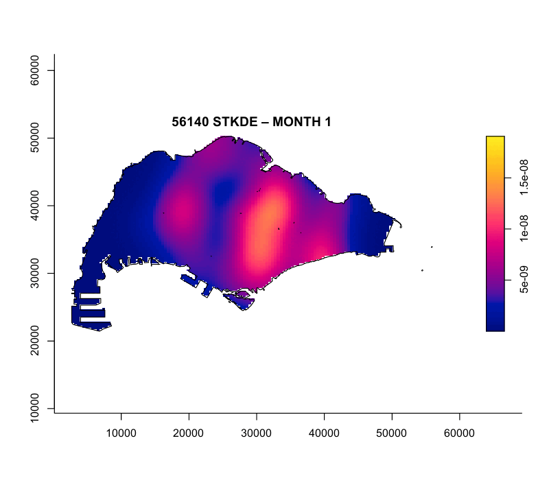
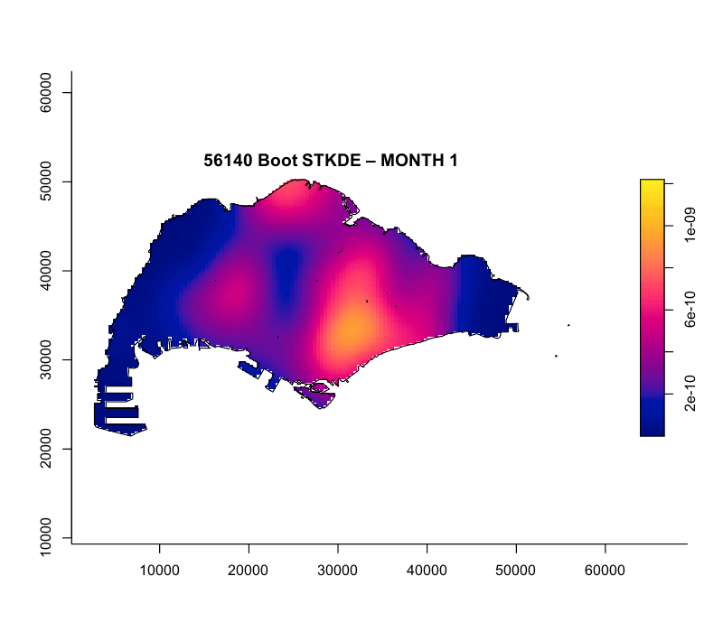
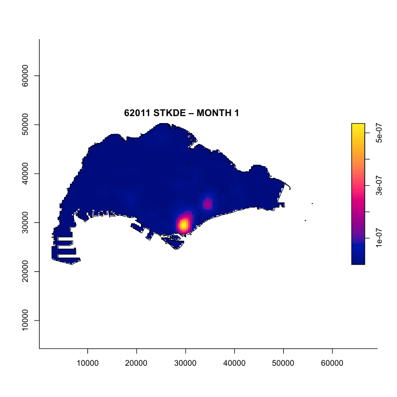
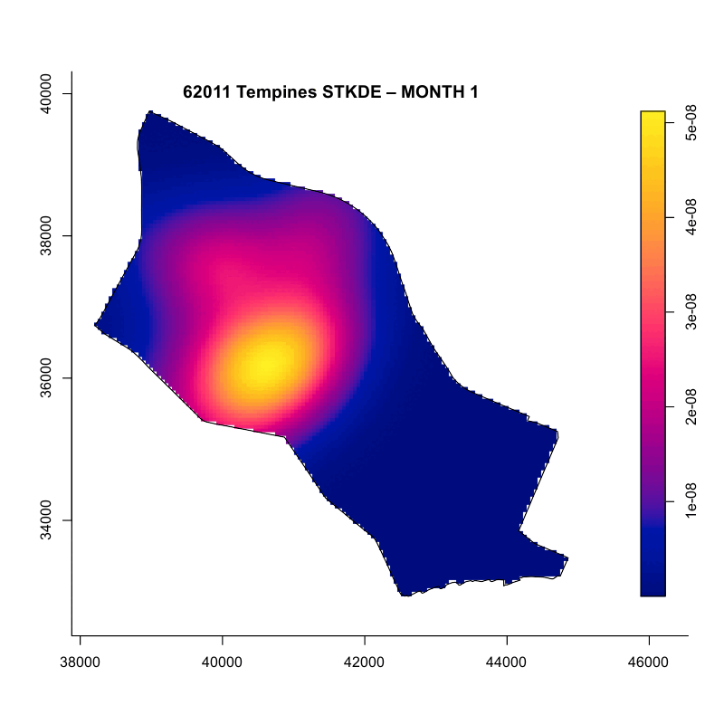
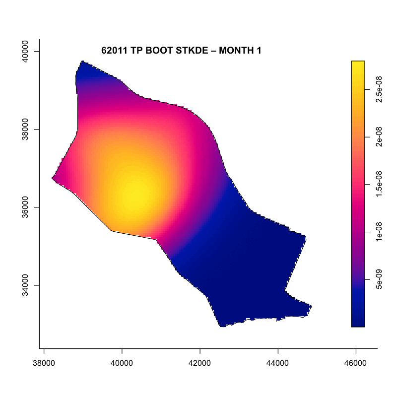
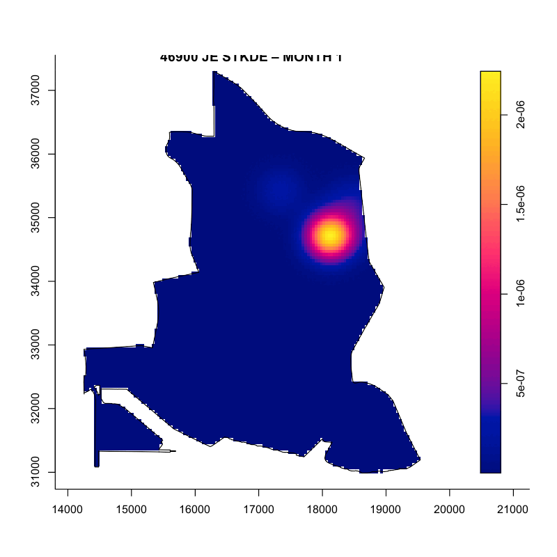
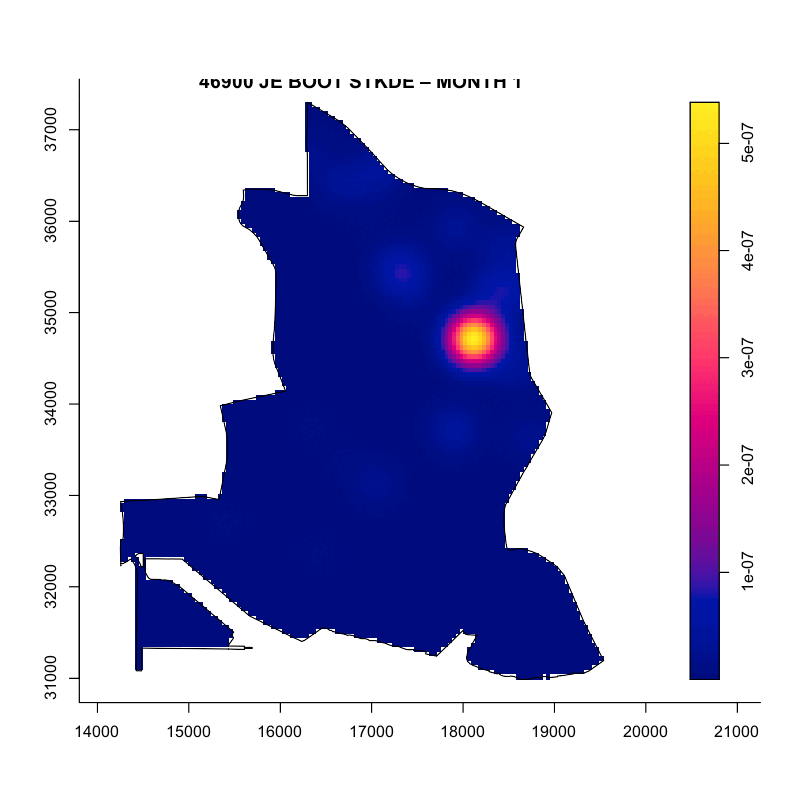

## Overview

### Motivation & Objectives

Business is a key driver of modern economies, and the location of businesses has a profound impact on both human activities and the surrounding environment. Studying the spatial and temporal dynamics of business locations helps reveal how economic activities unfold and evolve, while also offering valuable insights for urban planning.

This report demonstrates how to apply the Spatial and temporal Spatial Point Pattern Analysis through a case study of **new business registration in Singapore** from 1 January to 30 June 2025.

**Spatial Point Pattern Analysis** (SPPA) refers to the study of how points are arranged or distributed in given area. There points may represent **events**(e.g., crimes, road accidents, or disease), or **service and facility locations**(e.g., cafes, supermarkets). A **spatio-temporal point process** extends SPPA by including the element of time.

In this study, the following business types are selected for analysis:

| SSIC Code | Discrption | Number of Live Registration |
|:----------------------:|:----------------------:|:----------------------:|
| 46900 | Wholesale trade of a variety of goods without a dominant product | 3862 |
| 62011 | Development of software and applications (except games and cybersecurity) | 1590 |
| 56140 | Stalls selling cooked food and prepared drinks (including stalls at food courts and mobile food hawkers) | 475 |

The five-digit codes and their definitions are based on [Singapore Standard Industrial Classification](https://classification.codes/classifications/industry/ssic-singapore) (SSIC) 2020.

The business types were selected based on the number of new registrations in the first half of 2025. Wholesale trade and software development consistently ranked among the top sectors in 2025, while food stalls, within the top 10 in 2025, were included for their distinct Singaporean context.

*The primary focus of this study is to examine the spatial clustering of new businesses in Singapore during the first half of 2025 using Spatial Point Pattern Analysis (SPPA).*

## The Data

For this exercise, the two datasets used are as follows:

1.  Master Plan 2019 Subzone Boundary (No Sea) (KML) contains Singapoare's subzone boundary definitions according to Master Plan 2019, downloaded from [data.gov.sg](http://data.gov.sg).

2.  **ACRA Information on Corporate Entities**: This dataset consists of 27 separate CSV files organised by entity registration names and provides corporate entity registration records from January 1970 to August 2025. New business records were extracted from the dataset and analysed according to the SSIC 2020. The original data was downloaded from [data.gov.sg](http://data.gov.sg).

## Installing and Loading the R Packages

A total of **??** R packages will be used in this study.

| Package | Description |
|------------------------------------|------------------------------------|
| [sf](https://r-spatial.github.io/sf/) | Simple Features, a new R package which handles importing, managing, and processing vector-based geospatial data. |
| [raster](https://rspatial.org/raster/) | Tools for reading, writing, and analyzing raster (gridded) spatial data in R |
| [spatstat](https://spatstat.org/) | Provides useful functions for SPPA, including kcross, Lcross etc. |
| [sparr](https://tilmandavies.github.io/sparr/index.html) | Functions for fixed/adaptive kernel density estimation and relative risk mapping via density ratios; also supports fixed-bandwidth space-time density and risk estimation with inference. |
| [tmap](https://r-tmap.github.io/tmap/) | Creates cartographic quality static or interactive choropleth maps. |
| [tidyverse](https://www.tidyverse.org/) | A collection of R packages for data import, cleaning, transformation, and visualization (e.g., readr, dplyr, tidyr, ggplot2). |
| [terra](https://rspatial.github.io/terra/index.html) | Modern package for raster/vector spatial data and will be used to convert spastat outputs into terra format. |
| stopp |  |
| [stpp](https://cran.r-project.org/web/packages/stpp/index.html) | A package for the analysis, simulation, and visualization of spatio-temporal point patterns. |
| [gick](https://cran.r-project.org/web/packages/magick/vignettes/intro.html) | Tools for image processing e.g. creating animated images. |
| [httr](https://httr.r-lib.org/) | The package for making web APIs and HTTP requests. |
| [ggthemes](https://cran.r-project.org/web/packages/ggthemes/index.html) | An extension to `ggplot2` for enhanced visualisation |
| [plotly](https://plotly.com/r/getting-started/) | The package for creating interactive plotting. |
| [knitr](https://cran.r-project.org/web/packages/knitr/index.html) | The package for dynamic reporting |
| readxl |  |

: {tbl-colwidths="\[15,85\]"}

After installation via `install.packages()`, we load them into R environment using the code below.

```{r}
pacman:: p_load(sf, raster, rvest, spatstat, sparr, tmap, tidyverse, terra, stopp, stpp, magick, httr, ggthemes, plotly, knitr, readxl)
```

## Importing and Preparing Study Area

::: panel-tabset
### Singapore Subzone Map

The following steps are taken to import the spatial dataset: first import the `Master plan 2019 Subzone Boundary (No Sea)` data using **st_read()** function from sf package, extract the required 4 columns from the `Description` field, filter out the nearby islands, and finally save the file as `mpsz_cl` for further analysis.

The nearby islands are excluded from this study as there are relatively few business activities located there. Specifically, the western islands (with Jurong Island being the largest petroleum hub in the country), the southern islands (planned mainly for tourism as part of Sentosa), and the north-eastern islands (primarily used as military bases) are not considered. A single registration under Wholesale Trade located on the Western Islands is treated as out-of-scope and excluded. One registration assigned to SSIC 46900 (Wholesale trade) geocodes to the Western Islands. As this area lies outside our observation window, the record is treated as out-of-scope and excluded from the SPPA. According to its website, the entity (UEN: 202513500G) describes its principal activity as “pharmaceutical solutions” but is coded under wholesale trade; given the weight of a single observation compared to to the sector’s large base, its omission does not materially affect the results.

```{r}
#| eval: false
mpsz <- st_read("data/geospatial/rawdata/MasterPlan2019SubzoneBoundaryNoSeaKML.kml") %>%
  st_zm(drop = TRUE, what = "ZM") %>%
  st_transform(crs = 3414)


summary(mpsz)

tm_shape(mpsz) +
  tm_polygons()
```

```{r}
#| eval: false
mpsz$Description[200]
```

The code chunk below creates a function to extract desired information.

```{r}
#| eval: false
extract_kml_field <- function(html_text, field_name) {
  # return NA if missing or empty
  if (is.na(html_text) || html_text == "") return(NA_character_)
  
  page <- read_html(html_text)          #parse the HTML string 
  rows <- page %>% html_elements("tr")  #get all table rows <tr>
  
  value <- rows %>%
    keep(~ html_text2(html_element(.x, "th")) == field_name) %>% #keep row where <th> table header text = field_name
    html_element("td") %>%                                       #take its <td> table data
    html_text2()                                                 #extract clean text
  
  if (length(value) == 0) NA_character_ else value        #return NA if no match, otherwise the value
}
```

We call the function `extract_kml_field`, along with `map_chr()` from `purr` package to create new columns with extracted information, and re-arrange the order of columns for the `sf` dataset.

```{r}
#| eval: false
mpsz <- mpsz %>%
  mutate(
    REGION_N   = map_chr(Description, extract_kml_field, "REGION_N"),
    PLN_AREA_N = map_chr(Description, extract_kml_field, "PLN_AREA_N"),
    SUBZONE_N  = map_chr(Description, extract_kml_field, "SUBZONE_N"),
    SUBZONE_C  = map_chr(Description, extract_kml_field, "SUBZONE_C")
  ) %>%
  select(-Name, -Description) %>%
  relocate(geometry, .after = last_col())
```

The code chunk below removes the nearby islands.

```{r}
#| eval: false
mpsz_cl <- mpsz %>%
  filter(SUBZONE_N != "SOUTHERN GROUP",
         PLN_AREA_N != "WESTERN ISLANDS",
         PLN_AREA_N != "NORTH-EASTERN ISLANDS")
```

To streamline the workflow, the code chunk uses `write_rds` to save the newly created polygon data frame to disk, allowing it to be reused throughout this study.

```{r}
#| eval: false
write_rds(mpsz_cl,
          "data/rds/mpsz_cl.rds")
```

The code chunk below reads the saved geospatial data, summarises it, and generates a quick plot for review.

```{r}
mpsz_cl <- read_rds("data/rds/mpsz_cl.rds")
```

```{r}
summary(mpsz_cl)
```

```{r}
tm_shape(mpsz_cl) + tm_polygons()
```

### land use (noo use)

```{r}
#| eval: false
lu2019 <- st_read("data/geospatial/rawdata/MasterPlan2019LandUselayer.geojson") %>%
  st_zm(drop = TRUE, what = "ZM") %>%
  st_transform(crs = 3414)
```

```{r}
#| eval: false
lu2019$Description[1]
```

```{r}
#| eval: false
lu2023 <- st_read("data/geospatial/rawdata/AmendmenttoMasterPlan2019LandUselayer.geojson") %>%
  st_zm(drop = TRUE, what = "ZM") %>%
  st_transform(crs = 3414)
lu2023$Description[1:2] 
```

### Business registry

#### Importing the ACRA Data

The code chunk imports the ACRA data into the R environment as a tibble by applying a regex pattern and using `map_dfr(read_csv, show_col_types = FALSE)` from `spurr` to read multiple files and combine them into a single dataset.

```{r}
#| eval: false
folder_path <- "data/aspatial/acra"
file_list <- list.files(path = folder_path,
                        pattern = "^ACRA.*\\csv$",
                        full.names = TRUE)

acra_data <- file_list %>%
  map_dfr(read_csv,show_col_types = FALSE)
```

#### Saving the ACRA Data

The code chunk below loads consolidated ACRA data to R after saving it.

```{r}
#| eval: false
write_rds(acra_data, "data/rds/acra_data.rds") #rds not csv to avoid changing of field names..
```

```{r}
#| eval: false
acra_data <- read_rds("data/rds/acra_data.rds")
```

#### Selecting the Target Business and Period

The code chunk selects the period within the first six months of 2025. It renames long column names to ‘date’ for easier coding later, creates a new year column and both numeric and categorical month columns, and also tidies the postal code by adding a leading ‘0’.

```{r}
#| eval: false
acra_2025 <- acra_data %>%
  select(1:24) %>%
  rename(date = registration_incorporation_date) %>%
  mutate(date = as.Date(date),
         YEAR = year(date),
         MONTH_NUM = month(date),
         MONTH_ABBR = month(date, label = TRUE, abbr = TRUE),
         postal_code = str_pad(postal_code, width = 6, side = "left", pad = "0")) %>%
  filter(YEAR == 2025, MONTH_NUM <= 6)
```

The code chunk saves the data to the disk.

```{r}
#| eval: false
write_rds(acra_2025, "data/rds/acra_2025.rds")
```

We import the data for next step.

```{r}
#| eval: false
acra_2025 <- read_rds("data/rds/acra_2025.rds")
summary(acra_2025 )
```

The code chunk below filters the `entity_status_description`. We observe that the number of live entities is 37,012, compared to a total of 37,362 entities. This indicates that about 1% of new businesses registered in the first half of 2025 have already closed.

```{r}
#| eval: false
acra_2025l <- acra_2025 %>%
  filter(str_detect(entity_status_description, "Live"))
summary(acra_2025l)
```

The code chunk below saves and reads the data to R.

```{r}
#| eval: false
write_rds(acra_2025l, "data/rds/acra_2025l.rds")
```

```{r}
acra_2025l <- read_rds("data/rds/acra_2025l.rds")
```

#### Selecting Busines Type 2025

The code chunk below uses the `read_excel()` function from the `readxl` package (part of the `tidyverse` family) to load the Excel file containing information on SSIC codes into R. The top four rows are skipped, as the relevant data begins from the fifth row. The columns are then renamed for easier coding, and missing values in the value field are checked and dropped.

```{r}
ssic_lookup <- read_excel("data/aspatial/ssic2020-classification-structure.xlsx", skip = 4)%>%
  select(ssic_code = `SSIC 2020`, ssic_title = `SSIC 2020 Title`) %>%
  filter(!is.na(ssic_code))
```

The `count()` and `slice_max()` functions from the `dplyr` package (tidyverse family) are used for data summarisation and ranking. The code chunk below derives the top 15 new business registrations in early 2025 and adds SSIC description for easy interpretation.

```{r}
top15_25 <- acra_2025l %>%
  count(primary_ssic_code, sort = TRUE) %>%
  slice_max(n , n =15)  %>%
  mutate(primary_ssic_code = as.character(primary_ssic_code)) %>%
  left_join(ssic_lookup, by = c("primary_ssic_code" = "ssic_code"))

kable(top15_25)
```

As noted above, the following SSIC codes were selected based on the volume of new registrations and local flavour: **46900** (Wholesale trade), **62011** (Software development), and **56140** (Food stalls).

The code chunk below generates a comparison table of live versus struck-off entities for these three business types in early 2025. The results indicate that fewer than 1% of new registrations have already been struck off, suggesting a stable short-term survival rate for these sectors.

```{r}
#| eval: false
# Define the SSIC codes of interest
target_codes <- c("46900", "62011", "56140"
 )
# 4780 stalls retail
# 56122, 56123 takeaway

# Count in full dataset
counts_full <- acra_2025 %>%
  count(primary_ssic_code, name = "count_full") %>%
  filter(primary_ssic_code %in% target_codes)

# Count in live-only dataset
counts_live <- acra_2025l %>%
  count(primary_ssic_code, name = "count_live") %>%
  filter(primary_ssic_code %in% target_codes)

# Combine side by side
counts_compare <- counts_full %>%
  full_join(counts_live, by = "primary_ssic_code") %>%
  mutate(precentage =round((count_full- count_live)/ count_full * 100,2))%>%
  arrange(primary_ssic_code)

counts_compare
```

Next, we create new tibble data for each business type and save and import them to R.

```{r}
#| eval: false
biz_46900 <- acra_2025l %>% filter(primary_ssic_code == "46900") %>% 
  select(c(1, 3, 9, 12:17, 22, 25:27)) #wholesale
biz_62011 <- acra_2025l %>% filter(primary_ssic_code == "62011") %>% 
  select(c(1, 3, 9, 12:17, 22, 25:27)) #software
biz_56140 <- acra_2025l %>% filter(primary_ssic_code == "56140") %>% 
  select(c(1, 3, 9, 12:17, 22, 25:27)) #food stalls
```

```{r}
#| eval: false
write_rds(biz_46900, "data/rds/biz_46900.rds")
```

```{r}
biz_46900 <- read_rds("data/rds/biz_46900.rds")
```

```{r}
#| eval: false
write_rds(biz_62011, "data/rds/biz_62011.rds")
```

```{r}
biz_62011 <- read_rds("data/rds/biz_62011.rds")
```

```{r}
#| eval: false
write_rds(biz_56140, "data/rds/biz_56140.rds")

```

```{r}
biz_56140 <- read_rds("data/rds/biz_56140.rds")
```

### Performing Geocoding

The code chunk extracts unique postal codes from the postal_code field of a tidied tibble, queries the *SLA OneMap* `Reverse Geocode API` for each postal code. Then it store results in two data frames: - `found`: records with valid geocode results. - `not_found`: records where postal codes are not returned by the API.Clearning up the Geocoding The code chunk extracts the first 10 columns that contain useful information for this study Combining the Business Data with Geo Info The code chunk appends the business sf data frame with location information.

And then it saves the data as rds format, converts the tibble data frame to an `sf` object and assigns the correct EPSG.

```{r}
#| eval: false
geocode_biz <- function(biz_df, out_rds_path) {
  # Extract unique postal codes
  postcodes <- unique(biz_df$postal_code)
  url <- "https://onemap.gov.sg/api/common/elastic/search"
  
  found <- data.frame()
  not_found <- data.frame(postcode = character())
  
  # Loop through postal codes
  for (pc in postcodes) {
    query <- list(
      searchVal = pc,
      returnGeom = "Y",
      getAddrDetails = "Y",
      pageNum = "1"
    )
    
    res <- GET(url, query = query)
    json <- content(res)
    
    if (json$found != 0) {
      df <- as.data.frame(json$results, stringsAsFactors = FALSE)
      df$input_postcode <- pc
      found <- bind_rows(found, df)
    } else {
      not_found <- bind_rows(not_found, data.frame(postcode = pc))
    }
  }
  
  # Keep first 10 columns
  found <- found %>% select(1:10)
  
  # Join back to business data
  biz_df <- biz_df %>%
    left_join(found, by = c("postal_code" = "POSTAL"))
  
  # Save RDS
  write_rds(biz_df, out_rds_path)
  
  # Convert to sf
  biz_sf <- st_as_sf(biz_df,
                     coords = c("X", "Y"),
                     crs = 3414)
  


   return(biz_df)
}

```

The code chunk below calls the function `geocode_biz()` and save the load the `sf` data to R.

```{r}
#| eval: false
biz_46900_sf <- geocode_biz(biz_46900, "data/rds/biz_46900.rds")
write_rds(biz_46900_sf, "data/rds/biz_46900_sf.rds")
```

```{r}
biz_46900_sf<- read_rds("data/rds/biz_46900_sf.rds")
```

```{r}
#| eval: false
biz_62011_sf <- geocode_biz(biz_62011, "data/rds/biz_62011.rds")
write_rds(biz_62011_sf, "data/rds/biz_62011_sf.rds")
```

```{r}
biz_62011_sf <- read_rds("data/rds/biz_62011_sf.rds")
```

```{r}
#| eval: false
biz_56140_sf <- geocode_biz(biz_56140, "data/rds/biz_56140.rds")
write_rds(biz_56140_sf, "data/rds/biz_56140_sf.rds")
```

```{r}
biz_56140_sf <- read_rds("data/rds/biz_56140_sf.rds")
```

### Visualising the Distribution

The code chunk shows the new business registration number by month. The function `aes()` maps data frame columns to plot, e.g. `aes(x = var1, y = var2)` maps `var1` to the x-axis and `var2` to the y-axis.

```{r}
all_biz <- bind_rows(
  biz_46900_sf %>% mutate(SSIC = "Wholesale Trade (46900)"),
  biz_62011_sf %>% mutate(SSIC = "Software (62011)"),
  biz_56140_sf %>% mutate(SSIC = "Food Stalls (56140)")
)

ggplot(all_biz, aes(x = MONTH_ABBR)) +
  geom_bar() +
  facet_wrap(~SSIC, scales = "free_y") +
  labs(x = "Month", y = "Count")
```

Visualsing the business The code chunk plots the new business in interactive map.

```{r}
tmap_mode('view')
tm_shape(biz_46900_sf) +
  tm_dots(col = "red",    size = 0.5, alpha = 0.5) +
tm_shape(biz_62011_sf) +
  tm_dots(col = "blue",   size = 0.5, alpha = 0.5) +
tm_shape(biz_56140_sf) +
  tm_dots(col = "yellow",  size = 0.5, alpha = 0.5)
```

The code chunk reverses the tmap_mode from interactive to static.

```{r}
tmap_mode('plot')
```

Visualsing the business The code chunk plots the new business in interactive map.

```{r}
biz_56140_sf1 <- st_join(biz_56140_sf, mpsz_cl[c("SUBZONE_N","PLN_AREA_N")])
biz56140_summary0 <- biz_56140_sf1 %>% group_by(PLN_AREA_N) %>% summarise(count = n()) %>% arrange(desc(count))
biz56140_summary1 <- biz_56140_sf1 %>%
  group_by(PLN_AREA_N, SUBZONE_N) %>%
  summarise(count = n(), .groups = "drop") %>%
  arrange(desc(count))
head(biz56140_summary0)
head(biz56140_summary1)
```

```{r}
biz_46900_sf1 <- st_join(biz_46900_sf, mpsz_cl[c("SUBZONE_N","PLN_AREA_N")])
biz46900_summary0 <- biz_46900_sf1 %>% group_by(PLN_AREA_N) %>% summarise(count = n()) %>% arrange(desc(count))
biz46900_summary1 <- biz_46900_sf1 %>%
  group_by(PLN_AREA_N, SUBZONE_N) %>%
  summarise(count = n(), .groups = "drop") %>%
  arrange(desc(count))
head(biz46900_summary0)
head(biz46900_summary1)

```

```{r}
biz_62011_sf1 <- st_join(biz_62011_sf, mpsz_cl[c("SUBZONE_N","PLN_AREA_N")])
biz62011_summary0 <- biz_62011_sf1 %>% group_by(PLN_AREA_N) %>% summarise(count = n()) %>% arrange(desc(count))
biz62011_summary1 <- biz_62011_sf1 %>%
  group_by(PLN_AREA_N, SUBZONE_N) %>%
  summarise(count = n(), .groups = "drop") %>%
  arrange(desc(count))
head(biz62011_summary0)
head(biz62011_summary1)

```

Visualsing the business The code chunk plots the new business in interactive map.

| Col1      | KDE | Subzone 1 | Subzone 2     | Subzone 3   | ST Change | Findings |
|-----------|-----|-----------|---------------|-------------|-----------|----------|
| Hawkers   |     | Geylang   | Woodlands     | Sembawang   |           |          |
| Wholesale |     | Cecil     | Jurang West   | Kampong Ubi |           |          |
| Software  | Bo  | Boat Quay | Tanjong Pagar | Tempines    |           |          |

Narrow down to top 3–5 SSICs for deep-dive analysis SPPA/ST-SPPA
:::

## Geospatial Data Wrangling

In this section, the data (`sf` objects) will be converted to spatstat data structure: **ppp** (for point data) and **owin** for observation window.

### Creating Owin Object

First, the owin object can be created using the function `as.owin()` for polygon data. After the conversion, the `class()` and `plot()` functions can be used to verify that the object is of the correct class and that the data retains its original shape.

```{r}
#| eval: false
mpsz_cl <- read_rds("data/rds/mpsz_cl.rds")
```

```{r}
sg_owin <-as.owin(mpsz_cl)
```

```{r}
class(sg_owin)
```

```{r}
plot(sg_owin)
```

### Converting sf Point Data Frames to PPP

::: panel-tabset
#### Food Stalls 56140

Here we use `as.ppp()` of spatstat package to covert the point data `bsns_sf` to ppp file, confirm the change using `class()` and have a quick overview of the data statistics via `summary()`.when converting the sf to ppp, we include a nested rjitter() function to push away the overlapped data points.

```{r}
biz56140_ppp <- as.ppp(biz_56140_sf) %>%
  rjitter(retry = TRUE,
          nsim = 1,
          drop = TRUE)
class(biz56140_ppp)
```

```{r}
summary(biz56140_ppp)
```

```{r}
plot(unmark(biz56140_ppp), main = "biz56140")
```

```{r}
any(duplicated(biz56140_ppp))
```

#### Software Develoment 62011

Here we use `as.ppp()` of spatstat package to covert the point data `bsns_sf` to ppp file, confirm the change using `class()` and have a quick overview of the data statistics via `summary()`.when converting the sf to ppp, we include a nested rjitter() function to push away the overlapped data points.

```{r}
biz62011_ppp <- as.ppp(biz_62011_sf) %>%
  rjitter(retry = TRUE,
          nsim = 1,
          drop = TRUE)
class(biz62011_ppp)
```

```{r}
summary(biz62011_ppp)
```

```{r}
plot(unmark(biz62011_ppp), main = "biz62011_ppp")
```

```{r}
any(duplicated(biz56140_ppp))
```

#### Wholesale Trade 46900

Here we use `as.ppp()` of spatstat package to covert the point data `bsns_sf` to ppp file, confirm the change using `class()` and have a quick overview of the data statistics via `summary()`.when converting the sf to ppp, we include a nested rjitter() function to push away the overlapped data points.

```{r}
#| eval: false
biz46900_df1 <- biz_46900_sf %>%
  group_by(X,Y) %>%
  summarise(count = n(), .groups = "drop")

# Step 2: define a window (Singapore land boundary)
W <- as.owin(mpsz_cl)

# Step 3: convert aggregated points to weighted ppp
biz46900_ppp1 <- ppp(
  x = biz46900_df1$X,
  y = biz46900_df1$Y,
  window = W,
  marks = biz46900_df1$count   # weights
)

plot(unmark(biz46900_ppp1), main = "biz46900_ppp1")
```

```{r}
biz46900_ppp <- as.ppp(biz_46900_sf) %>%
  rjitter(retry = TRUE,
          nsim = 1,
          drop = TRUE)
class(biz46900_ppp)
```

```{r}
summary(biz46900_ppp)
```

```{r}
plot(unmark(biz46900_ppp), main = "biz46900_ppp")
```

```{r}
any(duplicated(biz46900_ppp))
```
:::

### Combining Point Events object and Owin Object

::: panel-tabset
#### Food Stalls 56140

The code chunk below combines `ppp` and `owin` into one `ppp` file which means it updates the window of **Food Stalls** to `sg_owin` and keeps the points that fall inside.

```{r}
biz56140_PPP = biz56140_ppp[sg_owin]
class(biz56140_PPP)
```

```{r}
summary(biz56140_PPP)
```

```{r}
plot(unmark(biz56140_PPP), main = "biz56140_PPP")
```

#### Software Development 62011

The code chunk below combines `ppp` and `owin` into one `ppp` file which means it updates the window of **Software Development** to `sg_owin` and keeps the points that fall inside.

```{r}
biz62011_PPP = biz62011_ppp[sg_owin]
class(biz62011_PPP)
```

```{r}
summary(biz62011_PPP)
```

```{r}
plot(unmark(biz62011_PPP), main = "biz62011_PPP")
```

#### Wholesale Trade 46900

The code chunk below combines `ppp` and `owin` into one `ppp` file which means it updates the window of **Wholesale Trade** to `sg_owin` and keeps the points that fall inside.

```{r}
biz46900_PPP = biz46900_ppp[sg_owin]
class(biz46900_PPP)
```

```{r}
summary(biz46900_PPP)
```

```{r}
plot(unmark(biz46900_PPP), main = "biz46900_PPP")
```
:::

### `sg_owin` Summary

Before running SPPA, the code chunk below visualises the point pattern (`ppp`) over its observation window for each business type. Based on the maps, the three business types display visibly different spatial distributions. The points are generally concentrated in central areas of Singapore, with a noticeable spread radiating outward and around the Central Water Catchment, forming a broad circular pattern. This suggests that the preparation of the point patterns is valid and it is appropriate to proceed.

```{r, fig.width=20, fig.height=5}
par(mfrow =c(1,3))
plot(unmark(biz56140_PPP), main = "biz56140_PPP")
plot(unmark(biz62011_PPP), main = "biz62011_PPP")
plot(unmark(biz46900_PPP), main = "biz46900_PPP")
```

## **First-order Spatial Point Pattern Analysis**

1st SPPA examines the *intensity* or *density* of points across a study area. It identifies spatial trends in point distribution without considering interaction between points helping to answer questions like: - Where are points most concentrated? - Is density uniform or variable? - How dispersed is the pattern?

### Clark-Evans Test for Nearest Neighbour Anaylysis (NNA)

Nearest Neighbor Analysis (NNA) is a general spatial analytical approach that examines the distribution of points by calculating the average nearest-neighbour distance to identify whether the pattern is clustered, random, or regular.

The Clark-Evans Test is a specific method within the NNA framework that uses the Clark-Evans aggregation index (R) to evaluate the spatial distribution of points.

In this section, the function `clarkevans.test()` from the spatstat package will be used. The hypotheses are defined as follows:

**Null hypothesis (H0)**: New businesses are randomly distributed, following Complete Spatial Randomness (CSR).

The **alternative hypothesis (H1)** here is the selected business type in Singapore are **clustered**. This is specified in the function by setting `alternative = c("cluster")`.

#### Performing the Clark-Evans Test without and with CSR on National Level

The function `clarkevans.test()` can be run in two modes: without CSR and with CSR. In this analysis, we try both modes. A 95% confidence level is applied to the test, which is set by specifying `nsim = 99`.

> The interpretation rule is:
>
> **𝑅\< 1**: clustered pattern
>
> **𝑅= 1**: random pattern
>
> **𝑅\> 1**: regular pattern

First we set a fixed random seed to ensure reproducibility.

```{r}
set.seed(1234)
```

::: panel-tabset
##### Food Stalls 56140

The output of the Clark and Evans test without CSR returns \*\*R=0.5305*, which suggests that new food stalls are clustered. When the test is run with CSR (Monte Carlo, nsim=99), the result shows* p=0.01 and R\<1*, confirming that new food stalls tend to open in* concentrated\* areas within Singapore.

```{r}
clarkevans.test(biz56140_PPP,
                correction = "none",
                clipregion = "sg_owin",
                alternative= c("clustered")
                )
```

```{r}
clarkevans.test(biz56140_PPP,
                correction ="none",
                clipregion ="sg_owin",
                alternative= "less",
                method = "MonteCarlo",
                nsim = 99)
```

##### software Development 62011

The Clark and Evans test conducted without CSR produced *R=0.31451*. The new software entities exhibit a clustered spatial pattern. When the test was repeated with CSR using Monte Carlo simulation (nsim=99), the results are *p=0.01* and *R\<1*. This provides statistically significant evidence that new software businesses in Singapore are **concentrated** in specific areas rather than being randomly distributed.

```{r}
clarkevans.test(biz62011_PPP,
                correction = "none",
                clipregion = "sg_owin",
                alternative= c("clustered")
                )
```

```{r}
clarkevans.test(biz62011_PPP,
                correction ="none",
                clipregion ="sg_owin",
                alternative= "less",
                method = "MonteCarlo",
                nsim = 99)
```

##### Wholesale Trade 46900

The Clark and Evans test conducted without CSR produced *R=0.30763*. The new software entities exhibit a clustered spatial pattern. When the test was repeated with CSR using Monte Carlo simulation (nsim=99), the results are *p=0.01* and *R\<1*. This provides statistically significant evidence that new software businesses in Singapore are **concentrated** in specific areas rather than being randomly distributed.

```{r}
clarkevans.test(biz46900_PPP,
                correction = "none",
                clipregion = "sg_owin",
                alternative= c("clustered")
                )
```

```{r}
clarkevans.test(biz46900_PPP,
                correction ="none",
                clipregion ="sg_owin",
                alternative= "less",
                method = "MonteCarlo",
                nsim = 99)
```
:::

### Kernel Density Estimation

**Kernel Density Estimation** (KDE) creates a continuous surface from point data, allowing us to visualise clusters, hotspots, and spatial variation.

Since the conventional statistical tests (Clark–Evans) indicate that all three business types show significant clustering in Singapore, we next apply KDE to obtain an initial understanding of the spatial distribution and hotspot density of new businesses across the island.

The `density()` function is used to compute a KDE of the business point pattern and smooth these point locations into a continuous intensity surface.

-   `sigma` is the bandwidth (smoothing parameter): a smaller sigma produces a spikier output, while a larger sigma smooths the surface.

-   Bandwidth selectors include `bw.diggle`, `bw.CvL`, `bw.scott`, and `bw.ppl`. According to Baddeley et al. (2016), `bw.ppl()` is recommended for patterns with many tight clusters, while `bw.diggle()` is more suitable when there is a single tight cluster within otherwise random noise.

-   Alternatively, we can specify a fixed bandwidth by setting the `sigma` parameter directly in `density()`.

-   Enabling edge correction helps avoid border bias.

-   The kernel function defines the shape of the smoothing: "gaussian" is the smoothest, while alternatives such as "epanechnikov", "quartic", or "disc" produce sharper surfaces.

For **adaptive bandwidths**, the function `density.adaptive()` can be used. This approach adjusts the bandwidth locally and is particularly useful for handling highly skewed distributions, such as the contrast between dense urban cores and sparse rural areas.

#### Computing KDE with Different Methods

::: panel-tabset
##### Food Stalls 56140

Before applying KDE, we first rescale the map to make interpretation easier. Without rescaling, the KDE output would appear very small because we are analysing only a few thousand data points spread across a large spatial window. To improve readability and interpretability, we convert the unit from metres (SVY21 coordinate system default) to kilometres using the `rescale.ppp()` function.

```{r}
biz56140_ppp_km <- rescale.ppp(
  biz56140_PPP, 1000, "km")
summary(biz56140_ppp_km)
```

The code chunk below derives automatic bandwidth values using four selectors. The results suggest that an appropriate bandwidth for the KDE lies in the range of 0.5–0.6 km, as new food stalls are generally located near residential blocks and close to one another. By contrast, larger bandwidth estimates of 2.6–3.1 km appear too wide and would likely oversmooth the data.

```{r}
bw.CvL(biz56140_ppp_km)
bw.scott(biz56140_ppp_km)
bw.ppl(biz56140_ppp_km)
bw.diggle(biz56140_ppp_km)
```

The code chunk below plots the KDE results using different bandwidth selectors. For comparison, we display all of them side by side. However, since the estimates from `bw.CvL` and `bw.scott` appear overly smoothed, they tend to blur the patterns and reduce the focus. In later sections, we therefore place greater emphasis on the bandwidths obtained from `bw.ppl` and `bw.diggle`, which preserve finer-scale spatial variation.

```{r}
kde_biz56140_km <- density(biz56140_ppp_km,
        sigma = bw.diggle,
        edge = TRUE,
        kernel = "gaussian")
```

```{r, fig.width=18, fig.height=12}
par(mfrow = c(2,2))#shows two plots side by side (1 row, 2 columns).

plot(kde_biz56140_km,
     main = "bw.diggle") #main is the title of the plot

plot(density(biz56140_ppp_km,
              sigma = bw.ppl,
              edge = TRUE,
              kernel = "gaussian"),
     main = "bw.ppl") #main is the title of the plot

plot(density(biz56140_ppp_km,
              sigma = bw.scott,
              edge = TRUE,
              kernel = "gaussian"),
     main = "bw.sscott")

plot(density(biz56140_ppp_km,
              sigma = bw.CvL,
              edge = TRUE,
              kernel = "gaussian"),
     main = "bw.CvL")     
```

Compared with fixed automatic bandwidths, adaptive bandwidth selection is not suitable for food stalls. Since these outlets are usually well planned by the government in advance, the adaptive bandwidth KDE becomes mostly muted.

```{r, fig.width=18, fig.height=6}
par(mfrow = c(1,2)) # par= plot appearance settings, mfrow= multi-frame by row e.g. 2 * 2.
plot(adaptive.density(biz56140_ppp_km,
             kernel = "voronoi"),
             main = "voronoi")
plot(adaptive.density(biz56140_ppp_km,
             kernel = "kernel"),
             main = "kernel")
```

##### Software Development 62011

Similarly, we first rescale the `ppp` using the `rescale.ppp()` function to change the measure of unit from metre to km.

```{r}
biz62011_ppp_km <- rescale.ppp(
  biz62011_PPP, 1000, "km")
summary(biz62011_ppp_km)
```

The code below evaluates four automatic fixed-bandwidth selectors (bw.diggle, bw.CvL, bw.scott, bw.ppl). The suggested bandwidths span 20m–5.94 km. This wide range reflects the new software registrations are very dense in the central (co-working spaces) but more dispersed in suburban areas.

```{r}
bw.CvL(biz62011_ppp_km)
bw.scott(biz62011_ppp_km)
bw.ppl(biz62011_ppp_km)
bw.diggle(biz62011_ppp_km)
```

Here we quick plot these KDEs before moving on the adaptive bandwidth. Th KDEs show the density in central areas.

```{r, fig.width=18, fig.height=12}
par(mfrow = c(2,2))#shows two plots side by side (1 row, 2 columns).

plot(density(biz62011_ppp_km,
        sigma = bw.diggle,
        edge = TRUE,
        kernel = "gaussian"),
    main = "bw.diggle") #main is the title of the plot

plot(density(biz62011_ppp_km,
              sigma = bw.ppl,
              edge = TRUE,
              kernel = "gaussian"),
     main = "bw.ppl") #main is the title of the plot

plot(density(biz62011_ppp_km,
              sigma = bw.scott,
              edge = TRUE,
              kernel = "gaussian"),
     main = "bw.sscott")

plot(density(biz62011_ppp_km,
              sigma = bw.CvL,
              edge = TRUE,
              kernel = "gaussian"),
     main = "bw.CvL")     
```

Compared with fixed automatic bandwidths, adaptive bandwidth selection is not suitable for software businesses. The dominance of the central business districts is so strong that it literately turns off the lights for all other areas.

```{r, fig.width=18, fig.height=6}
par(mfrow = c(1,2)) # par= plot appearance settings, mfrow= multi-frame by row e.g. 2 * 2.
plot(adaptive.density(biz62011_ppp_km,
             kernel = "voronoi"),
             main = "voronoi")
plot(adaptive.density(biz62011_ppp_km,
             kernel = "kernel"),
             main = "kernel")
```

Next we will focus on smaller areas e.g. zoom into sub zone level (e.g. Boat Quay, Tanjong Pagar, Tempines) for more understanding of KDE.

##### Wholesale Trade 46900

Again, we first rescale the `ppp` using the `rescale.ppp()` function to change the measure of unit from metre to km.

```{r}
biz46900_ppp_km <- rescale.ppp(
  biz46900_PPP, 1000, "km")
summary(biz46900_ppp_km)
```

The code below evaluates four automatic fixed-bandwidth selectors (bw.diggle, bw.CvL, bw.scott, bw.ppl). The suggested bandwidths span 20m–4.81 km. This wide range reflects the new wholesale business registrations are very dense in the central (co-working spaces) but more dispersed in suburban areas.

```{r}
bw.CvL(biz46900_ppp_km)
bw.scott(biz46900_ppp_km)
bw.ppl(biz46900_ppp_km)
bw.diggle(biz46900_ppp_km)
```

Here we quick plot these KDEs before moving on the adaptive bandwidth. Th KDEs show the density in central areas.

```{r, fig.width=18, fig.height=12}
par(mfrow = c(2,2))#shows two plots side by side (1 row, 2 columns).

plot(density(biz46900_ppp_km,
        sigma = bw.diggle,
        edge = TRUE,
        kernel = "gaussian"),
    main = "bw.diggle") #main is the title of the plot

plot(density(biz46900_ppp_km,
              sigma = bw.ppl,
              edge = TRUE,
              kernel = "gaussian"),
     main = "bw.ppl") #main is the title of the plot

plot(density(biz46900_ppp_km,
              sigma = bw.scott,
              edge = TRUE,
              kernel = "gaussian"),
     main = "bw.sscott")

plot(density(biz46900_ppp_km,
              sigma = bw.CvL,
              edge = TRUE,
              kernel = "gaussian"),
     main = "bw.CvL")     
```

Compared with fixed automatic bandwidths, adaptive bandwidth selection is not suitable for wholesale businesses neither. The concentration in CBD suppresses patterns in other parts of the island. To obtain a clearer picture, we next focus on smaller areas by zooming into the subzone level, e.g, Cecil, Jurong West, and Kampong Ubi, to better understand local dynamics.

```{r, fig.width=18, fig.height=6}
par(mfrow = c(1,2)) # par= plot appearance settings, mfrow= multi-frame by row e.g. 2 * 2.
plot(adaptive.density(biz46900_ppp_km,
             kernel = "voronoi"),
             main = "voronoi")
plot(adaptive.density(biz46900_ppp_km,
             kernel = "kernel"),
             main = "kernel")
```
:::

::: panel-tabset
### Plotting Cartopraphic Quality KDE Map

#### Food Stalls 56140

After comparsion, we decide to use `diggle` bandwidth to visualise the KDE.

-   First uses `rast()` from terra package to covert im kernel density object into *SpatRaster* object which is verified by the `class()`.

```{r}
kde_biz56140_terra <- rast(kde_biz56140_km)
class(kde_biz56140_terra)
kde_biz56140_terra
```

Here the CSR property (coord.ref.) should be SVY21 but is empty as per properties displayed above. The code chunk below assign the correct EPSG 3414 to the SpatRaster object.

```{r}
crs(kde_biz56140_terra) <- "EPSG:3414"
kde_biz56140_terra
```

Let's plot the KDE map with `tmap`.

```{r, fig.width=20, fig.height=12}
tm_shape(kde_biz56140_terra) + # load the data source for the layers that follow
  tm_raster(col.scale =
              tm_scale_continuous(  # uses a continuous colour scale.
                values = "magma"),
            col.legend = tm_legend(  # customises the legend for the raster:
              title = "Density values",
              title.size = 0.7,
              text.size = 0.7,
              bg.color = "white",
              bg.alpha = 0.7,
              position = tm_pos_in(
                "right", "bottom"),
              frame = TRUE)) +
  tm_graticules(labels.size = 0.7) + # adds latitude/longitude grid lines
  tm_compass() + # adds a compass
  tm_layout(scale = 1.0) + 
  tm_title(" KDE for Food Stalls 56140", size = 2, position = c("left", "top"))# keeps default size
```

#### software Development 62011

After comparison, we decided to further examine patterns at the subzone level. However, to maintain a consistent process across business types, we first use the bw.CvL bandwidth to visualise the KDE at the national scale before zooming into subzones.

```{r}
kde_biz62011_km <- density(biz62011_ppp_km,
              sigma = bw.CvL,
              edge = TRUE,
              kernel = "gaussian")
   
```

-   First uses `rast()` from terra package to covert im kernel density object into *SpatRaster* object which is verified by the `class()`.

```{r}
kde_biz62011_terra <- rast(kde_biz62011_km)
class(kde_biz62011_terra)
kde_biz62011_terra
```

Here the CSR property (coord.ref.) should be SVY21 but is empty as per properties displayed above. The code chunk below assign the correct EPSG 3414 to the SpatRaster object.

```{r}
crs(kde_biz62011_terra) <- "EPSG:3414"
kde_biz62011_terra
```

Let's plot the KDE map with tmap.

```{r, fig.width=20, fig.height=12}
tm_shape(kde_biz62011_terra) + # load the data source for the layers that follow
  tm_raster(col.scale =
              tm_scale_continuous(  # uses a continuous colour scale.
                values = "magma"),
            col.legend = tm_legend(  # customises the legend for the raster:
              title = "Density values",
              title.size = 0.7,
              text.size = 0.7,
              bg.color = "white",
              bg.alpha = 0.7,
              position = tm_pos_in(
                "right", "bottom"),
              frame = TRUE)) +
  tm_graticules(labels.size = 0.7) + # adds latitude/longitude grid lines
  tm_compass() + # adds a compass
  tm_layout(scale = 1.0) + 
  tm_title(" KDE for Software 62011", size = 2, position = c("left", "top"))# keeps default size
```

#### Wholesale Trade 46900

As anticipated, similar to the pattern observed for software development, we are unable to visualise a meaningful KDE at the national level for wholesale trade, due to the very high concentration of businesses in the central districts. Nevertheless, we present a high-quality KDE map at the national scale using tmap before proceeding to subzone-level analysis.

```{r}
kde_biz46900_km <- density(biz46900_ppp_km,
              sigma = bw.CvL,
              edge = TRUE,
              kernel = "gaussian")
   
```

-   First uses `rast()` from terra package to covert im kernel density object into *SpatRaster* object which is verified by the `class()`.

```{r}
kde_biz46900_terra <- rast(kde_biz46900_km)
class(kde_biz46900_terra)
kde_biz62011_terra
```

Here the CSR property (coord.ref.) should be SVY21 but is empty as per properties displayed above. The code chunk below assign the correct EPSG 3414 to the SpatRaster object.

```{r}
crs(kde_biz46900_terra) <- "EPSG:3414"
kde_biz46900_terra
```

Let's plot the KDE map with tmap.

```{r, fig.width=20, fig.height=12}
tm_shape(kde_biz46900_terra) + # load the data source for the layers that follow
  tm_raster(col.scale =
              tm_scale_continuous(  # uses a continuous colour scale.
                values = "magma"),
            col.legend = tm_legend(  # customises the legend for the raster:
              title = "Density values",
              title.size = 0.7,
              text.size = 0.7,
              bg.color = "white",
              bg.alpha = 0.7,
              position = tm_pos_in(
                "right", "bottom"),
              frame = TRUE)) +
  tm_graticules(labels.size = 0.7) + # adds latitude/longitude grid lines
  tm_compass() + # adds a compass
  tm_layout(scale = 1.0) + 
  tm_title(" KDE for Software 46900", size = 2, position = c("left", "top"))# keeps default size
```
:::

## **First Order SPPA at the Planning Subzone Level**

To gain finer spatial insights, we zoom into the subzone level and conduct the first-order SPPA for each business type. The subzone selection is mainly based on the number of new registrations.

| Business Type | Subzone 1       | Subzone 2     | Subzone 3 |
|---------------|-----------------|---------------|-----------|
| Food Stalls   | Geylang         | Woodlands     | Sembawang |
| Wholesale     | Jurong West     | Downtown Core | Geylang   |
| Software      | Singapore River | Downtown Core | Tampines  |

### Geospatial Data Wrangling

#### Food Stalls 56140

-   **Geylang** is located on the city fringe and is well known for its vibrant food culture and dense residential population. The area is home to many traditional eateries, including iconic dishes such as claypot frog porridge and turtle soup.

-   Located in the North Region of Singapore, **Woodlands** is near to the border to Johor Bahru. The town contains many large residential estates and is supported by growing industrial zones.

-   **Sembawang** is another northern residential town with a mix of new housing developments and industrial areas.

The code chunk uses filter() to create a new variable for each area and plot() for quick preview.

```{r}
gl <- mpsz_cl %>%
  filter(PLN_AREA_N == "GEYLANG")
wl <- mpsz_cl %>%
  filter(PLN_AREA_N == "WOODLANDS")
sbw <- mpsz_cl %>%
  filter(PLN_AREA_N == "SEMBAWANG")
```

```{r, fig.width=16, fig.height=5}
par(mfrow=c(1,3))
plot(st_geometry(gl), main = "Geylang")
plot(st_geometry(wl), main = "Woodlands")
plot(st_geometry(sbw), main = "Sembawang")
```

The code chunk below creates `owin` Object Using `as.owin()`

```{r}
gl_owin = as.owin(gl)
wl_owin = as.owin(wl)
sbw_owin = as.owin(sbw)
```

The code chunk below subsets the dataset to the study areas, rescales the unit of measurement from metre to kilometre and finally plot the areas with food stalls points.

```{r}
biz56140_gl_ppp = biz56140_ppp[gl_owin] #crop  points to subzone
biz56140_wl_ppp = biz56140_ppp[wl_owin]
biz56140_sbw_ppp = biz56140_ppp[sbw_owin]
```

```{r}
biz56140_gl_ppp.km = rescale.ppp(biz56140_gl_ppp, 1000, "km")
biz56140_wl_ppp.km = rescale.ppp(biz56140_wl_ppp, 1000, "km")
biz56140_sbw_ppp.km = rescale.ppp(biz56140_sbw_ppp, 1000, "km")
```

```{r, fig.width=16, fig.height=5}
par(mfrow=c(1,3))
plot(unmark(biz56140_gl_ppp.km),
  main = "Geylang")
plot(unmark(biz56140_wl_ppp.km),
  main = "Woodlands")
plot(unmark(biz56140_sbw_ppp.km),
  main = "Sembawang")

```

#### software Development 62011

-   **Singapore River** is tucked within the city centre and is well known for its historic riverside view. The area attracts many co-working spaces and start-ups.

\-**Downtown Core** sits at the heart of Singapore, offering a prestigious blend of office towers abd commercial hubs

-   **Tampines** is located in the East Region, close to Changi Airport, and hosts several business parks

The code chunk uses filter() to create a new variable for each area and plot() for quick preview.

```{r}
sr <- mpsz_cl %>%
  filter(PLN_AREA_N == "SINGAPORE RIVER")
dc <- mpsz_cl %>%
  filter(PLN_AREA_N == "DOWNTOWN CORE")
tp <- mpsz_cl %>%
  filter(PLN_AREA_N == "TAMPINES")
```

```{r, fig.width=16, fig.height=5}
par(mfrow=c(1,3))
plot(st_geometry(sr), main = "Singapore River")
plot(st_geometry(dc), main = "Downtown Core")
plot(st_geometry(tp), main = "Tampines")
```

The code chunk below creates `owin` Object Using `as.owin()`

```{r}
sr_owin = as.owin(sr)
dc_owin = as.owin(dc)
tp_owin = as.owin(tp)
```

The code chunk below subsets the dataset to the study areas, rescales the unit of measurement from metre to kilometre and finally plot the areas with food stalls points.

```{r}
biz62011_sr_ppp = biz62011_ppp[sr_owin] #crop  points to subzone
biz62011_dc_ppp = biz62011_ppp[dc_owin]
biz62011_tp_ppp = biz62011_ppp[tp_owin]
```

```{r}
biz62011_sr_ppp.km = rescale.ppp(biz62011_sr_ppp, 1000, "km")
biz62011_dc_ppp.km = rescale.ppp(biz62011_dc_ppp, 1000, "km")
biz62011_tp_ppp.km = rescale.ppp(biz62011_tp_ppp, 1000, "km")
```

```{r, fig.width=16, fig.height=5}
par(mfrow=c(1,3))
plot(unmark(biz62011_sr_ppp.km),
  main = "Outram")
plot(unmark(biz62011_dc_ppp.km),
  main = "Downtown Core")
plot(unmark(biz62011_tp_ppp.km),
  main = "Tempines")

```

#### Wholesale Trade 46900

-   **Jurong East** is located in the West Region and has been developed into a major regional centre. It is home to large shopping malls, business parks, and new residential developments.

\-**Downtown Core** sits at the heart of Singapore, offering a prestigious blend of office towers abd commercial hubs.

-   **Geylang** is not only a residential and food hub but also has a strong light industrial and warehousing presence like Kampong Ubi and Aljunied.

The code chunk uses filter() to create a new variable for each area and plot() for quick preview.

```{r}
je <- mpsz_cl %>%
  filter(PLN_AREA_N == "JURONG EAST")
dc <- mpsz_cl %>%
  filter(PLN_AREA_N == "DOWNTOWN CORE")
gl <- mpsz_cl %>%
  filter(PLN_AREA_N == "GEYLANG")
```

```{r, fig.width=16, fig.height=5}
par(mfrow=c(1,3))
plot(st_geometry(je), main = "Jurong East*")
plot(st_geometry(dc), main = "Downtown Core")
plot(st_geometry(gl), main = "Geylang")
```

The code chunk below creates `owin` Object Using `as.owin()`

```{r}
je_owin = as.owin(je)
dc_owin = as.owin(dc)
gl_owin = as.owin(gl)
```

The code chunk below subsets the dataset to the study areas, rescales the unit of measurement from metre to kilometre and finally plot the areas with food stalls points.

```{r}
biz46900_je_ppp = biz46900_ppp[je_owin] #crop  points to subzone
biz46900_dc_ppp = biz46900_ppp[dc_owin]
biz46900_gl_ppp = biz46900_ppp[gl_owin]
```

```{r}
biz46900_je_ppp.km = rescale.ppp(biz46900_je_ppp, 1000, "km")
biz46900_dc_ppp.km = rescale.ppp(biz46900_dc_ppp, 1000, "km")
biz46900_gl_ppp.km = rescale.ppp(biz46900_gl_ppp, 1000, "km")
```

```{r, fig.width=16, fig.height=5}
par(mfrow=c(1,3))
plot(unmark(biz46900_je_ppp.km),
  main = "Jurong East")
plot(unmark(biz46900_dc_ppp.km),
  main = "Downtown Core")
plot(unmark(biz46900_gl_ppp.km),
  main = "Tempines")

```

:::

### Clark-Evans Test

A 95% confidence level will be applied for the test.

-   Null Hypothesis: new businesses are randomly distributed.

-   Alternative Hypothesis: new businesses are clustered.

::: panel-tabset
#### Food Stalls 56140

The chunk chunk below computes the Clark-Evans Test for Geylang.

```{r}
clarkevans.test(biz56140_gl_ppp,
                correction ="none",
                clipregion = NULL,
                alternative = c("cluster"),
                nsim = 99)
```

The chunk chunk below performs the Clark-Evans Test for Woodlands.

```{r}
clarkevans.test(biz56140_wl_ppp,
                correction ="none",
                clipregion = NULL,
                alternative = c("cluster"),
                nsim = 99)
```

The chunk chunk below conducts the Clark-Evans Test for Sembawang.

```{r}
clarkevans.test(biz56140_sbw_ppp,
                correction ="none",
                clipregion = NULL,
                alternative = c("cluster"),
                nsim = 99)
```

Based on the test results, the new food stalls are found to be significantly clustered within the selected subzones, namely Geylang, Woodlands, and Sembawang.

#### Software Development 62011

The chunk chunk below computes the Clark-Evans Test for Singapore River.

```{r}
clarkevans.test(biz62011_sr_ppp,
                correction ="none",
                clipregion = NULL,
                alternative = c("cluster"),
                nsim = 99)
```

The chunk chunk below performs the Clark-Evans Test for Downtown Core.

```{r}
clarkevans.test(biz62011_dc_ppp,
                correction ="none",
                clipregion = NULL,
                alternative = c("cluster"),
                nsim = 99)
```

The chunk chunk below conducts the Clark-Evans Test for Tempines.

```{r}
clarkevans.test(biz62011_tp_ppp,
                correction ="none",
                clipregion = NULL,
                alternative = c("cluster"),
                nsim = 99)
```

Based on the test results, the new food stalls are found to be significantly clustered within the selected subzones, namely Singapore River, Downtown Core and Tempines.

#### Wholesale Trade 46900

The chunk chunk below computes the Clark-Evans Test for Jurong East.

```{r}
clarkevans.test(biz46900_je_ppp,
                correction ="none",
                clipregion = NULL,
                alternative = c("cluster"),
                nsim = 99)
```

The chunk chunk below performs the Clark-Evans Test for Downtown Core.

```{r}
clarkevans.test(biz46900_dc_ppp,
                correction ="none",
                clipregion = NULL,
                alternative = c("cluster"),
                nsim = 99)
```

The chunk chunk below conducts the Clark-Evans Test for Geylang.

```{r}
clarkevans.test(biz46900_gl_ppp,
                correction ="none",
                clipregion = NULL,
                alternative = c("cluster"),
                nsim = 99)
```

Based on the test results, the new food stalls are found to be significantly clustered within the selected subzones, namely Jurong East, Downtown Core and Geylang.
:::

### Computing KDE Surfaces By Planning Area

#### Food Stalls 56140

```{r, fig.width=18, fig.height=6}

par(mfrow=c(1,3))
plot(density(biz56140_gl_ppp.km,
              sigma = bw.diggle,
              edge = TRUE,
              kernel = "gaussian"),
      main = "Geylang")

plot(density(biz56140_wl_ppp.km,
              sigma = bw.diggle,
              edge = TRUE,
              kernel = "gaussian"),
      main = "woodlands")

plot(density(biz56140_sbw_ppp.km,
              sigma = bw.diggle,
              edge = TRUE,
              kernel = "gaussian"),
      main = "Sembawang")

```

```{r, fig.width=18, fig.height=6}

par(mfrow=c(1,3))
plot(density(biz56140_gl_ppp.km,
              sigma = bw.ppl,
              edge = TRUE,
              kernel = "gaussian"),
      main = "Geylang")

plot(density(biz56140_wl_ppp.km,
              sigma = bw.ppl,
              edge = TRUE,
              kernel = "gaussian"),
      main = "woodlands")

plot(density(biz56140_sbw_ppp.km,
              sigma = bw.ppl,
              edge = TRUE,
              kernel = "gaussian"),
      main = "Sembawang")

```

#### Software Development 62011

```{r, fig.width=18, fig.height=6}

par(mfrow=c(1,3))
plot(density(biz62011_sr_ppp.km,
              sigma = bw.diggle,
              edge = TRUE,
              kernel = "gaussian"),
      main = "Singapore River")

plot(density(biz62011_dc_ppp.km,
              sigma = bw.diggle,
              edge = TRUE,
              kernel = "gaussian"),
      main = "Downtown Core")

plot(density(biz62011_tp_ppp.km,
              sigma = bw.diggle,
              edge = TRUE,
              kernel = "gaussian"),
      main = "Tempines")

```

```{r, fig.width=18, fig.height=6}

par(mfrow=c(1,3))
plot(density(biz62011_sr_ppp.km,
              sigma = bw.ppl,
              method = "gaussian"),
      main = "Singapore River")

plot(density(biz62011_dc_ppp.km,
              sigma = bw.ppl,
              edge = TRUE,
              kernel = "gaussian"),
      main = "Downtown Core")

plot(density(biz62011_tp_ppp.km,
              sigma = bw.ppl,
              edge = TRUE,
              kernel = "gaussian"),
      main = "Tempines")

```

We observe a high density of new software business registrations in Singapore River, Downtown Core, and Tampines.

#### Wholesale Trade 46900

```{r, fig.width=18, fig.height=6}

par(mfrow=c(1,3))
plot(density(biz46900_je_ppp.km,
              sigma = bw.diggle,
              edge = TRUE,
              kernel = "gaussian"),
      main = "Jurong East")

plot(density(biz46900_dc_ppp.km,
              sigma = bw.diggle,
              edge = TRUE,
              kernel = "gaussian"),
      main = "Downtown Core")

plot(density(biz46900_gl_ppp.km,
              sigma = bw.diggle,
              edge = TRUE,
              kernel = "gaussian"),
      main = "Geylang")

```

```{r, fig.width=18, fig.height=6}

par(mfrow=c(1,3))
plot(density(biz46900_je_ppp.km,
              sigma = bw.ppl,
              method = "gaussian"),
      main = "Jurong East")

plot(density(biz46900_dc_ppp.km,
              sigma = bw.ppl,
              edge = TRUE,
              kernel = "gaussian"),
      main = "Downtown Core")

plot(density(biz46900_gl_ppp.km,
              sigma = bw.ppl,
              edge = TRUE,
              kernel = "gaussian"),
      main = "Geylang")

```

We observe a high density of new wholesale registrations in Jurong East, Downtown Core, and Geylang.

## **Second -order Spatial Point Pattern Analysis**

Unlike first-order analysis, which looks only at overall density independently, second-order methods reveal relationships and influences between points based on distance.

K-function measures cumulative neighbours. It uses all neighbours within distance r of a typical point (expected count divided by intensity).

Here we use K function- normalised version L-function Lest() and test against CSR envelope().

Ho = The distribution of new businesses at selected subzone is randomly distributed.

H1 = The distribution of new businesses at subzone is not randomly distributed.

> The interpretation rule for L function is:
>
> **L \> 0**: clustered pattern
>
> **L = 0**: random pattern
>
> **L\< 0**: regular pattern

If observed line is outside of envelope, we confirm there is significant clustering or inhibition.

### Food Stalls 56140

::: panel-tabset
Here we conduct L-function test on the selected subzones (Geylang, Woodlands, Sembawang) for 56140 Food Stalls.

#### Geylang

First we compute L-function estimate for Geylang.

```{r}
L_56140_gl = Lest(biz56140_gl_ppp, correction = "Ripley")
plot(L_56140_gl, . -r ~ r, 
     ylab= "L(d)-r", xlab = "d(m)", 
     xlim=c(0,1000))
```

We try the Monte Carlo simulation with 95% confidence.

```{r}
set.seed(1234)
L_56140_gl.csr <- envelope(biz56140_gl_ppp, Lest, 
                     nsim = 99, 
                     rank = 1, 
                     glocal=TRUE)

```

Then, plot the model output by using the code chunk below with `plot()`.

```{r fig.width=7,  fig.height=5.5}
plot(L_56140_gl.csr, . - r ~ r, 
     xlab="d", ylab="L(d)-r", xlim=c(0,500))
```

we transform the static L-function plot into an interactive version using plotly.

We first convert the CSR object (e.g., L_tm.csr or G_tm.csr) to a table with as.data.frame() and pass the object into a reusable function csr_plot() to generate the plot. The interactive plot lets us hover to view distances and significance levels. This makes it easy to see at which distances clustering or inhibition occurs based on colour coding.

The codes were referenced from a [R-blogger article](https://www.r-bloggers.com/quantumplots-with-ggplot2-and-spatstat/).

```{r}
#| fig-height: 5.5
title <- "Pairwise Distance: L function"

Lcsr_df <- as.data.frame(L_56140_gl.csr)

colour=c("#0D657D","#ee770d","#D3D3D3")
csr_plot <- ggplot(Lcsr_df, aes(r, obs-r))+
  # plot observed value
  geom_line(colour=c("#4d4d4d"))+
  geom_line(aes(r,theo-r), colour="red", linetype = "dashed")+
  # plot simulation envelopes
  geom_ribbon(aes(ymin=lo-r,ymax=hi-r),alpha=0.1, colour=c("#91bfdb")) +
  xlab("Distance r (m)") +
  ylab("L(r)-r") +
  geom_rug(data=Lcsr_df[Lcsr_df$obs > Lcsr_df$hi,], sides="b", colour=colour[1])  +
  geom_rug(data=Lcsr_df[Lcsr_df$obs < Lcsr_df$lo,], sides="b", colour=colour[2]) +
  geom_rug(data=Lcsr_df[Lcsr_df$obs >= Lcsr_df$lo & Lcsr_df$obs <= Lcsr_df$hi,], sides="b", color=colour[3]) +
  theme_tufte()+
  ggtitle(title)

text1<-"Significant clustering"
text2<-"Significant segregation"
text3<-"Not significant clustering/segregation"

# the below conditional statement is required to ensure that the labels (text1/2/3) are assigned to the correct traces
if (nrow(Lcsr_df[Lcsr_df$obs > Lcsr_df$hi,])==0){ 
  if (nrow(Lcsr_df[Lcsr_df$obs < Lcsr_df$lo,])==0){ 
    ggplotly(csr_plot, dynamicTicks=T) %>%
      style(text = text3, traces = 4) %>%
      rangeslider() 
  }else if (nrow(Lcsr_df[Lcsr_df$obs >= Lcsr_df$lo & Lcsr_df$obs <= Lcsr_df$hi,])==0){ 
    ggplotly(csr_plot, dynamicTicks=T) %>%
      style(text = text2, traces = 4) %>%
      rangeslider() 
  }else {
    ggplotly(csr_plot, dynamicTicks=T) %>%
      style(text = text2, traces = 4) %>%
      style(text = text3, traces = 5) %>%
      rangeslider() 
  }
} else if (nrow(Lcsr_df[Lcsr_df$obs < Lcsr_df$lo,])==0){
  if (nrow(Lcsr_df[Lcsr_df$obs >= Lcsr_df$lo & Lcsr_df$obs <= Lcsr_df$hi,])==0){
    ggplotly(csr_plot, dynamicTicks=T) %>%
      style(text = text1, traces = 4) %>%
      rangeslider() 
  } else{
    ggplotly(csr_plot, dynamicTicks=T) %>%
      style(text = text1, traces = 4) %>%
      style(text = text3, traces = 5) %>%
      rangeslider()
  }
} else{
  ggplotly(csr_plot, dynamicTicks=T) %>%
    style(text = text1, traces = 4) %>%
    style(text = text2, traces = 5) %>%
    style(text = text3, traces = 6) %>%
    rangeslider()
  }
```

Here we can see initial not significant negative values under 10 m, and later the solid line shows strong significant clustering (above the grey envelope) from 35 m to 530 m. This means that at very close range the points are evenly distributed, likely due to planning in the hawker centers, while at larger scales up to 530 m they tend to group together likely around residential areas.

#### Woodlands

First we compute L-function estimate for Woodlands.

```{r}
L_56140_wl = Lest(biz56140_wl_ppp, correction = "Ripley")
plot(L_56140_wl, . -r ~ r, 
     ylab= "L(d)-r", xlab = "d(m)", 
     xlim=c(0,1000))
```

We try the Monte Carlo simulation with 95% confidence.

```{r}
set.seed(1234)
L_56140_wl.csr <- envelope(biz56140_wl_ppp, Lest, 
                     nsim = 99, 
                     rank = 1, 
                     glocal=TRUE)

```

Then, plot the model output by using the code chunk below with `plot()`.

```{r fig.width=7,  fig.height=5.5}
plot(L_56140_wl.csr, . - r ~ r, 
     xlab="d", ylab="L(d)-r", xlim=c(0,500))
```

we transform the static L-function plot into an interactive version using plotly.

We first convert the CSR object (e.g., L_tm.csr or G_tm.csr) to a table with as.data.frame() and pass the object into a reusable function csr_plot() to generate the plot. The interactive plot lets us hover to view distances and significance levels. This makes it easy to see at which distances clustering or inhibition occurs based on colour coding.

The codes were referenced from a [R-blogger article](https://www.r-bloggers.com/quantumplots-with-ggplot2-and-spatstat/).

```{r}
#| fig-height: 5.5
title <- "Pairwise Distance: L function"

Lcsr_df <- as.data.frame(L_56140_wl.csr)

colour=c("#0D657D","#ee770d","#D3D3D3")
csr_plot <- ggplot(Lcsr_df, aes(r, obs-r))+
  # plot observed value
  geom_line(colour=c("#4d4d4d"))+
  geom_line(aes(r,theo-r), colour="red", linetype = "dashed")+
  # plot simulation envelopes
  geom_ribbon(aes(ymin=lo-r,ymax=hi-r),alpha=0.1, colour=c("#91bfdb")) +
  xlab("Distance r (m)") +
  ylab("L(r)-r") +
  geom_rug(data=Lcsr_df[Lcsr_df$obs > Lcsr_df$hi,], sides="b", colour=colour[1])  +
  geom_rug(data=Lcsr_df[Lcsr_df$obs < Lcsr_df$lo,], sides="b", colour=colour[2]) +
  geom_rug(data=Lcsr_df[Lcsr_df$obs >= Lcsr_df$lo & Lcsr_df$obs <= Lcsr_df$hi,], sides="b", color=colour[3]) +
  theme_tufte()+
  ggtitle(title)

text1<-"Significant clustering"
text2<-"Significant segregation"
text3<-"Not significant clustering/segregation"

# the below conditional statement is required to ensure that the labels (text1/2/3) are assigned to the correct traces
if (nrow(Lcsr_df[Lcsr_df$obs > Lcsr_df$hi,])==0){ 
  if (nrow(Lcsr_df[Lcsr_df$obs < Lcsr_df$lo,])==0){ 
    ggplotly(csr_plot, dynamicTicks=T) %>%
      style(text = text3, traces = 4) %>%
      rangeslider() 
  }else if (nrow(Lcsr_df[Lcsr_df$obs >= Lcsr_df$lo & Lcsr_df$obs <= Lcsr_df$hi,])==0){ 
    ggplotly(csr_plot, dynamicTicks=T) %>%
      style(text = text2, traces = 4) %>%
      rangeslider() 
  }else {
    ggplotly(csr_plot, dynamicTicks=T) %>%
      style(text = text2, traces = 4) %>%
      style(text = text3, traces = 5) %>%
      rangeslider() 
  }
} else if (nrow(Lcsr_df[Lcsr_df$obs < Lcsr_df$lo,])==0){
  if (nrow(Lcsr_df[Lcsr_df$obs >= Lcsr_df$lo & Lcsr_df$obs <= Lcsr_df$hi,])==0){
    ggplotly(csr_plot, dynamicTicks=T) %>%
      style(text = text1, traces = 4) %>%
      rangeslider() 
  } else{
    ggplotly(csr_plot, dynamicTicks=T) %>%
      style(text = text1, traces = 4) %>%
      style(text = text3, traces = 5) %>%
      rangeslider()
  }
} else{
  ggplotly(csr_plot, dynamicTicks=T) %>%
    style(text = text1, traces = 4) %>%
    style(text = text2, traces = 5) %>%
    style(text = text3, traces = 6) %>%
    rangeslider()
  }
```

Here we can see initial negative values (insignificant) under 55 m, and later the solid line shows a few significant clustering (above the grey envelope) at 135 m, 460m, again from 900m to 1100m. This pattern is probably due to the presence of large neighbourhoods and multiple hawker centres within these distances.

#### Sembanwang

First we compute L-function estimate for Sembanwang

```{r}
L_56140_sbw = Lest(biz56140_sbw_ppp, correction = "Ripley")
plot(L_56140_sbw, . -r ~ r, 
     ylab= "L(d)-r", xlab = "d(m)", 
     xlim=c(0,1000))
```

We try the Monte Carlo simulation with 95% confidence.

```{r}
set.seed(1234)
L_56140_sbw.csr <- envelope(biz56140_sbw_ppp, Lest, 
                     nsim = 99, 
                     rank = 1, 
                     glocal=TRUE)

```

Then, plot the model output by using the code chunk below with `plot()`.

```{r fig.width=7,  fig.height=5.5}
plot(L_56140_sbw.csr, . - r ~ r, 
     xlab="d", ylab="L(d)-r", xlim=c(0,500))
```

we transform the static L-function plot into an interactive version using plotly.

We first convert the CSR object (e.g., L.csr or G.csr) to a table with as.data.frame() and pass the object into a reusable function csr_plot() to generate the plot. The interactive plot lets us hover to view distances and significance levels. This makes it easy to see at which distances clustering or inhibition occurs based on colour coding.

The codes were referenced from a [R-blogger article](https://www.r-bloggers.com/quantumplots-with-ggplot2-and-spatstat/).

```{r}
#| fig-height: 5.5
title <- "Pairwise Distance: L function"

Lcsr_df <- as.data.frame(L_56140_sbw.csr)

colour=c("#0D657D","#ee770d","#D3D3D3")
csr_plot <- ggplot(Lcsr_df, aes(r, obs-r))+
  # plot observed value
  geom_line(colour=c("#4d4d4d"))+
  geom_line(aes(r,theo-r), colour="red", linetype = "dashed")+
  # plot simulation envelopes
  geom_ribbon(aes(ymin=lo-r,ymax=hi-r),alpha=0.1, colour=c("#91bfdb")) +
  xlab("Distance r (m)") +
  ylab("L(r)-r") +
  geom_rug(data=Lcsr_df[Lcsr_df$obs > Lcsr_df$hi,], sides="b", colour=colour[1])  +
  geom_rug(data=Lcsr_df[Lcsr_df$obs < Lcsr_df$lo,], sides="b", colour=colour[2]) +
  geom_rug(data=Lcsr_df[Lcsr_df$obs >= Lcsr_df$lo & Lcsr_df$obs <= Lcsr_df$hi,], sides="b", color=colour[3]) +
  theme_tufte()+
  ggtitle(title)

text1<-"Significant clustering"
text2<-"Significant segregation"
text3<-"Not significant clustering/segregation"

# the below conditional statement is required to ensure that the labels (text1/2/3) are assigned to the correct traces
if (nrow(Lcsr_df[Lcsr_df$obs > Lcsr_df$hi,])==0){ 
  if (nrow(Lcsr_df[Lcsr_df$obs < Lcsr_df$lo,])==0){ 
    ggplotly(csr_plot, dynamicTicks=T) %>%
      style(text = text3, traces = 4) %>%
      rangeslider() 
  }else if (nrow(Lcsr_df[Lcsr_df$obs >= Lcsr_df$lo & Lcsr_df$obs <= Lcsr_df$hi,])==0){ 
    ggplotly(csr_plot, dynamicTicks=T) %>%
      style(text = text2, traces = 4) %>%
      rangeslider() 
  }else {
    ggplotly(csr_plot, dynamicTicks=T) %>%
      style(text = text2, traces = 4) %>%
      style(text = text3, traces = 5) %>%
      rangeslider() 
  }
} else if (nrow(Lcsr_df[Lcsr_df$obs < Lcsr_df$lo,])==0){
  if (nrow(Lcsr_df[Lcsr_df$obs >= Lcsr_df$lo & Lcsr_df$obs <= Lcsr_df$hi,])==0){
    ggplotly(csr_plot, dynamicTicks=T) %>%
      style(text = text1, traces = 4) %>%
      rangeslider() 
  } else{
    ggplotly(csr_plot, dynamicTicks=T) %>%
      style(text = text1, traces = 4) %>%
      style(text = text3, traces = 5) %>%
      rangeslider()
  }
} else{
  ggplotly(csr_plot, dynamicTicks=T) %>%
    style(text = text1, traces = 4) %>%
    style(text = text2, traces = 5) %>%
    style(text = text3, traces = 6) %>%
    rangeslider()
  }
```

Here we can see initial negative values (insignificant) under 20 m, and later the solid line shows a few significant clustering (above the grey envelope) at 20-150m, again from 340m to 360m,ndicating local and neighbourhood-scale aggregation.
:::

### Software Development 62011

::: panel-tabset
Here we conduct L-function test on the selected subzones (Singapore River, Downtown Core, Tempines) for 62011 Software Development.

#### Singapore River

First we compute L-function estimate for Singapore River.

```{r}
L_62011_sr = Lest(biz62011_sr_ppp, correction = "Ripley")
plot(L_62011_sr, . -r ~ r, 
     ylab= "L(d)-r", xlab = "d(m)", 
     xlim=c(0,1000))
```

We try the Monte Carlo simulation with 95% confidence.

```{r}
set.seed(1234)
L_62011_sr.csr <- envelope(biz62011_sr_ppp, Lest, 
                     nsim = 99, 
                     rank = 1, 
                     glocal=TRUE)

```

Then, plot the model output by using the code chunk below with `plot()`.

```{r fig.width=7,  fig.height=5.5}
plot(L_62011_sr.csr, . - r ~ r, 
     xlab="d", ylab="L(d)-r", xlim=c(0,500))
```

we transform the static L-function plot into an interactive version using plotly.

The codes were referenced from a [R-blogger article](https://www.r-bloggers.com/quantumplots-with-ggplot2-and-spatstat/).

```{r}
#| fig-height: 5.5
title <- "Pairwise Distance: L function"

Lcsr_df <- as.data.frame(L_62011_sr.csr)

colour=c("#0D657D","#ee770d","#D3D3D3")
csr_plot <- ggplot(Lcsr_df, aes(r, obs-r))+
  # plot observed value
  geom_line(colour=c("#4d4d4d"))+
  geom_line(aes(r,theo-r), colour="red", linetype = "dashed")+
  # plot simulation envelopes
  geom_ribbon(aes(ymin=lo-r,ymax=hi-r),alpha=0.1, colour=c("#91bfdb")) +
  xlab("Distance r (m)") +
  ylab("L(r)-r") +
  geom_rug(data=Lcsr_df[Lcsr_df$obs > Lcsr_df$hi,], sides="b", colour=colour[1])  +
  geom_rug(data=Lcsr_df[Lcsr_df$obs < Lcsr_df$lo,], sides="b", colour=colour[2]) +
  geom_rug(data=Lcsr_df[Lcsr_df$obs >= Lcsr_df$lo & Lcsr_df$obs <= Lcsr_df$hi,], sides="b", color=colour[3]) +
  theme_tufte()+
  ggtitle(title)

text1<-"Significant clustering"
text2<-"Significant segregation"
text3<-"Not significant clustering/segregation"

# the below conditional statement is required to ensure that the labels (text1/2/3) are assigned to the correct traces
if (nrow(Lcsr_df[Lcsr_df$obs > Lcsr_df$hi,])==0){ 
  if (nrow(Lcsr_df[Lcsr_df$obs < Lcsr_df$lo,])==0){ 
    ggplotly(csr_plot, dynamicTicks=T) %>%
      style(text = text3, traces = 4) %>%
      rangeslider() 
  }else if (nrow(Lcsr_df[Lcsr_df$obs >= Lcsr_df$lo & Lcsr_df$obs <= Lcsr_df$hi,])==0){ 
    ggplotly(csr_plot, dynamicTicks=T) %>%
      style(text = text2, traces = 4) %>%
      rangeslider() 
  }else {
    ggplotly(csr_plot, dynamicTicks=T) %>%
      style(text = text2, traces = 4) %>%
      style(text = text3, traces = 5) %>%
      rangeslider() 
  }
} else if (nrow(Lcsr_df[Lcsr_df$obs < Lcsr_df$lo,])==0){
  if (nrow(Lcsr_df[Lcsr_df$obs >= Lcsr_df$lo & Lcsr_df$obs <= Lcsr_df$hi,])==0){
    ggplotly(csr_plot, dynamicTicks=T) %>%
      style(text = text1, traces = 4) %>%
      rangeslider() 
  } else{
    ggplotly(csr_plot, dynamicTicks=T) %>%
      style(text = text1, traces = 4) %>%
      style(text = text3, traces = 5) %>%
      rangeslider()
  }
} else{
  ggplotly(csr_plot, dynamicTicks=T) %>%
    style(text = text1, traces = 4) %>%
    style(text = text2, traces = 5) %>%
    style(text = text3, traces = 6) %>%
    rangeslider()
  }
```

Here we can see solid line shows strong significant clustering (above the grey envelope) from 0 m to 300 m. Further new businesses are heavily clustered from 0m to 100m.

#### Downtown Core

First we compute L-function estimate for Downtown Core.

```{r}
L_62011_dc = Lest(biz62011_dc_ppp, correction = "Ripley")
plot(L_62011_dc, . -r ~ r, 
     ylab= "L(d)-r", xlab = "d(m)", 
     xlim=c(0,1000))
```

We try the Monte Carlo simulation with 95% confidence.

```{r}
set.seed(1234)
L_62011_dc.csr <- envelope(biz62011_dc_ppp, Lest, 
                     nsim = 99, 
                     rank = 1, 
                     glocal=TRUE)
```

Then, plot the model output by using the code chunk below with `plot()`.

```{r fig.width=7,  fig.height=5.5}
plot(L_62011_dc.csr, . - r ~ r, 
     xlab="d", ylab="L(d)-r", xlim=c(0,500))
```

we transform the static L-function plot into an interactive version using plotly.

The codes were referenced from a [R-blogger article](https://www.r-bloggers.com/quantumplots-with-ggplot2-and-spatstat/).

```{r}
#| fig-height: 5.5
title <- "Pairwise Distance: L function"

Lcsr_df <- as.data.frame(L_62011_dc.csr)

colour=c("#0D657D","#ee770d","#D3D3D3")
csr_plot <- ggplot(Lcsr_df, aes(r, obs-r))+
  # plot observed value
  geom_line(colour=c("#4d4d4d"))+
  geom_line(aes(r,theo-r), colour="red", linetype = "dashed")+
  # plot simulation envelopes
  geom_ribbon(aes(ymin=lo-r,ymax=hi-r),alpha=0.1, colour=c("#91bfdb")) +
  xlab("Distance r (m)") +
  ylab("L(r)-r") +
  geom_rug(data=Lcsr_df[Lcsr_df$obs > Lcsr_df$hi,], sides="b", colour=colour[1])  +
  geom_rug(data=Lcsr_df[Lcsr_df$obs < Lcsr_df$lo,], sides="b", colour=colour[2]) +
  geom_rug(data=Lcsr_df[Lcsr_df$obs >= Lcsr_df$lo & Lcsr_df$obs <= Lcsr_df$hi,], sides="b", color=colour[3]) +
  theme_tufte()+
  ggtitle(title)

text1<-"Significant clustering"
text2<-"Significant segregation"
text3<-"Not significant clustering/segregation"

# the below conditional statement is required to ensure that the labels (text1/2/3) are assigned to the correct traces
if (nrow(Lcsr_df[Lcsr_df$obs > Lcsr_df$hi,])==0){ 
  if (nrow(Lcsr_df[Lcsr_df$obs < Lcsr_df$lo,])==0){ 
    ggplotly(csr_plot, dynamicTicks=T) %>%
      style(text = text3, traces = 4) %>%
      rangeslider() 
  }else if (nrow(Lcsr_df[Lcsr_df$obs >= Lcsr_df$lo & Lcsr_df$obs <= Lcsr_df$hi,])==0){ 
    ggplotly(csr_plot, dynamicTicks=T) %>%
      style(text = text2, traces = 4) %>%
      rangeslider() 
  }else {
    ggplotly(csr_plot, dynamicTicks=T) %>%
      style(text = text2, traces = 4) %>%
      style(text = text3, traces = 5) %>%
      rangeslider() 
  }
} else if (nrow(Lcsr_df[Lcsr_df$obs < Lcsr_df$lo,])==0){
  if (nrow(Lcsr_df[Lcsr_df$obs >= Lcsr_df$lo & Lcsr_df$obs <= Lcsr_df$hi,])==0){
    ggplotly(csr_plot, dynamicTicks=T) %>%
      style(text = text1, traces = 4) %>%
      rangeslider() 
  } else{
    ggplotly(csr_plot, dynamicTicks=T) %>%
      style(text = text1, traces = 4) %>%
      style(text = text3, traces = 5) %>%
      rangeslider()
  }
} else{
  ggplotly(csr_plot, dynamicTicks=T) %>%
    style(text = text1, traces = 4) %>%
    style(text = text2, traces = 5) %>%
    style(text = text3, traces = 6) %>%
    rangeslider()
  }
```

Here we can see solid line shows strong significant clustering (above the grey envelope) from 0 m to 750 m. Further new businesses are heavily clustered from 0m to 100m, prabably at co-working spaces.

#### Tempines

First we compute L-function estimate for Tempines

```{r}
L_62011_tp = Lest(biz62011_tp_ppp, correction = "Ripley")
plot(L_62011_tp, . -r ~ r, 
     ylab= "L(d)-r", xlab = "d(m)", 
     xlim=c(0,1000))
```

We try the Monte Carlo simulation with 95% confidence.

```{r}
set.seed(1234)
L_62011_tp.csr <- envelope(biz62011_tp_ppp, Lest, 
                     nsim = 99, 
                     rank = 1, 
                     glocal=TRUE)

```

Then, plot the model output by using the code chunk below with `plot()`.

```{r fig.width=7,  fig.height=5.5}
plot(L_62011_tp.csr, . - r ~ r, 
     xlab="d", ylab="L(d)-r", xlim=c(0,500))
```

we transform the static L-function plot into an interactive version using plotly.

The codes were referenced from a [R-blogger article](https://www.r-bloggers.com/quantumplots-with-ggplot2-and-spatstat/).

```{r}
#| fig-height: 5.5
title <- "Pairwise Distance: L function"

Lcsr_df <- as.data.frame(L_62011_tp.csr)

colour=c("#0D657D","#ee770d","#D3D3D3")
csr_plot <- ggplot(Lcsr_df, aes(r, obs-r))+
  # plot observed value
  geom_line(colour=c("#4d4d4d"))+
  geom_line(aes(r,theo-r), colour="red", linetype = "dashed")+
  # plot simulation envelopes
  geom_ribbon(aes(ymin=lo-r,ymax=hi-r),alpha=0.1, colour=c("#91bfdb")) +
  xlab("Distance r (m)") +
  ylab("L(r)-r") +
  geom_rug(data=Lcsr_df[Lcsr_df$obs > Lcsr_df$hi,], sides="b", colour=colour[1])  +
  geom_rug(data=Lcsr_df[Lcsr_df$obs < Lcsr_df$lo,], sides="b", colour=colour[2]) +
  geom_rug(data=Lcsr_df[Lcsr_df$obs >= Lcsr_df$lo & Lcsr_df$obs <= Lcsr_df$hi,], sides="b", color=colour[3]) +
  theme_tufte()+
  ggtitle(title)

text1<-"Significant clustering"
text2<-"Significant segregation"
text3<-"Not significant clustering/segregation"

# the below conditional statement is required to ensure that the labels (text1/2/3) are assigned to the correct traces
if (nrow(Lcsr_df[Lcsr_df$obs > Lcsr_df$hi,])==0){ 
  if (nrow(Lcsr_df[Lcsr_df$obs < Lcsr_df$lo,])==0){ 
    ggplotly(csr_plot, dynamicTicks=T) %>%
      style(text = text3, traces = 4) %>%
      rangeslider() 
  }else if (nrow(Lcsr_df[Lcsr_df$obs >= Lcsr_df$lo & Lcsr_df$obs <= Lcsr_df$hi,])==0){ 
    ggplotly(csr_plot, dynamicTicks=T) %>%
      style(text = text2, traces = 4) %>%
      rangeslider() 
  }else {
    ggplotly(csr_plot, dynamicTicks=T) %>%
      style(text = text2, traces = 4) %>%
      style(text = text3, traces = 5) %>%
      rangeslider() 
  }
} else if (nrow(Lcsr_df[Lcsr_df$obs < Lcsr_df$lo,])==0){
  if (nrow(Lcsr_df[Lcsr_df$obs >= Lcsr_df$lo & Lcsr_df$obs <= Lcsr_df$hi,])==0){
    ggplotly(csr_plot, dynamicTicks=T) %>%
      style(text = text1, traces = 4) %>%
      rangeslider() 
  } else{
    ggplotly(csr_plot, dynamicTicks=T) %>%
      style(text = text1, traces = 4) %>%
      style(text = text3, traces = 5) %>%
      rangeslider()
  }
} else{
  ggplotly(csr_plot, dynamicTicks=T) %>%
    style(text = text1, traces = 4) %>%
    style(text = text2, traces = 5) %>%
    style(text = text3, traces = 6) %>%
    rangeslider()
  }
```

Here we can see insignificant negative values below 20 m, with significant clustering observed at 50–150 m and again at 1,360–1,650 m, indicating business park–scale aggregation for software firms in Tampines.
:::

### Wholesale Trade 46900

::: panel-tabset
Here we conduct L-function test on the selected subzones (Jurong East, Downtown Core, Geylang) for 46900 Wholesale Trade.

#### Jurong East

First we compute L-function estimate for Jurong East.

```{r}
L_46900_je = Lest(biz46900_je_ppp, correction = "Ripley")
plot(L_46900_je, . -r ~ r, 
     ylab= "L(d)-r", xlab = "d(m)", 
     xlim=c(0,1000))
```

We try the Monte Carlo simulation with 95% confidence.

```{r}
set.seed(1234)
L_46900_je.csr <- envelope(biz46900_je_ppp, Lest, 
                     nsim = 99, 
                     rank = 1, 
                     glocal=TRUE)

```

Then, plot the model output by using the code chunk below with `plot()`.

```{r fig.width=7,  fig.height=5.5}
plot(L_46900_je.csr, . - r ~ r, 
     xlab="d", ylab="L(d)-r", xlim=c(0,500))
```

we transform the static L-function plot into an interactive version using plotly.

The codes were referenced from a [R-blogger article](https://www.r-bloggers.com/quantumplots-with-ggplot2-and-spatstat/).

```{r}
#| fig-height: 5.5
title <- "Pairwise Distance: L function"

Lcsr_df <- as.data.frame(L_46900_je.csr)

colour=c("#0D657D","#ee770d","#D3D3D3")
csr_plot <- ggplot(Lcsr_df, aes(r, obs-r))+
  # plot observed value
  geom_line(colour=c("#4d4d4d"))+
  geom_line(aes(r,theo-r), colour="red", linetype = "dashed")+
  # plot simulation envelopes
  geom_ribbon(aes(ymin=lo-r,ymax=hi-r),alpha=0.1, colour=c("#91bfdb")) +
  xlab("Distance r (m)") +
  ylab("L(r)-r") +
  geom_rug(data=Lcsr_df[Lcsr_df$obs > Lcsr_df$hi,], sides="b", colour=colour[1])  +
  geom_rug(data=Lcsr_df[Lcsr_df$obs < Lcsr_df$lo,], sides="b", colour=colour[2]) +
  geom_rug(data=Lcsr_df[Lcsr_df$obs >= Lcsr_df$lo & Lcsr_df$obs <= Lcsr_df$hi,], sides="b", color=colour[3]) +
  theme_tufte()+
  ggtitle(title)

text1<-"Significant clustering"
text2<-"Significant segregation"
text3<-"Not significant clustering/segregation"

# the below conditional statement is required to ensure that the labels (text1/2/3) are assigned to the correct traces
if (nrow(Lcsr_df[Lcsr_df$obs > Lcsr_df$hi,])==0){ 
  if (nrow(Lcsr_df[Lcsr_df$obs < Lcsr_df$lo,])==0){ 
    ggplotly(csr_plot, dynamicTicks=T) %>%
      style(text = text3, traces = 4) %>%
      rangeslider() 
  }else if (nrow(Lcsr_df[Lcsr_df$obs >= Lcsr_df$lo & Lcsr_df$obs <= Lcsr_df$hi,])==0){ 
    ggplotly(csr_plot, dynamicTicks=T) %>%
      style(text = text2, traces = 4) %>%
      rangeslider() 
  }else {
    ggplotly(csr_plot, dynamicTicks=T) %>%
      style(text = text2, traces = 4) %>%
      style(text = text3, traces = 5) %>%
      rangeslider() 
  }
} else if (nrow(Lcsr_df[Lcsr_df$obs < Lcsr_df$lo,])==0){
  if (nrow(Lcsr_df[Lcsr_df$obs >= Lcsr_df$lo & Lcsr_df$obs <= Lcsr_df$hi,])==0){
    ggplotly(csr_plot, dynamicTicks=T) %>%
      style(text = text1, traces = 4) %>%
      rangeslider() 
  } else{
    ggplotly(csr_plot, dynamicTicks=T) %>%
      style(text = text1, traces = 4) %>%
      style(text = text3, traces = 5) %>%
      rangeslider()
  }
} else{
  ggplotly(csr_plot, dynamicTicks=T) %>%
    style(text = text1, traces = 4) %>%
    style(text = text2, traces = 5) %>%
    style(text = text3, traces = 6) %>%
    rangeslider()
  }
```

Here we can see solid line shows strong significant clustering (above the grey envelope) from 0 m to 1,300 m. Further new businesses are heavily clustered from 0m to 70m.

#### Downtown Core - Cecil

L-function test on Downtown Core for wholesale Business took 30 mins to complete, here we zoom into Cecil to see the code prestige effect. First we prepare the observation window and compute L-function estimate for Downtown Core.

```{r}
cc <- mpsz_cl %>%
  filter(SUBZONE_N == "CECIL")
cc_owin = as.owin(cc)
biz46900_cc_ppp = biz46900_ppp[cc_owin]
```

```{r}
L_46900_cc = Lest(biz46900_cc_ppp, correction = "Ripley")
plot(L_46900_cc, . -r ~ r, 
     ylab= "L(d)-r", xlab = "d(m)", 
     xlim=c(0,300))
```

We try the Monte Carlo simulation with 95% confidence.

```{r}
set.seed(1234)
L_46900_cc.csr <- envelope(biz46900_cc_ppp, Lest, 
                     nsim = 99, 
                     rank = 1, 
                     glocal=TRUE)
```


Then, plot the model output by using the code chunk below with `plot()`.

```{r fig.width=7,  fig.height=5.5}
plot(L_46900_cc.csr, . - r ~ r, 
     xlab="d", ylab="L(d)-r", xlim=c(0,300))
```

we transform the static L-function plot into an interactive version using plotly.

The codes were referenced from a [R-blogger article](https://www.r-bloggers.com/quantumplots-with-ggplot2-and-spatstat/).

```{r}
#| fig-height: 5.5
title <- "Pairwise Distance: L function"

Lcsr_df <- as.data.frame(L_46900_cc.csr)

colour=c("#0D657D","#ee770d","#D3D3D3")
csr_plot <- ggplot(Lcsr_df, aes(r, obs-r))+
  # plot observed value
  geom_line(colour=c("#4d4d4d"))+
  geom_line(aes(r,theo-r), colour="red", linetype = "dashed")+
  # plot simulation envelopes
  geom_ribbon(aes(ymin=lo-r,ymax=hi-r),alpha=0.1, colour=c("#91bfdb")) +
  xlab("Distance r (m)") +
  ylab("L(r)-r") +
  geom_rug(data=Lcsr_df[Lcsr_df$obs > Lcsr_df$hi,], sides="b", colour=colour[1])  +
  geom_rug(data=Lcsr_df[Lcsr_df$obs < Lcsr_df$lo,], sides="b", colour=colour[2]) +
  geom_rug(data=Lcsr_df[Lcsr_df$obs >= Lcsr_df$lo & Lcsr_df$obs <= Lcsr_df$hi,], sides="b", color=colour[3]) +
  theme_tufte()+
  ggtitle(title)

text1<-"Significant clustering"
text2<-"Significant segregation"
text3<-"Not significant clustering/segregation"

# the below conditional statement is required to ensure that the labels (text1/2/3) are assigned to the correct traces
if (nrow(Lcsr_df[Lcsr_df$obs > Lcsr_df$hi,])==0){ 
  if (nrow(Lcsr_df[Lcsr_df$obs < Lcsr_df$lo,])==0){ 
    ggplotly(csr_plot, dynamicTicks=T) %>%
      style(text = text3, traces = 4) %>%
      rangeslider() 
  }else if (nrow(Lcsr_df[Lcsr_df$obs >= Lcsr_df$lo & Lcsr_df$obs <= Lcsr_df$hi,])==0){ 
    ggplotly(csr_plot, dynamicTicks=T) %>%
      style(text = text2, traces = 4) %>%
      rangeslider() 
  }else {
    ggplotly(csr_plot, dynamicTicks=T) %>%
      style(text = text2, traces = 4) %>%
      style(text = text3, traces = 5) %>%
      rangeslider() 
  }
} else if (nrow(Lcsr_df[Lcsr_df$obs < Lcsr_df$lo,])==0){
  if (nrow(Lcsr_df[Lcsr_df$obs >= Lcsr_df$lo & Lcsr_df$obs <= Lcsr_df$hi,])==0){
    ggplotly(csr_plot, dynamicTicks=T) %>%
      style(text = text1, traces = 4) %>%
      rangeslider() 
  } else{
    ggplotly(csr_plot, dynamicTicks=T) %>%
      style(text = text1, traces = 4) %>%
      style(text = text3, traces = 5) %>%
      rangeslider()
  }
} else{
  ggplotly(csr_plot, dynamicTicks=T) %>%
    style(text = text1, traces = 4) %>%
    style(text = text2, traces = 5) %>%
    style(text = text3, traces = 6) %>%
    rangeslider()
  }
```

Here we can see solid line shows strong significant clustering (above the grey envelope) from 0 m to 120 m. Further new businesses are heavily clustered from 0m to 50m, probably at co-working spaces.

#### Geylang

First we compute L-function estimate for Geylang

```{r}
L_46900_gl = Lest(biz46900_gl_ppp, correction = "Ripley")
plot(L_46900_gl, . -r ~ r, 
     ylab= "L(d)-r", xlab = "d(m)", 
     xlim=c(0,1000))
```

We try the Monte Carlo simulation with 95% confidence.

```{r}
set.seed(1234)
L_46900_gl.csr <- envelope(biz46900_gl_ppp, Lest, 
                     nsim = 99, 
                     rank = 1, 
                     glocal=TRUE)

```

Then, plot the model output by using the code chunk below with `plot()`.

```{r fig.width=7,  fig.height=5.5}
plot(L_46900_gl.csr, . - r ~ r, 
     xlab="d", ylab="L(d)-r", xlim=c(0,500))
```

we transform the static L-function plot into an interactive version using plotly.

The codes were referenced from a [R-blogger article](https://www.r-bloggers.com/quantumplots-with-ggplot2-and-spatstat/).

```{r}
#| fig-height: 5.5
title <- "Pairwise Distance: L function"

Lcsr_df <- as.data.frame(L_46900_gl.csr)

colour=c("#0D657D","#ee770d","#D3D3D3")
csr_plot <- ggplot(Lcsr_df, aes(r, obs-r))+
  # plot observed value
  geom_line(colour=c("#4d4d4d"))+
  geom_line(aes(r,theo-r), colour="red", linetype = "dashed")+
  # plot simulation envelopes
  geom_ribbon(aes(ymin=lo-r,ymax=hi-r),alpha=0.1, colour=c("#91bfdb")) +
  xlab("Distance r (m)") +
  ylab("L(r)-r") +
  geom_rug(data=Lcsr_df[Lcsr_df$obs > Lcsr_df$hi,], sides="b", colour=colour[1])  +
  geom_rug(data=Lcsr_df[Lcsr_df$obs < Lcsr_df$lo,], sides="b", colour=colour[2]) +
  geom_rug(data=Lcsr_df[Lcsr_df$obs >= Lcsr_df$lo & Lcsr_df$obs <= Lcsr_df$hi,], sides="b", color=colour[3]) +
  theme_tufte()+
  ggtitle(title)

text1<-"Significant clustering"
text2<-"Significant segregation"
text3<-"Not significant clustering/segregation"

# the below conditional statement is required to ensure that the labels (text1/2/3) are assigned to the correct traces
if (nrow(Lcsr_df[Lcsr_df$obs > Lcsr_df$hi,])==0){ 
  if (nrow(Lcsr_df[Lcsr_df$obs < Lcsr_df$lo,])==0){ 
    ggplotly(csr_plot, dynamicTicks=T) %>%
      style(text = text3, traces = 4) %>%
      rangeslider() 
  }else if (nrow(Lcsr_df[Lcsr_df$obs >= Lcsr_df$lo & Lcsr_df$obs <= Lcsr_df$hi,])==0){ 
    ggplotly(csr_plot, dynamicTicks=T) %>%
      style(text = text2, traces = 4) %>%
      rangeslider() 
  }else {
    ggplotly(csr_plot, dynamicTicks=T) %>%
      style(text = text2, traces = 4) %>%
      style(text = text3, traces = 5) %>%
      rangeslider() 
  }
} else if (nrow(Lcsr_df[Lcsr_df$obs < Lcsr_df$lo,])==0){
  if (nrow(Lcsr_df[Lcsr_df$obs >= Lcsr_df$lo & Lcsr_df$obs <= Lcsr_df$hi,])==0){
    ggplotly(csr_plot, dynamicTicks=T) %>%
      style(text = text1, traces = 4) %>%
      rangeslider() 
  } else{
    ggplotly(csr_plot, dynamicTicks=T) %>%
      style(text = text1, traces = 4) %>%
      style(text = text3, traces = 5) %>%
      rangeslider()
  }
} else{
  ggplotly(csr_plot, dynamicTicks=T) %>%
    style(text = text1, traces = 4) %>%
    style(text = text2, traces = 5) %>%
    style(text = text3, traces = 6) %>%
    rangeslider()
  }
```

HHere we can see solid line shows strong significant clustering (above the grey envelope) from 0 m to 900 m. Further new businesses are heavily clustered from 0m to 100m, probably at warehouse hubs like kampong Ubi or Aljunied.
:::

## **Spatio-temporal SPPA**

Next, we analyse when and where new business registrations evolve in Singapore using spatio-temporal point pattern analysis (SPPA). A spatio-temporal point process is a random set of points, each representing the location and time of an event. Common examples include disease cases, animal sightings, or natural disasters such as fires and earthquakes. In this study, we will first visualise registrations by month, then compute monthly spatio-temporal kernel density estimates (STKDE), and finally conduct second-order spatio-temporal analyses to draw conclusions.

Recalling the full Singapore map plot, we first dissolve all sub-districts into a single boundary.

```{r}
mpsz_m <-mpsz_cl %>%
    st_union() 
  
mpsz_m 
class(mpsz_m)

tm_shape(mpsz_m) +
  tm_borders() +
  tm_title("Singapore")

sg_m_owin <- as.owin(mpsz_m)
class(sg_m_owin)
```

### Visualising the New Business Points

::: panel-tabset
#### Food Stalls 56140

Let's revisit the plot for food stalls again. The code chunk below overlays the polygonal study area `mpsz_m` with the food stalls points `biz_56140_sf` using `tmap` package.

```{r}
tm_shape(mpsz_m) +
  tm_polygons() +
tm_shape(biz_56140_sf) +
  tm_dots()
```

The code chunk below produces a grid of maps, with one map for each month of 2025, to visualise the spatial distribution of new business. Each facet uses the same geographic frame, so that it is easy to obverse how fire patterns vary over time and space.

```{r}
tm_shape(mpsz_m) +
  tm_polygons() +
tm_shape(biz_56140_sf) +
  tm_dots(size = 0.1) +
tm_facets(by = "MONTH_ABBR",  #split the map into multiple panels by month factors
          free.coords = FALSE, # all panels share the same coordinate system / map extent.
          drop.units = TRUE)  # drop if some months have no data,
```

#### Software Development 62011

Let's revisit the plot for software firms again. The code chunk below overlays the polygonal study area `mpsz_m` with the food stalls points `biz_62011_sf` using `tmap` package.

```{r}
tm_shape(mpsz_m) +
  tm_polygons() +
tm_shape(biz_62011_sf) +
  tm_dots()
```

The code chunk below produces a grid of maps by month.

```{r}
tm_shape(mpsz_m) +
  tm_polygons() +
tm_shape(biz_62011_sf) +
  tm_dots(size = 0.1) +
tm_facets(by = "MONTH_ABBR",  #split the map into multiple panels by month factors
          free.coords = FALSE, # all panels share the same coordinate system / map extent.
          drop.units = TRUE)  # drop if some months have no data,
```

#### Wholesale Trade 46900

Let's revisit the plot for new wholesale business again. The code chunk below overlays the polygonal study area `mpsz_cl` with the food stalls points `biz_46900_sf` using `tmap` package.

```{r}
tm_shape(mpsz_m) +
  tm_polygons() +
tm_shape(biz_46900_sf) +
  tm_dots()
```

The code chunk below produces a collection of monthly maps.

```{r}
tm_shape(mpsz_m) +
  tm_polygons() +
tm_shape(biz_46900_sf) +
  tm_dots(size = 0.1) +
tm_facets(by = "MONTH_ABBR",  #split the map into multiple panels by month factors
          free.coords = FALSE, # all panels share the same coordinate system / map extent.
          drop.units = TRUE)  # drop if some months have no data,
```
:::

## **Spatio-temporal KDE by Month**

In this section, we use `spattemp.density()` to build spatio-temporal `ppp` (with x, y, time) from the point data frame to show when and where new businesses are more likely.


### Food Stalls 56140

::: panel-tabset

#### A Extracting `MONTH_NUM` field

Since `as.ppp()` from spatstat only needs a mark field (e.g numeric field Month_num) and the geometry, this step ensures the data frame is reduced to just what is necessary.

As mentioned above, in `spatstat`, the marks of a `ppp` object could be:

-   numeric mark,quantitative values, which is used for intensity or regression analysis
-   character marks, converted to `factor`, which are then used for for categorical analysis

```{r}
biz56140_month <- biz_56140_sf %>%
  select(MONTH_NUM)

str(biz56140_month)
plot(biz56140_month)
```

#### B Creating `ppp`

The code chunk below converts sf data frame to `ppp` object.

```{r}
biz56140_month_ppp <- as.ppp(biz56140_month)
biz56140_month_ppp
```

The code chunk below check the summary statistics including object class.

```{r}
summary(biz56140_month_ppp)
```

The code chunk below performs a quick sanity check to ensure there are no duplicate points, which could avoid biased results or errors.

```{r}
any(duplicated(biz56140_month_ppp))
```

The code chunk below draws the points for a quick look.

```{r}
plot(biz56140_month_ppp)
```

#### C Adding `owin` Object

`ppp[owin]` in `spatstat` clips the point pattern to a given window. That means only points of e.g. `biz56140_month_ppp` that fall in the study area `sg_owin` are kept and outputs a new `ppp` object.

```{r}
biz56140_month_owin <- biz56140_month_ppp[sg_m_owin]
summary(biz56140_month_owin)
plot(biz56140_month_owin)
```

#### D Computing Spatio-temporal KDE

The code chunk below calculate the STKDE using `spattemp.density()`.

```{r}
st_kde_biz56140_m <- spattemp.density(biz56140_month_owin)

summary(st_kde_biz56140_m)
class(st_kde_biz56140_m)
```
When using plug-in rule in spattemp.density(), the spatio-temporal bandwidths are 2.5km and 1.3 days.

The code chunk below applies boot.spattemp() generated optimal bandwidths 2.45km and 40 days to STKDE computation.

```{r}
#| eval: false
set.seed(1234)
BOOT.spattemp(biz56140_month_owin)
```


```{r}
kde_56140_boot <- spattemp.density(biz56140_month_owin,
                                  h = 2455,
                                  lambda = 1.3)
summary(kde_56140_boot)
```


#### E Ploting the STKDE Ojbect

The class of `st_kde` is `stden` which stores a stack of KDE surfaces, one for each time slice. Using `plot(st_kde_biz56140_m)` alone, plots 6 monthly KDE. The code chunk below first creates a list for then plots 6 KDE maps between Jan 25 and Jun 25 in a 2 \* 3 grid.

```{r, fig.width= 12, fig.height= 8}
tims <- c(1:6)
par(mfcol = c(2,3))
for (i in tims){
  plot(st_kde_biz56140_m, i, override.par= FALSE,
       fix.range= TRUE,
       main = paste("56140 KDE at month", i))
}
```

Here we quickly plot the monthly KDE. The `fix.range = TRUE` argument is important: without a common colour scale, months with few events are exaggerated and low-activity months can look quite intense.

```{r, fig.width=12, fig.height=12}
par(mfrow = c(4,3))
plot(st_kde_biz56140_m, override.par = FALSE, fix.range = TRUE)
```

#### F Visualsing STKDE in gif

Here we use `magick` package to animate the `st_kde_biz56140_m` file.

```{r}
#| eval: false
# pick all 6 months
sel <- seq_along(st_kde_biz56140_m$tgrid)

frames <- lapply(sel, function(i) {
  tsel <- st_kde_biz56140_m$tgrid[i]
  img  <- image_graph(width = 800, height = 700, res = 96) # open a plot device

  plot(st_kde_biz56140_m, tselect = tsel, override.par = FALSE, fix.range = TRUE,
       main = paste("STKDE – MONTH", tsel))

  dev.off()
  img
})

# combine frames into gif
anim <- image_animate(image_join(frames), delay = 50, loop = 0)


# save to file
image_write(anim, "img/st_kde_biz56140_m.gif")
```




Here we use `magick` package to animate the `kde_56140_boot` file.

```{r}
#| eval: false
# pick all 6 months
sel <- seq_along(kde_56140_boot$tgrid)

frames <- lapply(sel, function(i) {
  tsel <- kde_56140_boot$tgrid[i]
  img  <- image_graph(width = 800, height = 700, res = 96) # open a plot device

  plot(kde_56140_boot, tselect = tsel, override.par = FALSE, fix.range = TRUE,
       main = paste("56140 Boot STKDE – MONTH", tsel))

  dev.off()
  img
})

anim <- image_animate(image_join(frames), delay = 50, loop = 0)

image_write(anim, "img/kde_56140_boot.gif")
```



:::

### Software Development 62011

::: panel-tabset

#### A Extracting `MONTH_NUM` field

Since `as.ppp()` from spatstat only needs a mark field (e.g numeric field MONTH_NUM) and the geometry, this step ensures the data frame is reduced to just what is necessary.

As mentioned above, in `spatstat`, the marks of a `ppp` object could be:

-   numeric mark,quantitative values, which is used for intensity or regression analysis
-   character marks, converted to `factor`, which are then used for for categorical analysis

```{r}
biz62011_month <- biz_62011_sf %>%
  select(MONTH_NUM)

str(biz62011_month)
plot(biz62011_month)
```

#### B Creating `ppp`

The code chunk below converts sf data frame to `ppp` object.

```{r}
biz62011_month_ppp <- as.ppp(biz62011_month)
biz62011_month_ppp
```

The code chunk below check the summary statistics including object class.

```{r}
summary(biz62011_month_ppp)
```

The code chunk below performs a quick sanity check to ensure there are no duplicate points, which could avoid biased results or errors.

```{r}
any(duplicated(biz62011_month_ppp))
```

The code chunk below draws the points for a quick look.

```{r}
plot(biz62011_month_ppp)
```

#### C Adding `owin` Object

`ppp[owin]` in `spatstat` clips the point pattern to a given window. That means only points of e.g. `biz62011_month_ppp` that fall in the study area `sg_owin` are kept and outputs a new `ppp` object.

```{r}
biz62011_month_owin <- biz62011_month_ppp[sg_m_owin]
summary(biz62011_month_owin)
plot(biz62011_month_owin)
```

#### D Computing Spatio-temporal KDE

The code chunk below calculate the STKDE using `spattemp.density()`.

```{r}
st_kde_biz62011_m <- spattemp.density(biz62011_month_owin)

summary(st_kde_biz62011_m)
class(st_kde_biz62011_m)
```

#### E Ploting the STKDE Ojbect

The class of `st_kde` is `stden` which stores a stack of KDE surfaces, one for each time slice. Using `plot(st_kde_biz620110_m)` alone, plots 6 monthly KDE. The code chunk below first creates a list for then plots 6 KDE maps between Jan 25 and Jun 25 in a 2 \* 3 grid.

```{r, fig.width= 12, fig.height= 8}
tims <- c(1:6)
par(mfcol = c(2,3))
for (i in tims){
  plot(st_kde_biz62011_m, i, override.par= FALSE,
       fix.range= TRUE,
       main = paste("56140 KDE at month", i))
}
```

Here we quickly plot the monthly KDE. The `fix.range = TRUE` argument is important: without a common colour scale, months with few events are exaggerated and low-activity months can look quite intense.

```{r, fig.width=12, fig.height=12}
par(mfrow = c(4,3))
plot(st_kde_biz62011_m, override.par = FALSE, fix.range = TRUE)
```

####F Visualising STKDE in gif

Here we use `magick` package to animate the `st_kde_biz62011_m` file.

```{r}
#| eval: false
# pick all 6 months
sel <- seq_along(st_kde_biz62011_m$tgrid)

frames <- lapply(sel, function(i) {
  tsel <- st_kde_biz62011_m$tgrid[i]
  img  <- image_graph(width = 800, height = 800, res = 96) # open a plot device

  plot(st_kde_biz62011_m, tselect = tsel, override.par = FALSE, fix.range = TRUE,
       main = paste("62011 STKDE – MONTH", tsel))

  dev.off()
  img
})

# combine frames into gif
anim <- image_animate(image_join(frames), delay = 50, loop = 0)


# save to file
image_write(anim, "img/st_kde_biz62011_m.gif")
```



:::

### Software Development 62011 -Tempines

::: panel-tabset

Here we also zone in subzone Tempines for for details.

#### A Extracting `MONTH_NUM` field

Since `as.ppp()` from spatstat only needs a mark field (e.g numeric field MONTH_NUM) and the geometry, this step ensures the data frame is reduced to just what is necessary.

As mentioned above, in `spatstat`, the marks of a `ppp` object could be:

-   numeric mark,quantitative values, which is used for intensity or regression analysis
-   character marks, converted to `factor`, which are then used for for categorical analysis

```{r}
tp_m <-tp %>%
    st_union() 
  
tp_m
class(tp_m)

tm_shape(tp_m) +
  tm_borders() +
  tm_title("Tempines")

tp_m_owin <- as.owin(tp_m)
class(tp_m_owin)
```

```{r}
biz62011_month <- biz_62011_sf %>%
  select(MONTH_NUM)

str(biz62011_month)
plot(biz62011_month)
```

#### B Creating `ppp`

The code chunk below converts sf data frame to `ppp` object.

```{r}
biz62011_month_ppp <- as.ppp(biz62011_month)
biz62011_month_ppp
```

The code chunk below check the summary statistics including object class.

```{r}
summary(biz62011_month_ppp)
```

The code chunk below performs a quick sanity check to ensure there are no duplicate points, which could avoid biased results or errors.

```{r}
any(duplicated(biz62011_month_ppp))
```

The code chunk below draws the points for a quick look.

```{r}
plot(biz62011_month_ppp)
```

#### C Adding `owin` Object

`ppp[owin]` in `spatstat` clips the point pattern to a given window. That means only points of e.g. `biz62011_month_ppp` that fall in the study area `tp_owin` are kept and outputs a new `ppp` object.

```{r}
biz62011_month_tp_owin <- biz62011_month_ppp[tp_m_owin]
summary(biz62011_month_tp_owin)
plot(biz62011_month_tp_owin)
```


#### D Computing Spatio-temporal KDE

The code chunk below calculate the STKDE using `spattemp.density()`.

```{r}
st_kde_biz62011_tp_m <- spattemp.density(biz62011_month_tp_owin)

summary(st_kde_biz62011_tp_m)
class(st_kde_biz62011_tp_m)
```

When using plug-in rule in spattemp.density(), the spatio-temporal bandwidths are 555m and 33 days.

The code chunk below applies boot.spattemp() generated optimal bandwidths 767m and 57 days to STKDE computation.

```{r}
#| eval: false
set.seed(1234)
BOOT.spattemp(biz62011_month_tp_owin)
```


```{r}
kde_62011_tp_boot <- spattemp.density(biz62011_month_tp_owin,
                                  h = 770,
                                  lambda = 1.91)
summary(kde_62011_tp_boot)
```


#### E Ploting the STKDE Ojbect

The class of `st_kde` is `stden` which stores a stack of KDE surfaces, one for each time slice. Using `plot(st_kde_biz620110_m)` alone, plots 6 monthly KDE. The code chunk below first creates a list for then plots 6 KDE maps between Jan 25 and Jun 25 in a 2 \* 3 grid.

```{r, fig.width= 12, fig.height= 10}
tims <- c(1:6)
par(mfcol = c(2,3))
for (i in tims){
  plot(st_kde_biz62011_tp_m, i, override.par= FALSE,
       fix.range= TRUE,
       main = paste("56140 KDE at month", i))
}
```

Here we quickly plot the monthly KDE. The `fix.range = TRUE` argument is important: without a common colour scale, months with few events are exaggerated and low-activity months can look quite intense.

```{r, fig.width=12, fig.height=17}
par(mfrow = c(4,3))
plot(st_kde_biz62011_tp_m, override.par = FALSE, fix.range = TRUE)
```

#### F Visualsing STKDE in gif


Here we use `magick` package to animate the `st_kde_biz62011_tp_m` file.

```{r}
#| eval: false
# pick all 6 months
sel <- seq_along(st_kde_biz62011_tp_m$tgrid)

frames <- lapply(sel, function(i) {
  tsel <- st_kde_biz62011_tp_m$tgrid[i]
  img  <- image_graph(width = 800, height = 800, res = 96) # open a plot device

  plot(st_kde_biz62011_tp_m, tselect = tsel, override.par = FALSE, fix.range = TRUE,
       main = paste("62011 Tempines STKDE – MONTH", tsel))

  dev.off()
  img
})

# combine frames into gif
anim <- image_animate(image_join(frames), delay = 50, loop = 0)


# save to file
image_write(anim, "img/st_kde_biz62011_tp_m.gif")
```




Here we use `magick` package to animate the `kde_62011_tp_boot` file.

```{r}
#| eval: false
# pick all 6 months
sel <- seq_along(kde_62011_tp_boot$tgrid)

frames <- lapply(sel, function(i) {
  tsel <- kde_62011_tp_boot$tgrid[i]
  img  <- image_graph(width = 800, height = 800, res = 96) # open a plot device

  plot(kde_62011_tp_boot, tselect = tsel, override.par = FALSE, fix.range = TRUE,
       main = paste("62011 TP BOOT STKDE – MONTH", tsel))

  dev.off()
  img
})

# combine frames into gif
anim <- image_animate(image_join(frames), delay = 50, loop = 0)


# save to file
image_write(anim, "img/kde_62011_tp_boot.gif")
```




:::

### Wholesale Trade 46900

::: panel-tabset

#### A Extracting `MONTH_NUM` field

Since `as.ppp()` from spatstat only needs a mark field (e.g numeric field MONTH_NUM) and the geometry, this step ensures the data frame is reduced to just what is necessary.

As mentioned above, in `spatstat`, the marks of a `ppp` object could be:

-   numeric mark,quantitative values, which is used for intensity or regression analysis
-   character marks, converted to `factor`, which are then used for for categorical analysis

```{r}
biz46900_month <- biz_46900_sf %>%
  select(MONTH_NUM)

str(biz46900_month)
plot(biz46900_month)
```

#### B Creating `ppp`

The code chunk below converts sf data frame to `ppp` object.

```{r}
biz46900_month_ppp <- as.ppp(biz46900_month)
biz46900_month_ppp
```

The code chunk below check the summary statistics including object class.

```{r}
summary(biz46900_month_ppp)
```

The code chunk below performs a quick sanity check to ensure there are no duplicate points, which could avoid biased results or errors.

```{r}
any(duplicated(biz46900_month_ppp))
```

The code chunk below draws the points for a quick look.

```{r}
plot(biz46900_month_ppp)
```

#### C Adding `owin` Object

`ppp[owin]` in `spatstat` clips the point pattern to a given window. That means only points of e.g. `biz46900_month_ppp` that fall in the study area `sg_m_owin` are kept and outputs a new `ppp` object.

```{r}
biz46900_month_owin <- biz46900_month_ppp[sg_m_owin]
summary(biz46900_month_owin)
plot(biz46900_month_owin)
```

#### D Computing Spatio-temporal KDE

The code chunk below calculate the STKDE using `spattemp.density()`.

```{r}
st_kde_biz46900_m <- spattemp.density(biz46900_month_owin)

summary(st_kde_biz46900_m)
class(st_kde_biz46900_m)
```

#### E Ploting the STKDE Ojbect

The class of `st_kde` is `stden` which stores a stack of KDE surfaces, one for each time slice. Using `plot(st_kde_biz46900_m)` alone, plots 6 monthly KDE. The code chunk below first creates a list for then plots 6 KDE maps between Jan 25 and Jun 25 in a 2 \* 3 grid.

```{r, fig.width= 12, fig.height= 8}
tims <- c(1:6)
par(mfcol = c(2,3))
for (i in tims){
  plot(st_kde_biz46900_m, i, override.par= FALSE,
       fix.range= TRUE,
       main = paste("56140 KDE at month", i))
}
```

Here we quickly plot the monthly KDE. The `fix.range = TRUE` argument is important: without a common colour scale, months with few events are exaggerated and low-activity months can look quite intense.

```{r, fig.width=12, fig.height=12}
par(mfrow = c(4,3))
plot(st_kde_biz46900_m, override.par = FALSE, fix.range = TRUE)
```

####F Visualising STKDE in gif

Here we use `magick` package to animate the `st_kde_biz62011_m` file.

```{r}
#| eval: false
# pick all 6 months
sel <- seq_along(st_kde_biz46900_m$tgrid)

frames <- lapply(sel, function(i) {
  tsel <- st_kde_biz46900_m$tgrid[i]
  img  <- image_graph(width = 800, height = 800, res = 96) # open a plot device

  plot(st_kde_biz46900_m, tselect = tsel, override.par = FALSE, fix.range = TRUE,
       main = paste("46900 STKDE – MONTH", tsel))

  dev.off()
  img
})

# combine frames into gif
anim <- image_animate(image_join(frames), delay = 50, loop = 0)


# save to file
image_write(anim, "img/st_kde_biz46900_m.gif")
```


:::


### Wholesale Trade 46900 - Jurong East

::: panel-tabset

Here we also zone in subzone Tempines for for details.

#### A Extracting `MONTH_NUM` field

Since `as.ppp()` from spatstat only needs a mark field (e.g numeric field MONTH_NUM) and the geometry, this step ensures the data frame is reduced to just what is necessary.

As mentioned above, in `spatstat`, the marks of a `ppp` object could be:

-   numeric mark,quantitative values, which is used for intensity or regression analysis
-   character marks, converted to `factor`, which are then used for for categorical analysis

```{r}
je_m <-je %>%
    st_union() 
  
je_m
class(je_m)

tm_shape(je_m) +
  tm_borders() +
  tm_title("Jurong East")

je_m_owin <- as.owin(je_m)
class(je_m_owin)
```

```{r}
biz46900_month <- biz_46900_sf %>%
  select(MONTH_NUM)

str(biz46900_month)
plot(biz46900_month)
```

#### B Creating `ppp`

The code chunk below converts sf data frame to `ppp` object.

```{r}
biz46900_month_ppp <- as.ppp(biz46900_month)
biz46900_month_ppp
```

The code chunk below check the summary statistics including object class.

```{r}
summary(biz46900_month_ppp)
```

The code chunk below performs a quick sanity check to ensure there are no duplicate points, which could avoid biased results or errors.

```{r}
any(duplicated(biz46900_month_ppp))
```

The code chunk below draws the points for a quick look.

```{r}
plot(biz46900_month_ppp)
```


#### C Adding `owin` Object

`ppp[owin]` in `spatstat` clips the point pattern to a given window. That means only points of e.g. `biz46900_month_ppp` that fall in the study area `je_owin` are kept and outputs a new `ppp` object.

```{r}
biz46900_month_je_owin <- biz46900_month_ppp[je_m_owin]
summary(biz46900_month_je_owin)
plot(biz46900_month_je_owin)
```

#### D Computing Spatio-temporal KDE

The code chunk below calculate the STKDE using `spattemp.density()`.

```{r}
st_kde_biz46900_je_m <- spattemp.density(biz46900_month_je_owin)

summary(st_kde_biz46900_je_m)
class(st_kde_biz46900_je_m)
```


When using plug-in rule in spattemp.density(), the spatio-temporal bandwidths are 238m and 4 days.

The code chunk below applies boot.spattemp() generated optimal bandwidths 186m and 67 days to STKDE computation.

```{r}
#| eval: false
set.seed(1234)
BOOT.spattemp(biz46900_month_je_owin)
```


```{r}
kde_46900_je_boot <- spattemp.density(biz46900_month_je_owin,
                                  h = 186,
                                  lambda = 2.22)
summary(kde_46900_je_boot)
```


#### E Ploting the STKDE Ojbect

The class of `st_kde` is `stden` which stores a stack of KDE surfaces, one for each time slice. Using `plot(st_kde_biz46900_je_m)` alone, plots 6 monthly KDE. The code chunk below first creates a list for then plots 6 KDE maps between Jan 25 and Jun 25 in a 2 \* 3 grid.

```{r, fig.width= 12, fig.height= 10}
tims <- c(1:6)
par(mfcol = c(2,3))
for (i in tims){
  plot(st_kde_biz46900_je_m, i, override.par= FALSE,
       fix.range= TRUE,
       main = paste("46900 JE KDE at month", i))
}
```

Here we quickly plot the monthly KDE. The `fix.range = TRUE` argument is important: without a common colour scale, months with few events are exaggerated and low-activity months can look quite intense.

```{r, fig.width=12, fig.height=18}
par(mfrow = c(4,3))
plot(st_kde_biz46900_je_m, override.par = FALSE, fix.range = TRUE)
```

#### F Visualsing STKDE in gif

Here we use `magick` package to animate the `st_kde_biz46800_je_m` file.

```{r}
#| eval: false
# pick all 6 months
sel <- seq_along(st_kde_biz46900_je_m$tgrid)

frames <- lapply(sel, function(i) {
  tsel <- st_kde_biz46900_je_m$tgrid[i]
  img  <- image_graph(width = 800, height = 800, res = 96) # open a plot device

  plot(st_kde_biz46900_je_m, tselect = tsel, override.par = FALSE, fix.range = TRUE,
       main = paste("46900 JE STKDE – MONTH", tsel))

  dev.off()
  img
})

# combine frames into gif
anim <- image_animate(image_join(frames), delay = 50, loop = 0)


# save to file
image_write(anim, "img/st_kde_biz46900_je_m.gif")
```




Here we use `magick` package to animate the `kde_46900_je_boot` file.

```{r}
#| eval: false
# pick all 6 months
sel <- seq_along(kde_46900_je_boot$tgrid)

frames <- lapply(sel, function(i) {
  tsel <- kde_46900_je_boot$tgrid[i]
  img  <- image_graph(width = 800, height = 800, res = 96) # open a plot device

  plot(kde_46900_je_boot, tselect = tsel, override.par = FALSE, fix.range = TRUE,
       main = paste("46900 JE BOOT STKDE – MONTH", tsel))

  dev.off()
  img
})

# combine frames into gif
anim <- image_animate(image_join(frames), delay = 50, loop = 0)


# save to file
image_write(anim, "img/kde_46900_je_boot.gif")
```




:::


## **second order spatial and spatio-temporal analysis**


| Col1      | KDE | Subzone 1 | Subzone 2     | Subzone 3   | ST Change | Findings |
|-----------|-----|-----------|---------------|-------------|-----------|----------|
| Hawkers   |     | Geylang   | Woodlands     | Sembawang   |           |          |
| Wholesale |     | Cecil     | Jurang West   | Kampong Ubi |           |          |
| Software  |     | Boat Quay | Tanjong Pagar | Tempines    |           |          |

## Compute spatial and spatio-temporal KDE of the selected business types.

## second order spatial and spatio-temporal analysis on the selected business types.

## Describe and discuss the analysis results obtained from first and second orders of SPPA & ST SPPA.

## short report of not more than 150 words describing the spatio-temporal patterns revealed by the geovisualisation and statistical graphics.

## discuss how these findings can be used to support urban land use planning and management. (Not more than 500 words)

To strengthen the analysis, the full year of 2024 is also included as a baseline under Spatio-Temporal SPPA.
