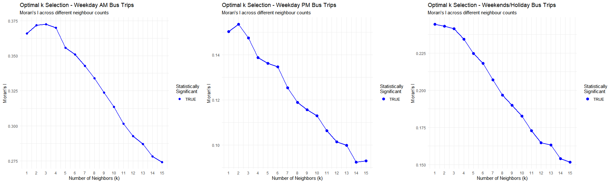

::: callout-important
Running the entire script takes approximately 45 minutes from start to finish.
:::

## Overview

### Background and Motivation

Urban mobility refers to the movement of people and goods across all transport modes within and between cities. With population growth and climate pressures, Cities are developing smart and sustainable transport systems to enhance accessibility and reduce carbon emissions.

During the progress, massive amounts of data are generated from technologies that track people using public transport such as buses, MRT, and roads from smart cards, GPS, and RFID systems. For instance, tap-on and tap-off data from smart cards capture trip flows from origins to destinations, and discounts are often offered for off-peak travel at the tap-off point.

### Methods & Objective

Using **Local Measures of Spatial Autocorrelation (LMSA)** and **Emerging Hot Spot Analysis (EHSA)** , this exercise aims to analyse bus trips generated by origin at the hexagon level during **three** peak periods:

-   weekday morning (6 am – 9 am),

-   weekday afternoon (5 pm – 8 pm),

-   weekend/holiday (11 am – 8 pm).

Through the progress, our goals are to identify specific locations where values are significantly clustered or dispersed, and to reveal how hot and cold spots evolve over time. We hope to discover emerging travel trends for more responsive transport planning.

## Loading Packages in to R

There are **six** packages used in this exercise. `add more package, spdep`, "

|  |  |
|---------------------------|---------------------------------------------|
| **Package** | **Description** |
| [sf](https://r-spatial.github.io/sf/) | Handles importing, managing, and processing vector-based geospatial data |
| [tidyverse](https://www.tidyverse.org/) | A collection of R packages for data wrangling and visualisation, including **readr**, **dplyr**, and **ggplot2**. |
| [tmap](https://r-tmap.github.io/tmap/) | Creates cartographic quality static and interactive thematic (choropleth) maps. |
| [knitr](https://cran.r-project.org/web/packages/knitr/index.html/) | Provides an elegant, flexible, and fast static table generation with R |
| [kableExtra](https://cran.r-project.org/web/packages/kableExtra/vignettes/awesome_table_in_html.html) | An extension of knitr for creating elegant html table with R |
| [DT](https://rstudio.github.io/DT/) | Provides an R interface to the JavaScript library DataTables for create interactive htnl tables. |
| [rvest](https://rvest.tidyverse.org/) | Scrapes or harvests data from web pages. |
| [sfdep](https://sfdep.josiahparry.com/) | Puilt on **spdep** package, provides a tidyverse-friendly interface with list-columns and additional functionality, more importantly including functions to analyse spatial temporal data. |
| \[corrplot\]((https://cran.r-project.org/web/packages/corrplot/vignettes/corrplot-intro.htm) | Provides a powerful and flexible tool for visualising correlation matrices. |
| [GGally](https://ggobi.github.io/ggally/reference/ggcorr.html) | An collection of functions for creating various plots |
| [Kendall](https://rdrr.io/cran/Kendall/) | Computes the Mann-Kendall trend test |
| [Plotly](https://plotly.com/r/getting-started/) | Creates interactive praphs |
| [ggpubr](https://rpkgs.datanovia.com/ggpubr/) | Provides elegant data visualisation based on 'ggplot2' |

: {tbl-colwidths="\[15,85\]"}

The code chunk below loads the required package into R.

```{r}
pacman::p_load(tidyverse, sf, sfdep, tmap, knitr, kableExtra, DT, rvest, sfdep, GGally, corrplot, Kendall ,spdep,plotly, ggpubr)
```

## Getting the Data into R environment

| Data Set | Decription | Format |
|-------------------|----------------------------------|-------------------|
| MasterPlan2019SubzoneBoundaryNoSeaKML | The lateset Singapore boundary data in 2019, that we explored in Hands-on Ex 1-2 and in-class Ex01. | KML |
| BusStop | Quarterly updated bus stop locations from [LTADataMall](https://datamall.lta.gov.sg/content/datamall/en/static-data.html). The version is issued in Aug 2025. | SHP |
| origin_destination_bus_202508 | The Passenger Volume by Origin–Destination Bus Stops dataset was downloaded from LTA DataMall via API.The file contains monthly trip flow counts per bus stop per hour. The version used in this study is August 2025. For reference, see the [LTA DataMall API User Guide](https://datamall.lta.gov.sg/content/dam/datamall/datasets/LTA_DataMall_API_User_Guide.pdf). | CSV |

### Importing the Geospatial Ploygon Data: Master Plan 2019 Subzone

The code chunk below imports **Master Plan 2019 Subzone Boundary (No Sea)** from Singapore’s open data portal.

```{r}
mpsz <- st_read("data/geospatial/MasterPlan2019SubzoneBoundaryNoSeaKML.kml")
```

The code chunk below shows how to process a KML file. We first define a function, `extract_kml_field()`, to extract values from the HTML description, then apply it to the KML using `map_chr()` from the **purrr** package to map the extracted values as character columns. The same method can also be used with other data formats such as GML or GeoJSON. More details can be found in [hands-on Ex01-2](https://isss626-ypan.netlify.app/hands-on_ex/hands-on_ex01_2/hands-on_ex01_2).

```{r}
extract_kml_field <- function(html_text, field_name) {
  # return NA if missing or empty
  if (is.na(html_text) || html_text == "") return(NA_character_)
  
  page <- read_html(html_text)          #parse the HTML string 
  rows <- page %>% html_elements("tr")  #get all table rows <tr>
  
  value <- rows %>%
    keep(~ html_text2(html_element(.x, "th")) == field_name) %>% #keep row where <th> table header text = field_name
    html_element("td") %>%                                       #take its <td> table data
    html_text2()                                                 #extract clean text
  
  if (length(value) == 0) NA_character_ else value        #return NA if no match, otherwise the value
}
```

```{r}
mpsz <- mpsz %>%
  mutate(
     #for each description string, call the function, It returns a length-1 character per row (or NA)
    REGION_N = map_chr(Description, extract_kml_field, "REGION_N"),
    PLN_AREA_N = map_chr(Description, extract_kml_field, "PLN_AREA_N"),
    SUBZONE_N = map_chr(Description, extract_kml_field, "SUBZONE_N"),
    SUBZONE_C = map_chr(Description, extract_kml_field, "SUBZONE_C")
  ) %>%
  select(-Name, -Description) %>% #drop the raw KML attributes
  relocate(geometry, .after = last_col()) #move the geometry column to the end
```

For Singapore spatial data, **EPSG:3414 (SVY21)** is the standard projected Coordinate Reference System (CRS). It measures in metres instead of degrees and is suitable for distance-based spatial analysis. Since the EPSG is missing, we assign the correct projected CRS 3414 to the `sf` object.

```{r}
class(mpsz)
mpsz <- st_transform(mpsz, 3414)
st_crs(mpsz)
```

The code chunk here saves the object for further use.

```{r}
write_rds(mpsz, "data/rds/mpsz.rds")

```

We also import the pre-processed data as `mpsz_pop25` from coursework *In-Class Exercise 01*, where we combine the Subzone Master Plan (Version 2019) with the latest dataset **“Singapore Residents by Planning Area/Subzone, Age Group, Sex and Type of Dwelling, June 2025”** downloaded from the [SingStat](https://www.singstat.gov.sg/) homepage. This is for exploratory data analysis later, where we conduct a correlation test between peak bus trip origin and two demographic indicators: **dependency ratio** and **economic activity ratio (EAR)**. The dependency ratio is calculated as the population aged 65 and above divided by the population under 65. Please see more details [here](https://isss626-ypan.netlify.app/in-class_ex/in-class_ex01/in-class_ex01).

```{r}
mpsz_pop25<-read_rds("data/rds/mpsz_pop2025.rds")
```

The code chunk below calculates the `EAR` as the population aged 25–64 divided by the total population and assigns a value of 0 to missing entries, as some subzones have no registered residents.

```{r}
mpsz_pop25 <- mpsz_pop25 %>%
  mutate(`ECONOMY ACTIVE` = ifelse(is.na(`ECONOMY ACTIVE`), 0, `ECONOMY ACTIVE`))%>%
  mutate(`EAR` = ifelse(is.na(`TOTAL`), 0, `ECONOMY ACTIVE`/ `TOTAL` ))%>%
  mutate(DEPENDENCY = ifelse(is.na(DEPENDENCY), 0, DEPENDENCY)) %>%
  mutate(EAR = ifelse(is.na(EAR), 0, EAR))
```

### Importing the Geospatial Point Data: Bus Stop Locations

The code chunk below imports *BusStop* Locations in shapefile format nto R environment. The file is last updated in Augest 2025 and downloaded from LTA DataMall.

```{r}
BusStop <- st_read(dsn = "data/LTADataMall",
                   layer = "BusStop") %>%
  st_transform(crs = 3414)
```

#### Visualisation of the Bus Stop Distribution in Singapore

Here we plot the bus stops in Singapore to see the distribution of their locations using `plot()` from base R.

```{r}
plot(st_geometry(mpsz))
plot(st_geometry(BusStop), add = TRUE, cex = 0.5, col ="blue")
```

Using the **tmap** package in interactive mode helps us quickly spot **five** bus stops located outside of Singapore that are located in the transit hub in New Bahru. However, we turn off the interactive mode to save data bandwidth, as more interactive mapping will be performed later.

```{r}
#tmap_mode("plot")
tm_shape(mpsz) +
  tm_polygons() +
tm_shape(BusStop) +
  tm_dots() +
tm_view(set_zoom_limits = c(11,14))
```

```{r}
tmap_mode("plot")
```

#### Extracting Bus Stops Located within Singapore

Since there are a few points located outside the Singapore boundary, the code chunk below uses [`st_join()`](https://r-spatial.github.io/sf/reference/st_join.html) to select all bus stops within Singapore.

```{r}
BusStop_SG <- st_join(
  BusStop, mpsz,
  join = st_within, # or st_intersects etc
  left = FALSE) # inner-join
```

::: callout-caution
1.  If we encounter an error message such as `st_crs(x) != st_crs(y)` when excuting `st_join`, it indicates that the coordinate reference systems (CRS) of the two objects are not the same. In such cases, we should assign the correct and consistent CRS EPSG:3414 before performing the `st_join()`. Here we assigned CRS in the previous step. Both `st_transform()` and `st_set_crs()` can be used to apply the appropriate CRS.

2.  we could use `st_join()` to perform a join on two `sf` objects that contain geometry information.

The difference between argument `join = st_within` and `st_intersects` is:

-   `st_within(a, b)` returns features from `a` that are **entirely inside** features from `b`.
-   `st_intersects(a, b)` returns features from `a` that **touch or overlap** features from `b`.

We use `st_within` since we strictly want only the bus stops inside of Singapore.

3.  For two regular (non-spatial) `tibble` or `data.frame` objects, we use `*_join()` functions from **dplyr** (e.g. `left_join()`, `inner_join()`) to perform relational joins based on matching keys.
:::

The **5** bus stops outside of Singapore are excluded.

```{r}
nrow(BusStop) - nrow(BusStop_SG)
```

```{r}
#tmap_mode("plot")
tm_shape(mpsz) +
  tm_polygons() +
  tm_shape(BusStop_SG) +
  tm_dots()+
  tm_view(set_zoom_limits = c(11,14))
```

```{r}
tmap_mode("plot")
```

#### Removing Duplicates in Bus Stops

We notice here are 18 bus stops that appear twice in the bus stop locations dataset.

```{r}
sum(duplicated(BusStop_SG$BUS_STOP_N))
```

They share similar names and located close to each other,probably temporary or replacement stops.

```{r}
dp_busstops <-BusStop_SG %>%
  group_by(BUS_STOP_N) %>%
  filter(n()> 1) %>%
  arrange(BUS_STOP_N)
kable(head(dp_busstops,6))
```

The code chunk below removes these duplicates in bus stop locations.

```{r}
BusStop_in_SG <- BusStop_SG %>%
  distinct(BUS_STOP_N, .keep_all = TRUE)
```

Next, we double-check that the points have been correctly filtered to include only those within Singapore.

```{r}
nrow(BusStop_in_SG) -length(unique(BusStop_SG$BUS_STOP_N))  # total rows - unique bus stops
```

```{r}
write_rds(BusStop_in_SG,"data/rds/BusStop_in_SG.rds")
```

Here we also plot the bus stop map.

```{r}
#| code-fold: true
#| code-summary: "CODE"
#tmap_mode("plot")
tm_shape(mpsz) +
  tm_polygons() +
  tm_shape(BusStop_in_SG) +
  tm_dots()+
  tm_view(set_zoom_limits = c(11,14))
```

#### Creating the Analytical Hexagons (Grid)

As mentioned, we want to build a hexagonal grid that overlays bus network in Singpoare. (Apte *et al*, 2013) The reason is that the hexagon grid makes irregular zones regular and contiguous, which helps reduce spatial bias.

We use [`st_make_grid()`](https://r-spatial.github.io/sf/reference/st_make_grid.html) from **sf** package to cover the island.

The argument `cellsize` for hexagonal cells requires the distance between opposite edges. So for this analysis, we should use `750`, since the perpendicular distance is 375m. 375 m is about a 3–5 minute walking distance or one bus-stop distance in Singapore.

```{r}
hexagon <- st_make_grid(mpsz,
                        cellsize = 750,  ## attention 375m required for take-home ex.
                        what = "polygon",
                        square = FALSE) %>%
  st_sf()                                ## this st_* function doesn't return sf data.frame, we need to specifically coerce the file to sf object.

```

The code chunk below visualises the hexagon grid with bus stop in Singapore.

```{r}
#| code-fold: true
#| code-summary: "CODE"
tm_shape(hexagon) +
  tm_fill(col = "white", title = "Hexagons") +
  tm_borders(alpha = 0.5) +
  tm_layout(main.title = "Analytical Hexagon Layer Overplot on Singapore",
            main.title.position = "center",
            main.title.size = 1.0,
            legend.height = 0.35, 
            legend.width = 0.35,
            frame = TRUE) +
  tm_compass(type="8star", size = 2, bg.color = "white", bg.alpha = 0.5) +
  tm_scale_bar(bg.color = "white", bg.alpha = 0.5) +
  tm_shape(mpsz) +
  tm_fill("green", title = "Singapore Boundary", alpha = 0.5) +
  tm_shape(BusStop_in_SG) +
  tm_dots(col = "red", size = 0.005, title = "Bus Stops")
```

#### Cropping hexagons with bus stops

There are many hexagons that do not contain any bus stops, which are not useful since we want to study the origin of bus trips, thus only hexagons with bus stops should be included.

To achieve this, we first filter the hexagons using a spatial intersection with the busstop points using `st_intersection()` from the **sf** package. `st_intersection()` returns the geometric overlap (catchment), while `st_intersects()` returns a logical relation (TRUE/FALSE). After filtering, the hexagon count is reduced from 4,524 to 924. Since there might be more than one bus stops, the output of `st_intersects()` will be stored int the list.`lengths()` from base R operates on `list` and returns the number of bus stops that touch or overlap the hexagon.

```{r}
hexagon$busstop_count =  #create a new column to store the count
  lengths(st_intersects(hexagon, BusStop_in_SG)) 
```

The code chunk below filters the hexagons with bus stop(s).

```{r}
hexagon <- filter(hexagon, busstop_count >0)
```

The visualastion below confirms only the hexagon with bus stops retained.

```{r}
#| code-fold: true
#| code-summary: "CODE"

tm_shape(mpsz) + tm_fill("green",fill_alpha =0.6) +
tm_shape(hexagon) +tm_fill(col = "white", title = "Hexagons") + tm_borders("gray60") +
tm_shape(BusStop_in_SG) + tm_dots("black",  size = 0.1,shape = 19, title = "Bus Stops") + 
tm_compass(type = "8star", size = 2) +
  tm_scalebar() +
  tm_grid(lwd = 0.1, alpha = 0.2) +
  tm_credits("Source: data.gov.sg & LTADataMall",
            position = c("right", "bottom")) +
tm_title("Analytical hexagon layer overplot on Singapore", size = 1)
```

#### Assigning IDs to each hexagon

Here we have a quick look the hexagon dataset.

```{r}
kable(head(hexagon)) %>%
  kable_styling(font_size = 24)
```

The code chunk below removes the unwanted column and generates a set of 4-digit HEX_ID strings along with leading zero, then converts them from character to factor (ID) type using as.factor().

```{r}
#hexagon <- hexagon %>%
  #select(, -busstop_count)  #- to drop the column

hexagon$HEX_ID <- sprintf(
  "H%04d", seq_len(nrow(hexagon))) %>%  #4d is to accommodate the hexagon number
  as.factor()  #ordinal scale

kable(head(hexagon))
```

The code chunk below shows the distribution of the hexagon layer that four hexgons are isolated at east side of Singapore.

```{r}
tm_shape(hexagon) +
  tm_fill("HEX_ID")
```

```{r}
write_rds(hexagon, "data/rds/hexagon.rds")
```

### Importing the Attribute Data: Bus Trips

The code chunk below imports *Passenger Volume by Origin Destination Bus Stops* downloaded from LTA DataMall into R environment. The data contains the monthly bus trips occurred in Augest 2025.

```{r}
odbus <- read_csv("data/LTADataMall/origin_destination_bus_202508.csv")
```

There are totally 5,876,969 records in the data set. Columns like `YEAR_MONTH` and `DESTINATION_PT_CODE` are not required for this study. `DAY_TYPE` includes **"WEEKDAY"** and **"weekend/HOLIDAY"**, while `TIME_PER_HOUR` represents hourly intervals from **0:00 (midnight)** to **23:00**, corresponding to each hour of the day.

```{r}
summary(odbus)
```

#### Cleaning Trip Generation Data

The code chunk below creates a new `tbl_df` object called `trips` which excludes the two columns `YEAR_MONTH` and `DESTINATION_PT_CODE` and renames the columns from `odbus`.

```{r}
# select the variables
trips <- odbus %>%
  select (c(ORIGIN_PT_CODE, DAY_TYPE, TIME_PER_HOUR, TOTAL_TRIPS)) %>%
  rename(BUS_STOP_N = ORIGIN_PT_CODE) %>%  # easier when performing join later
  rename(HOUR_OF_DAY= TIME_PER_HOUR) %>%
  rename(TRIPS = TOTAL_TRIPS) #easy interpretation
```

`The BUS_STOP_N` (bus stop code of the trip origin) is converted to a factor, as it serves as a unique identifier and allows easier grouping using `group_by()` later.

```{r}
trips$BUS_STOP_N <- as.factor(trips$BUS_STOP_N)
kable(head(trips))
```

#### Populating Hexagon IDs into *BusStop* and *trips* Data Frame

Next, we combine the `hexagon`, `BusStop`, and `trips` datasets.

This code creates a look-up table linking each bus stop `BUS_STOP_N` to the hexagon that it belongs to `HEX_ID`.

```{r}
bs_hex <- st_join(
  BusStop_in_SG, hexagon) %>%
  st_drop_geometry() %>%
  select(c(BUS_STOP_N, HEX_ID))

bs_hex$BUS_STOP_N <- as.factor(bs_hex$BUS_STOP_N)
kable(head(bs_hex))
```

```{r}
write_rds(bs_hex, "data/rds/bs_hex.rds")
```

The code chunk below shows that we have 5148 bus stop names in `trips` and `5149` in `bs_hex`.

```{r}
n_distinct(trips$BUS_STOP_N)
n_distinct(bs_hex$BUS_STOP_N)
```

The code chunk below extracts all the bus stop codes in `trips` not found in `bs_hex`, that accounts for 151 bus stops in `trips` but not found in bus stop location dataset.

```{r}

trips %>%
  filter(!(BUS_STOP_N %in% bs_hex$BUS_STOP_N)) %>%
  distinct(BUS_STOP_N) %>%
  nrow()
```

```{r}
bs_hex_list <- bs_hex %>%
  group_by(BUS_STOP_N) %>%
  summarise(HEX_IDS = list(unique(HEX_ID)))
```

The code chunk below merges the `HEX_ID` into `trips`. Due the unmatched bus stops in `trips`, we now have 5,783,137 rows in `trips`, 93832 less.

```{r}
trips<- inner_join(trips, bs_hex)
nrow(odbus) -nrow(trips)
kable(head(trips))
```

```{r}
sum(is.na(trips$HEX_ID))
```

Additionally, the number of hexagon cells was reduced from 924 to 824, since the 10 hexagons are these where bus stops locate but had no trip records.

For example, bus stops **0000 (Changi Airport)** and **00000 (Changi Bay)** from the *Bus Stop Locations* dataset have no passenger tap-on data. Therefore, their corresponding hex cell **HEX_ID 834** was excluded after the join.

```{r}
length(unique(trips$HEX_ID))
length(unique(bs_hex$HEX_ID))
nrow(trips)
```

Here are these 10 hexagons.

```{r}
bs_hex %>%
  filter(!(HEX_ID %in% trips$HEX_ID)) %>%
  distinct(HEX_ID) %>%
  arrange(HEX_ID) %>%
  kable()
```

```{r}
sum(is.na(trips))
```

## Data Wrangling

### Aggregating the Trips

The code chunk below groups trip volume by **HEX_ID, DATE_TYPE, and HOUR_OF_DAY**.

```{r}
trips_wide <- trips%>%
  group_by(
    HEX_ID,
    DAY_TYPE,
    HOUR_OF_DAY) %>%
  summarise(TRIPS = sum(TRIPS)) %>%
  ungroup() %>%
  pivot_wider(names_from = HOUR_OF_DAY,
              values_from = TRIPS)

trips_wide[is.na(trips_wide)] <- 0  #assign 0 to cells with missing value
  
colnames(trips_wide)
```

```{r}
sum(is.na(trips_wide))
```

### Filtering Peak Periods for GMSA & LMSA

The code chunk below adds up the trip volume per Hexagon for **three** peak periods and creates three new columns:

-   weekday morning (6 am – 9 am) as "WEEKDAY_AM"

-   weekday afternoon (5 pm – 8 pm) as "WEEKDAY_PM"

-   weekend/holiday (11 am – 8 pm) as "WEEKEND"

```{r}
peak_trips <- trips_wide %>%
  mutate(
    WEEKDAY_AM = if_else(
      DAY_TYPE == "WEEKDAY",
      rowSums(.[3:5], na.rm = TRUE), #remove NAs before calculation
      NA_real_                 #missing value should be numeric
    ),
    WEEKDAY_PM = if_else(
      DAY_TYPE == "WEEKDAY",
      rowSums(.[14:16], na.rm = TRUE),
      NA_real_
    ),
    WEEKEND = if_else(
      DAY_TYPE == "WEEKENDS/HOLIDAY",
      rowSums(.[8:16], na.rm = TRUE),
      NA_real_)) %>%
  select(HEX_ID, WEEKDAY_AM, WEEKDAY_PM, WEEKEND) %>%
  group_by(HEX_ID) %>%
  summarise(
    WEEKDAY_AM = sum(WEEKDAY_AM, na.rm = TRUE),
    WEEKDAY_PM = sum(WEEKDAY_PM, na.rm = TRUE),
    WEEKEND = sum(WEEKEND, na.rm = TRUE)
  )
 
```

We have a quick overview on the newly created `peak_trips` data.

```{r}
kable(head(peak_trips, 10))
```

The code chunk below saves `peak_trips` and load it back to system.

```{r}
write_rds(peak_trips, "data/rds/peak_trips.rds")
```

```{r}
peak_trips <- read_rds("data/rds/peak_trips.rds")
```

The code chunk below joins the two data sets by `HEX_ID`, converts the `tibble data.frame` to `sf data.frame` and saves the file for further spatial analysis.

```{r}
peak_hex <- left_join(hexagon,peak_trips) %>%
  st_as_sf()
```

Since we knew there are 10 hexagon

```{r}
peak_hex %>%
  filter(!(HEX_ID %in% peak_trips$HEX_ID)) %>%
  distinct(HEX_ID) %>%
   arrange(HEX_ID) %>%
  kable()
```

```{r}
peak_hex[is.na(peak_hex)] <- 0
sum(is.na(peak_hex))
```

```{r}
write_rds(peak_hex, "data/rds/peak_hex.rds")
```

```{r}
peak_hex <- read_rds("data/rds/peak_hex.rds")
```

The code chunk below extracts the peak trips for each study period.

```{r}
# 1. Weekday Morning Peak (6-9am)
weekday_am <- peak_hex %>%
  select(2,3,6)
# 2. Weekday Afternoon Peak (5-8pm)
weekday_pm <- peak_hex %>%
  select(2,4,6)
# 3. Weekend/Holiday Peak (11am-8pm)
weekend <- peak_hex %>%
  select(2,5,6)
```

```{r}
peak_hex_1 <- left_join(peak_trips,hexagon) %>%
  st_as_sf()
```

### Create Space-time Cube for EHSA

There are two ways to create spacetime objects using `as_spacetime()` or `spacetime()`. The first method transforms `sf` object that contains location IDs, time and geometry into a spacetime object.The second way create a space object from two separate objects one for geometry and another one for attribute data.

We use the latter approach with [`spacetime()`](https://sfdep.josiahparry.com/reference/spacetime) of **sfdep** to create an [**spatio-temporal cube**](https://sfdep.josiahparry.com/articles/spacetime-s3.html) and verifies the class using `is_spacetime_cube()`.

But before that step, we need to prepare for the transformation.

From the steps above, we notice that not every hexagon has trip records in `trips`. To create a space–time cube from a complete lattice that captures all hexagons and all time steps, we first generate a dummy time grid based on `HEX_ID` and `HOUR_OF_DAY`.

Next, we extract the weekday and weekend trip records from the grouped `trips` data by aggregating trip volumes by `HEX_ID`, `HOUR_OF_DAY`, and `DAY_TYPE`. Each of these aggregated tables is then **left-joined** with the corresponding time grid to ensure that hexagons with no trip records are included. The resulting tables are subsequently converted into **space–time cubes**.

Finally, we filter the cubes to retain only the required time periods for the subsequent EHSA analysis. EHSA requires multiple time steps to detect trends. We note that the number of time steps may be relatively short (t must include at least t and t-1 to perform the EHSA test). Therefore, we adopt a 5-hour window for weekdays (covering two 3-hour peak periods: 5–10 and 16–21) and an 11-hour window for weekends (10–21), each extending one hour before and after.

```{r}
# creating the time table
grid4st <- crossing(HEX_ID = hexagon$HEX_ID, HOUR_OF_DAY = 0:23) 
kable(head(grid4st, 10))
```

```{r}
# aggregating the trips table
trips_gp <- trips %>% 
  group_by(HEX_ID, HOUR_OF_DAY, DAY_TYPE) %>%
  summarise(TRIPS =sum(TRIPS))
kable(head(trips_gp,10))
```

```{r}
# extraction based on day type
trips_weekday <- trips_gp %>%
  filter(DAY_TYPE == "WEEKDAY") %>%
  ungroup() %>%
  select(, -DAY_TYPE)
kable(head(trips_weekday, 10))

trips_weekend <- trips_gp %>%
  filter(DAY_TYPE == "WEEKENDS/HOLIDAY") %>%
  ungroup() %>%
  select(, -DAY_TYPE)
kable(head(trips_weekend, 10))

nrow(bind_rows(trips_weekday, trips_weekend))
nrow(trips_gp)
```

```{r}
# adding the weekday trips to the container 
weekday4st <-left_join(grid4st, trips_weekday)
```

```{r}
# filled missing value with 0
weekday4st[is.na(weekday4st)] <- 0
kable(head(weekday4st, 10))
```

```{r}
# adding the weekdend trips to the container and handling the missing values
weekend4st <-left_join(grid4st, trips_weekend)
weekend4st[is.na(weekend4st)] <- 0
kable(head(weekend4st, 10))
```

```{r}
# building space-time cubes
weekday_st <- spacetime(weekday4st, hexagon, .loc_col = "HEX_ID", .time_col = "HOUR_OF_DAY")
is_spacetime_cube(weekday_st)
weekend_st <- spacetime(weekend4st, hexagon, .loc_col = "HEX_ID", .time_col = "HOUR_OF_DAY")
is_spacetime_cube(weekend_st)
```

```{r}
# saving the data
write_rds(weekday4st, "data/rds/weekday4st.rds")
write_rds(weekend4st, "data/rds/weekend4st.rds")
write_rds(weekday_st, "data/rds/weekday_st.rds")
write_rds(weekend_st, "data/rds/weekend_st.rds")
```

The code chunk below extracts the space-time cube for each peak period with extended window.

```{r}
# 1. Weekday Morning Peak (6-9am)
am_st <-weekday_st %>%
  filter(HOUR_OF_DAY %in% c(5:9))
# 2. Weekday Afternoon Peak (5-8pm) 
pm_st <-weekday_st %>%
  filter(HOUR_OF_DAY %in% c(16:20))
# 3. Weekend/Holiday Peak (11am-8pm)
wkd_st <-weekday_st %>%
  filter(HOUR_OF_DAY %in% c(10:20))
```

```{r}
# saving the data
write_rds(am_st, "data/rds/am_st.rds")
write_rds(pm_st, "data/rds/pm_st.rds")
write_rds(wkd_st, "data/rds/wkd_st.rds")
```

### Creating Peak Trips with Demographic Indicators

```{r}
hex_pop <- st_intersection(hexagon, mpsz_pop25) %>%
  mutate(overlap_area = st_area(.)) %>%
  group_by(HEX_ID) %>%
  summarise(DEPENDENCY = weighted.mean(DEPENDENCY, as.numeric(overlap_area), na.rm = TRUE),
           EAR = weighted.mean(EAR, as.numeric(overlap_area), na.rm = TRUE),
            .groups = 'drop') %>%
   left_join(
    hexagon %>% st_drop_geometry() %>% select(HEX_ID, busstop_count),
    by = "HEX_ID")
```

```{r}
peak_hex_pop <-left_join(hex_pop,peak_trips)
  
```

### Creating Hexagon Reference Table

We created a reference table to lookup HEX_IDs and their corresponding Subzones or Planning Areas, which can be used to explain spatial patterns observed throughout the study.

```{r}
peak_hex_with_subzone <- peak_hex %>%
  st_intersection(mpsz %>% select(SUBZONE_N)) %>%
  mutate(overlap_area = st_area(.)) %>%
  group_by(HEX_ID) %>%
  arrange(desc(overlap_area)) %>%
  slice(1) %>%  # Keep the subzone with largest overlap
  ungroup() %>%
  select(-overlap_area)
```

```{r}
write_rds(peak_hex_with_subzone, "data/rds/peak_hex_with_subzone.rds")
```

### The interactive Trips Data Frame

The code chunk below generates an interactive data table for `peak_trips` that we can search for the trip volume by `HEX_ID`. We did not use the \``trips` dataset as it contains too many records, which significantly slows down the loading of the interactive table.

```{r}
htmltools::div(              # creates a html wrapper to style the table
                             # sets font-size, 80% of page width, auto margin to center the table
  style = "font-size: 18px; width: 80%; margin: auto;",
                             # makes an interactive table ((search, sort, paginate))
  DT::datatable(             
    peak_trips,
    options = list(          # JavaScript options
      pageLength = 10,       # shows 10 rows per page
      scrollY = 300,         # gives the table a 500px-tall scrollable view port
      scrollX = TRUE         # enables horizontal scrolling
    ),
    class = "stripe hover compact"  #tightens spacing
  )
)
```

The table below is used to search for hexagon locations.

```{r}
htmltools::div(              # creates a html wrapper to style the table
                             # sets font-size, 80% of page width, auto margin to center the table
  style = "font-size: 18px; width: 80%; margin: auto;",
                             # makes an interactive table ((search, sort, paginate))
  DT::datatable(             
    peak_hex_pop,
    options = list(          # JavaScript options
      pageLength = 10,       # shows 10 rows per page
      scrollY = 300,         # gives the table a 500px-tall scrollable view port
      scrollX = TRUE         # enables horizontal scrolling
    ),
    class = "stripe hover compact"  #tightens spacing
  )
)

```

## Exploratory Data Analysis

Here we examine the hourly trip distribution for weekdays and weekend, then apply **box maps** and **percentile maps** to identify outliers and the top 1% extreme values on the map based on aggregated origination trip volumes during peak periods.

### Hourly Distribution For Weekdays and weekend

The plot below shows weekday origination volumes by hour. Trips begin around **5am**, surge sharply to a **7am** peak, ease after **9am**, then climb again from **4pm** to an evening peak comparable to 7am. Volumes reduce after **8pm**, with trips ending at midnight.

```{r}
weekday4st %>%
  ggplot(aes(x = factor(HOUR_OF_DAY), y = TRIPS)) +
  geom_col(fill = "skyblue") +
  scale_y_continuous(labels = scales::comma_format()) +
  labs(title = "Trip Distribution Across Weekday Hours")
```

The plot below shows weekend origination volumes by hour. Trips begin around **5am**, rise steadily to a midday peak near **noon**, stay relatively high until about **8pm**, and then decline gradually, with trips ending around midnight.

```{r}
weekend4st %>%
  ggplot(aes(x = factor(HOUR_OF_DAY), y = TRIPS)) +
  geom_col(fill = "skyblue") +
  labs(title = "Trip Distribution Across Weekend Hours")
```

The interactive chart below compares hourly trip distributions between weekdays and weekends. Weekday trips exhibit two distinct peaks at around 7 AM and 6 PM, both exceeding 8 million trips. During the peak periods, trip volumes decline in between, forming a smaller midday hump around 1 PM, which likely corresponds to lunch-hour travel.

In contrast, weekend trips display a much flatter pattern,peaked between 12 PM and 6 PM with hourly volumes of about 2 million trips.

These patterns likely correspond to commuting activities on weekdays, while weekend/holiday mobility is characterised by more evenly distributed leisure and personal travel throughout the day.

```{r}
# Combine all hourly data
combined_data <- bind_rows(
  weekday4st %>% group_by(HOUR_OF_DAY) %>% summarise(total_trips = sum(TRIPS)) %>% mutate(day_type = "Weekday"),
  weekend4st %>% group_by(HOUR_OF_DAY) %>% summarise(total_trips = sum(TRIPS)) %>% mutate(day_type = "Weekend")
)

cb<-ggplot(combined_data, aes(x = HOUR_OF_DAY, y = total_trips, color = day_type)) +
  geom_line(size = 1) +
  geom_point(size = 1.5) +
  scale_color_manual(values = c("Weekday" = "lightcoral", "Weekend" = "skyblue")) +
  scale_y_continuous(
    labels = scales::comma_format(),  # Use regular numbers instead of scientific notation
    breaks = scales::pretty_breaks()  # Better break points
  ) +
  scale_x_continuous(breaks = 0:23) +  # Show all hours
  labs(
    title = "Trip Distribution: Weekday vs Weekend",
    x = "Hour of Day",
    y = "Total Trips",
    color = "Day Type"
  ) +
  theme_minimal()

ggplotly(cb)
```

### Histogram for Aggragated Peak Trip Volumes

The code chunk creates figures for the distribution of trip volumes during Weekday Morning, Weekday Afternoon, and Weekend Peak periods. We observe that all histograms show right-skewed patterns. ESRI suggests if the variable is skewed, features should have about **eight** neighbours each.

```{r, fig.width=15, fig.height=5}

w1<-weekday_am %>%
  ggplot(aes(x = WEEKDAY_AM)) +
  geom_histogram(bins = 30,fill = "skyblue") +
  scale_x_continuous(labels = scales::comma_format()) +
  labs(title = "Peak Weekday Morning Volumes Across the Nation")


w2<-weekday_pm %>%
  ggplot(aes(x = WEEKDAY_PM)) +
  geom_histogram(bins = 30,fill = "skyblue") +
  scale_x_continuous(labels = scales::comma_format()) +
  labs(title = "Peak Weekday Morning Volumes Across the Nation")

w3<-weekend %>%
  ggplot(aes(x = WEEKEND)) +
  geom_histogram(bins = 30,fill = "skyblue") +
  scale_x_continuous(labels = scales::comma_format()) +
  labs(title = "Peak Weekend/Holiday Volumes Across the Nation")

ggpubr::ggarrange(w1, w2, w3, ncol = 3, nrow = 1)
```

### Correlation Matrix for Peak Periods

The code chunk below generates a correlation matrix for aggregated trip volumes, weekday morning (6–9 am), weekday afternoon (5–8 pm), and weekend peak (11 am–8 pm). Overall, the results show strong correlations among all peak periods. In particular, weekday afternoon and weekend trips are strongly correlated (*r = 0.94*), which suggests highly similar travel patterns. Additionally, bus stop counts show a moderate association with the weekday morning peak (*r = 0.59*).

```{r}
corrplot(cor(st_drop_geometry(peak_hex[,c(1,3:5)])),
  diag = FALSE,        # hide diagonal values
  order = "AOE",       # angular order of eigenvectors
  tl.pos = "td",       # label position (top-diagonal)
  tl.cex = 0.5,        # label size
  method = "number",   # display numbers instead of circles
  type = "upper")       # show only upper triangle 
```

The correlation matrix indicates that the demographic distribution variables, such as the dependency ratio and economically active ratio (EAR), show weak associations with trip-origin volumes. This finding warrants further analysis to identify the underlying factors influencing spatial variations in travel demand.

```{r}
corrplot(
  cor(st_drop_geometry(peak_hex_pop[, c(2:3, 5:8)]), use = "complete.obs"),
  diag = FALSE,        # hide diagonal values
  order = "AOE",       # angular order of eigenvectors
  tl.pos = "td",       # label position (top-diagonal)
  tl.cex = 0.5,        # label size
  method = "number",   # display numbers instead of circles
  type = "upper")       # show only upper triangle
```

### Box Map for Aggergated Trip Volumes During Peak Period

A quartile map divides trip volume into four equal classes based on its frequency.

The **box map** extends the **quartile map** by adding upper and lower outlier categories, defined using the interquartile range (IQR). Values greater than **Q3 + 1.5 × IQR** or less than **Q1 − 1.5 × IQR** are classified as **outliers**. That helps us spot the areas that beyond the quartile range.

The code chunk checks that there are no missing trip records in all 3 peak periods for each hexagon.

```{r}
peak_hex <- peak_hex %>%
  drop_na()
```

```{r}
sum(is.na(peak_hex))
sum(is.na(peak_hex))
sum(is.na(peak_hex))
```

The code chunk below creates functions to plot a box map for selected variable in the data frame, which we learnt from *In-class Ex01*. Please see more details [here](https://isss626-ypan.netlify.app/in-class_ex/in-class_ex01/in-class_ex01).

```{r}
#| code-fold: true
#| code-summary: "CODE"
boxbreaks <- function(v,mult=1.5) {
  qv <- unname(quantile(v))
  iqr <- qv[4] - qv[2]
  upfence <- qv[4] + mult * iqr
  lofence <- qv[2] - mult * iqr
  # initialize break points vector
  bb <- vector(mode="numeric",length=7)
  # logic for lower and upper fences
  if (lofence < qv[1]) {  # no lower outliers
    bb[1] <- lofence
    bb[2] <- floor(qv[1])
  } else {
    bb[2] <- lofence
    bb[1] <- qv[1]
  }
  if (upfence > qv[5]) { # no upper outliers
    bb[7] <- upfence
    bb[6] <- ceiling(qv[5])
  } else {
    bb[6] <- upfence
    bb[7] <- qv[5]
  }
  bb[3:5] <- qv[2:4]
  return(bb)
}


get.var <- function(vname,df) {
  v <- df[vname] %>% st_set_geometry(NULL)
  v <- unname(v[,1])
  return(v)
}

boxmap <- function(vnam, df, 
                   legtitle=NA,
                   mtitle="Box Map",
                   mult=1.5){
  var <- get.var(vnam,df)
  var <- as.vector(unlist(var))
  bb <- boxbreaks(var)
  tm_shape(mpsz) +
  tm_fill("gray",fill_alpha =0.5) +
  tm_shape(df) +
        tm_fill(vnam,
        fill.scale = tm_scale(
        breaks = bb,
        values = "-brewer.rd_bu",         
        value.na = NA,            
        labels = c("lower outlier", 
                     "< 25%", 
                     "25% - 50%", 
                     "50% - 75%",
                     "> 75%", 
                     "upper outlier")),
      fill.legend = tm_legend(
      title = "TRIPS",
      position = tm_pos_in("left", "bottom"),
        na.show = FALSE)) +
    tm_borders() +
    tm_title(mtitle) +
    tm_compass(type="8star", size = 2) +
    tm_scalebar() +
    tm_grid(alpha =0.2) +
    tm_credits("Source: data.gov.sg & LTADataMall",
            position = c("right", "bottom"))
}
```

```{r, fig.height=6, fig.width=8}
b1<- boxmap("WEEKDAY_AM", peak_hex,mtitle = "Box Map(Weekday Morning Peak)")
b2<- boxmap("WEEKDAY_PM", peak_hex,mtitle = "Box Map(Weekday Evening Peak)")
b3<- boxmap("WEEKEND", peak_hex,mtitle = "Box Map(Weekend/holiday Peak)")
```

### Percentile Map Aggergated Trip Volumes During Peak Period

The percentile map highlights extreme origination trip volumes using six percentile classes **(0–1%, 1–10%, 10–50%, 50–90%, 90–99%, 99–100%)**, derived via `quantile(c(0,.01,.1,.5,.9,.99,1))`.

The code chunk below creates functions to plot a percentile map for selected variable in the data frame.

```{r}
#| code-fold: true
#| code-summary: "CODE"
get.var <- function(vname, df) {
  v <- df[vname] %>% 
    st_set_geometry(NULL)
  v <- unname(v[,1])
  return(v)
}

percentmap <- function(vnam, df, legtitle = NA, mtitle = "Percentile Map") {
  percent <- c(0, .01, .1, .5, .9, .99, 1)
  var <- get.var(vnam, df)
  var <- as.vector(unlist(var))
  bperc <- quantile(var, percent, na.rm = TRUE)
  bperc <- bperc + seq_along(bperc) * 1e-10
  
  tm_shape(mpsz) +
    tm_fill("gray", fill_alpha = 0.5) +
    tm_shape(df) +
    tm_fill(vnam,
            fill.scale = tm_scale(
              breaks =   bperc,
              values = "-brewer.rd_bu",
              labels = c("<1%", "1–10%", "10–50%", "50–90%", "90–99%", ">99%")),
            fill.legend = tm_legend(
              title = legtitle,
              na.show = FALSE,
              position =tm_pos_in("left", "bottom"))) +
    tm_borders() +
    tm_title(mtitle) +
    tm_compass(type = "8star", size = 2) +
    tm_scalebar() +
    tm_grid(alpha = 0.2) +
    tm_credits("Source: data.gov.sg & LTADataMall",
               position = c("right", "bottom"))
}
```

The code chunk below plots percentile map for the three peak periods.

```{r, fig.height=6, fig.width=8}
p1<-percentmap("WEEKDAY_AM", peak_hex,mtitle = "Percentiles Map(Weekday Morning Peak)")
p2<-percentmap("WEEKDAY_PM", peak_hex_1,mtitle = "Percentiles Map(Weekday Evening Peak)")
p3<-percentmap("WEEKEND", peak_hex_1,mtitle = "Percentiles Map(Weekend/holiday Peak)")
```

```{r}
quantile(peak_hex$WEEKDAY_AM, probs = c(0.99, 1))
```

**Interpretation**

Across all peak periods, aggravated frequency begins above 99% in the [Heartland](https://curiocity.nlb.gov.sg/story-maps/heartland/) cores (National Library Board Singapore,2025), spills over to surrounding areas, and diminishes below 1% toward coastal edges such as Marine Parade, and Lim Chu Kang. This spatial gradient effect reflects a centre-to-edge diffusion pattern for urban mobility across Singapore.

In Singapore, “heartland” refers to the suburban neighbourhoods with HDB estates, local markets community facilities. That is outside of the central business districts, such as Downtown Core, Orchard, or Marina Bay.

::: panel-tabset
#### Weekday Morning Peak

**Pattern:** Hotspots emerge from the western and Heartland cores (99%) and gradually diffuse toward outer areas (90%), before dissipating at the edges (1%).

-   **Above 99% (Core Hotspots):** Pioneer (Joo Koon)(possible High-Low outlier), Jurong West, Clementi, Ang Mo Kio, Toa Payoh, Tampines, Woodlands
-   **Around 90% (Expanding Zone):** Bukit Panjang, Jurong East, Choa Chu Kang, Sembawang (Central), Yishun, Hougang, Geylang
-   **Below 1% (Edge Dissipation):** Marina South, Marine Parade, Bedok (Siglap), Lim Chu Kang

```{r, fig.height=8, fig.width=18}
tmap_arrange(b1,p1, ncol =2)
```

#### Weekday Afternoon Peak

**Pattern:** Frequency shifts slightly to east and central region. Trip volumes again radiate outward from the 99% core to the 1% peripheral areas.

-   **Above 99% (Core Hotspots):** Jurong West, Clementi, Ang Mo Kio, Serangoon, Toa Payoh, Bedok (North), Tampines, Punggol, Woodlands
-   **Around 90% (Transitional Zone):** Rochor, Downtown Core, Bukit Merah, Queenstown, Bukit Timah, Bukit Panjang, Choa Chu Kang, Sembawang, Yishun, Sengkang, Bedok
-   **Below 1% (Peripheral Cooling):** Marina South, Marine Parade, Bedok (Siglap), Lim Chu Kang

```{r, fig.height=8, fig.width=18}
tmap_arrange(b2,p2, ncol =2)
```

#### Weekend/Holiday Peak

**Pattern:** The pattern seems silimiar with the evening trend, with sustained high activity across major residential zones and cooling along the fringes.

-   **Above 99% (Core Hotspots):** Jurong West, Clementi, Ang Mo Kio, Serangoon, Toa Payoh, Bedok, Tampines, Punggol
-   **Around 90% (Spill-over Zone):** Rochor, Downtown Core, Bukit Merah, Bukit Timah, Bukit Panjang, Choa Chu Kang, Sembawang, Yishun, Sengkang, Bedok, Changi
-   **Below 1% (Edge Cooling):** Tuas, Marine Parade, Paya Lebar, Sembawang (Peripheral), Lim Chu Kang

```{r, fig.height=8, fig.width=18}
tmap_arrange(b3,p3, ncol =2)
```
:::

### Animated Percentile Map for Hourly Weekday and Weekend Volumes

The code chunk below creates animated percentile maps for weekday and weekend hourly trip volumes, allowing us to visualise the flow movements before proceeding to the spatial autocorrelation analysis.

```{r}
sum(is.na(weekday4st[["TRIPS"]]))
sum(is.na(weekend4st[["TRIPS"]]))
```

```{r}
#| code-fold: true
#| code-summary: "CODE"
get.var <- function(vname, df) {
  v <- df[vname] %>% 
    st_set_geometry(NULL)
  v <- unname(v[,1])
  return(v)
}

percentmap_animated <- function(vnam, df, legtitle = NA, mtitle = "Percentile Map", filename = "animated.gif") {
  # Calculate percentile breaks using the parameters
  percent <- c(0, .01, .1, .5, .9, .99, 1)
  var <- get.var(vnam, df)  # Use vnam parameter
  var <- as.vector(unlist(var))
  bperc <- quantile(var, percent, na.rm = TRUE)
  bperc <- bperc + seq_along(bperc) * 1e-10 #jitter 

  animated_map <- tm_shape(mpsz) +
    tm_fill("gray", fill_alpha = 0.5) +
    tm_shape(df) +  
    tm_fill(vnam,   
            fill.scale = tm_scale(
              breaks = bperc,
              values = "-RdBu",         
              value.na = NA,
              labels = c("<1%", "1–10%", "10–50%", "50–90%", "90–99%", ">99%")),
            fill.legend = tm_legend(
              title = legtitle,
              na.show = FALSE)) +
    tm_borders() +
    tm_compass(type = "8star", size = 2) +
    tm_scalebar() +
    tm_grid(alpha = 0.2) +
    tm_credits("Source: data.gov.sg & LTADataMall",
              position = c("right", "bottom")) +
    tm_animate(frames = "HOUR_OF_DAY", fps = 1, play = "loop") +
    tm_layout(main.title = mtitle)  
  
  full_path <- file.path("img", filename)  
  # Create the animation
  tmap_animation(animated_map,
                 filename = full_path,
                 width = 1000, 
                 height = 600)
}
```

The code chunk below first adds geometry information to the `weekday4st` and `weekend4st` `tibble` data frames by joining them with the `hexagon` `sf` object. We then call the previously created `percentmap_animated()` function to plot and save the animated **GIF** files for each dataset.

```{r}
weekday4st.sf <- left_join(hexagon,weekday4st)
```

```{r}
percentmap_animated("TRIPS", weekday4st.sf, 
           legtitle = "Weekday Trip Percentiles",
           mtitle = "Percentiles Map (Weekday Hourly Data)",
           filename = "weekday_hourly.gif")
```

```{r}
weekend4st.sf <- left_join(hexagon,weekend4st)
percentmap_animated("TRIPS", weekend4st.sf,
           legtitle = "Weekend Trip Percentiles",
           mtitle = "Percentiles Map (Weekend/Holiday Hourly Data)", 
           filename = "weekend_hourly.gif")
```

**Interpretation**:

We observe a spill-over or wave-like effect spreading from the above-mentioned 1% high-frequency areas toward the outer edges.

::: panel-tabset
#### Weekday Trips


#### Weekend Trips


:::

## Global Measures of Spatial Association (GMSA)

As Tobler’s First Law of Geography says, everything is related to everything else, but near things are more related than distant things.” Through **GMSA**, we aim to find out if there is any spatial association within the origination of bus trip frequency. If it is confirmed (even if it is not confirmed, we can still proceed, since many times the truth will unfold upon further investigation, similarly, the spatial autocorrelation might not appear at the global level but may exist at a more local stage), we will further examine and find out where the clusters are through **LMSA**. Ideally, we could also categorise the clusters with the help of **Emerging Hotspot Analysis (EHSA)**. We use confidence level of 95% (or significant level 5%) trhoughtout this study.

First let's perform the Global Measures of Spatial Association.

The **null hypothesis** for GMSA is that bus trips during peak hours are **randomly distributed** across the island.

To answer that, we compute the global spatial autocorrelation statistics (global Moran’s I and Geary’s C) and perform spatial randomness tests over **100** simulations,by passing `nsim = 99` argument in the test functions.

If the p-value \>= 0.05, we conclude it is spatial randomness. If p-value \< 0.05, null hypothesis is rejected, this indicates evidence of spatial clustering.

The global Moran’s I and Geary’s C statistics are inversely related measures.

| Pattern                                | Results                   |
|----------------------------------------|---------------------------|
| *C* approaches 0 and *I* approaches 1  | clustered (similarity)    |
| *C* approaches 3 and *I* approaches −1 | Dispersed (dissimilarity) |

C approaches 0 and I approaches 1 when similar values are clustered. C approaches 3 and I approaches -1 when dissimilar values tend to cluster. High values of C measures correspond to low values of I.

### Computing Spatial Weights Matrix: sfdep method

#### Neighbourhood Selection

Contiguity-based spatial weights are commonly used to establish neighbourhood relationships when spatial units (e.g., polygons or hexagons) share a boundary or a vertex. There are two types of contiguity: Rook, which requires shared edges, and Queen, which is more inclusive and considers both shared edges and corners.

Since this study examines peak-hour bus trip generation at the origin level, a contiguity-based method is appropriate as an initial approach, as it assesses whether nearby areas exhibit similar trip-origin intensities and patterns without imposing an artificial distance threshold. However, we observe four isolated hexagons (approximately 0.5% of all observations) located near Changi Airport in eastern Singapore. We tried the solution from [Stack Overflow](https://stackoverflow.com/questions/57269254/how-to-impute-missing-neighbours-of-a-spatial-weight-matrix-queen-contiguity), but it could not resolve the missing neighbor issue. Therefore, we consider using distance-based weighting schemes.

THere are two options for distance based neighborhood, we can either consider **fixed distance** using [`st_dist_band()`](https://sfdep.josiahparry.com/reference/st_dist_band) of **sfdep** package or **K-Nearest Neighbours (kNN)** using [`st_knn()`](https://sfdep.josiahparry.com/reference/st_knn.html?q=st_knn#null) of **sfdep**.

By default, **fixed distance** method creates a distance band with the maximum distance of k-nearest neighbours where k = 1 to ensure that all features are connected while the **KNN** method find k number of nearest neighbours.

Further in a fixed-distance weights matrix, dense areas typically have many neighbours, while edge areas have few. This leads to uneven spatial smoothing, as local relationships vary by feature density. In contrast, the K-NN approach produces an adaptive spatial structure (in distance), that ensures each region has the k number of neighbours, regardless of its spatial location.

We notice there are two disconnected regions after applied the fixed distance method as the output below. Thus, we better focus on KNN method.

```{r}
wm_fd <- peak_hex%>%
  mutate(nb = st_dist_band(peak_hex$geometry),
         wt = st_inverse_distance(nb, geometry, scale = 1, alpha = 1),
         wt = map(wt, ~ .x / sum(.x)), #row-standardisation
         .before = 1)
wm_fd$nb
```

#### The selection of *k*

Before moving forward, it is necessary to identify an optimal k that balances spatial connectivity and local relevance. To determine this value, we computed Global Moran’s I statistics across a range of k values (from 1 to 15) using the [`global_moran_test()`](https://sfdep.josiahparry.com/reference/global_moran_test.html) function from **sfdep**. (ESRI, 2025) The “optimal” k corresponds to the point where Moran’s I either peaks or stabilises, which means a reasonable level of spatial dependence without over-smoothing the neighbourhood structure.

```{r}
#| eval: false
#| code-fold: true
#| code-summary: "CODE"
# Analyze AM Peak 
k_values <- 1:15
moran_am <- numeric(15)  # Create empty vector for 15 results
p_am <- numeric(15)

# Calculate Moran's I for each k value
for (k in 1:15) {
  nb <- st_knn(peak_hex$geometry, k = k)
  wt<- st_inverse_distance(nb, peak_hex$geometry, scale = 1, alpha = 1)
  wt<- map(wt, ~ .x / sum(.x))
  
  moran_result <- global_moran_test(peak_hex$WEEKDAY_AM, nb, wt)
  moran_am[k] <- moran_result$estimate[1]
  p_am[k] <- moran_result$estimate[2]
  
}

# Create results table
k_results_am <- data.frame(
  k = 1:15,
  moran_i = moran_am,
  p_value = p_am
)

i1<- ggplot(k_results_am, aes(k, moran_i)) +
  geom_line(color = "blue", linewidth = 1) +
  geom_point(aes(color = p_value < 0.05), size =2) +  #ensure it is statistically signficant
  scale_color_manual(values = c("FALSE" = "red", "TRUE" = "blue"),
                     name = "Statistically\nSignificant") +
  labs(title = "Optimal k Selection - Weekday AM Bus Trips",
       subtitle = "Moran's I across different neighbour counts",
       x = "Number of Neighbors (k)",
       y = "Moran's I") +
  scale_x_continuous(breaks = 1:15) +
  theme_minimal()


```

```{r}
#| eval: false
#| code-fold: true
#| code-summary: "CODE"
# Analyze PM Peak 
k_values <- 1:15
moran_pm <- numeric(15)  # Create empty vector for 15 results
p_pm <- numeric(15)

# Calculate Moran's I for each k value
for (k in 1:15) {
  nb <- st_knn(peak_hex$geometry, k = k)
  wt <- st_weights(nb)
  moran_result <- global_moran_test(peak_hex$WEEKDAY_PM, nb, wt)
  moran_pm[k] <- moran_result$estimate[1]
  p_pm[k] <- moran_result$estimate[2]
  
}

# Create results table
k_results_pm <- data.frame(
  k = 1:15,
  moran_i = moran_pm,
  p_value = p_pm
)

i2<-ggplot(k_results_pm, aes(k, moran_i)) +
  geom_line(color = "blue", linewidth = 1) +
  geom_point(aes(color = p_value < 0.05), size = 3) +
  scale_color_manual(values = c("FALSE" = "red", "TRUE" = "blue"),
                     name = "Statistically\nSignificant") +
  labs(title = "Optimal k Selection - Weekday PM Bus Trips",
       subtitle = "Moran's I across different neighbour counts",
       x = "Number of Neighbors (k)",
       y = "Moran's I") +
  scale_x_continuous(breaks = 1:15) +
  theme_minimal()
```

```{r}
#| eval: false
#| code-fold: true
#| code-summary: "CODE"
# Analyze weekend Peak 
k_values <- 1:15
moran_wkd <- numeric(15)  # Create empty vector for 15 results
p_wkd <- numeric(15)

# Calculate Moran's I for each k value
for (k in 1:15) {
  nb <- st_knn(peak_hex$geometry, k = k)
  wt <- st_weights(nb)
  moran_result <- global_moran_test(peak_hex$WEEKEND, nb, wt)
  moran_wkd[k] <- moran_result$estimate[1]
  p_wkd[k] <- moran_result$estimate[2]

}

# Create results table
k_results_wkd <- data.frame(
  k = 1:15,
  moran_i = moran_wkd,
  p_value = p_wkd
)

i3<-ggplot(k_results_wkd, aes(k, moran_i)) +
  geom_line(color = "blue", linewidth = 1) +
  geom_point(aes(color = p_value < 0.05), size = 3) +
  scale_color_manual(values = c("FALSE" = "red", "TRUE" = "blue"),
                     name = "Statistically\nSignificant") +
  labs(title = "Optimal k Selection - weekend/Holiday Bus Trips",
       subtitle = "Moran's I across different neighbour counts",
       x = "Number of Neighbors (k)",
       y = "Moran's I") +
  scale_x_continuous(breaks = 1:15) +
  theme_minimal()
```

The code chunk below shows how the statistically significant Global Moran’s I varies as the amount of neighbours k increases from 1 to 15.

```{r, fig.width=20, fig.height = 6}
#| eval: false
ggarrange(i1,i2,i3,ncol = 3) # image size is large
```



Early EDA confirmed that trip volumes during all peak periods are right-skewed.

Based on the Global Moran’s I results, the first local peaks occur at k = 2 or k = 3, followed by additional peaks at k = 6, 8, 10, and 12. According to ESRI’s best-practice recommendation, when the attribute values are skewed, each feature should have at least one neighbour and, on average about eight neighbours to achieve stable spatial relationships.

To determine the suitable k, we create connectivity maps for k = 3, 6, 8, 10, and 12.

The code chunk below derives a coordinate matrix from the `peak_hex` which is used to plot the spatial connectivity map.

```{r}
coords <- st_coordinates(st_centroid(peak_hex))

```

The code chunk below plots the spatial connectivity maps for k in 3, 6, 8 , 10 and 12.

After visually comparing these connectivity maps and Spatial Correlograms Moran's I in the later section, however, in this study, increasing k beyond six did not improve spatial coherence and instead introduced unnecessary smoothing. Therefore, k = 6 was adopted consistently across weekday AM, weekday PM, and weekend analyses to preserve local spatial relationships and comparability. We also tested k = 8 as a robustness check given skewness, but it did not materially change results.

```{r}
for (k in c(3,6,8,10,12)) {
  nb <- st_knn(peak_hex$geometry, k = k)
  
  plot(peak_hex$geometry,
     main=paste("Connectivity map — k =", k))
  plot(nb,
     coords=coords,
     pch = 19,
     cex = 0.6,
     add = TRUE,
     col= "red")
}
```

#### Creating Spatial Weights Matrix

To further explain the construction of the weight matrix, we select **inverse distance** method for distance weights using [`st_inverse_distance()`](https://sfdep.josiahparry.com/reference/st_inverse_distance.html?q=st_inverse#null) of **sfdep** package.

The **inverse distance** method models explicit distance decay, that closer neighbours contribute more, farther neighbours less. We then apply the row standardisation by scaling the weights so that the sum of all neighbour weights equals 1 for each hexagon. This ensures that the overall influence of each feature remains comparable, even when the number or distance of neighbours varies across the study area. It is confirmed that the average neighbour count is 6 for all regions.

```{r}
wm_knn <- peak_hex%>%
  mutate(nb = st_knn(peak_hex$geometry, k = 6),
         wt = st_inverse_distance(nb, geometry, scale = 1, alpha = 1),
         wt = map(wt, ~ .x / sum(.x)), #row-standardisation
         .before = 1)
table(lengths(wm_knn$nb))
```

### Global Moran’s I

Global Moran’s I measures how the features differ from the values in the study area as a whole,from -1 to 1, similar with Persons’r (correlation coefficient). The Moran’s I statistics could be conducted by using functions from **sfdep** package.

There are three levels of Global Moran’s I available:

1.  we could use [`global_moran()`](https://sfdep.josiahparry.com/reference/global_moran) function to compute computes the Global Moran’s I index directly and returns a tibble-style data frame (different from the list output in the spdep package).

2.  [`global_moran_test()`](https://sfdep.josiahparry.com/reference/global_moran_test.html) can perform a hypothesis test of Moran’s I under randomisation. As we seen previously, it returns test statistics, expected value, variance, and p-value.

3.  Further, we could use [`global_moran_perm()`](https://sfdep.josiahparry.com/reference/global_moran_perm.html) to conduct Monte Carlo permutation test to assess the significance of Moran’s I against complete spatial randomness.

In this study, we use the `global_moran_perm()` for a more robust inference with 100 simulation.

::: panel-tabset
#### Weekday Morning Peak

[`global_moran_perm()`](https://sfdep.josiahparry.com/reference/global_moran_perm.html) is used to perform 100 Monte Carlo simulations.

```{r}
set.seed(1234)
```

```{r}
wamiperm <- global_moran_perm(wm_knn$WEEKDAY_AM,
                  wm_knn$nb,
                  wm_knn$wt,
                  nsim = 99) #100 simulations since the it starts with 0.

wamiperm
summary(wamiperm[["res"]])
```

The code chunk below uses `hist()` and `abline()` of R Graphic to visualise the simulated Moran’s I test in detail.

```{r}
hist(wamiperm$res,freq = TRUE, breaks = 20,
     xlab = "Simulated Moran's I (KNN=6, Weekday Morning Peak)")
abline(v = 0, col = "red") # v is to set x value for vertical line
```

The histogram above shows the observed Moran’s I lies far to the right of the simulated mean, that means significant positive spatial clustering during the weekday morning peak.

#### Weekday Afternoon Peak

[`global_moran_perm()`](https://sfdep.josiahparry.com/reference/global_moran_perm.html) is used to perform 100 Monte Carlo simulations.

```{r}
set.seed(1234)
```

```{r}
wpmiperm <- global_moran_perm(wm_knn$WEEKDAY_PM,
                  wm_knn$nb,
                  wm_knn$wt,
                  nsim = 99) #100 simulations since the it starts with 0.

wpmiperm
summary(wpmiperm[["res"]])
```

The code chunk below uses hist() and abline() of R Graphic to visualise the simulated Moran’s I test in detail.

```{r}
hist(wpmiperm$res,freq = TRUE, breaks = 20,
     xlab = "Simulated Moran's I (KNN=6, Weekday Afternoon Peak)")
abline(v = 0, col = "red") # v is to set x value for vertical line
```

The histogram above shows the observed Moran’s I lies far to the right of the simulated mean, that means significant positive spatial clustering during the weekday peak peak.

#### weekend/Holiday Peak

[`global_moran_perm()`](https://sfdep.josiahparry.com/reference/global_moran_perm.html) is used to perform 100 Monte Carlo simulations.

```{r}
set.seed(1234)
```

```{r}
wkdiperm <- global_moran_perm(wm_knn$WEEKEND,
                  wm_knn$nb,
                  wm_knn$wt,
                  nsim = 99) #100 simulations since the it starts with 0.

wkdiperm
summary(wkdiperm[["res"]])
wkdiperm$parameter
```

The code chunk below uses hist() and abline() of R Graphic to visualise the simulated Moran’s I test in detail.

```{r}
hist(wkdiperm$res,freq = TRUE, breaks = 20,
     xlab = "Simulated Moran's I (KNN=6, Weekend Peak)")
abline(v = 0, col = "red") # v is to set x value for vertical line
```

The histogram above shows the observed Moran’s I lies far to the right of the simulated mean, that means significant positive spatial clustering during the weekend/holiday peak.
:::

#### Statistical Conclusion

**Interpretation Rule:**

| Global Moran's I value | Description           |
|------------------------|-----------------------|
| positive (I\>0)        | Clustered.            |
| approximately zero     | Randomly Distributed. |
| negative (I\<0)        | Dispersed.            |

The Global Moran's I analysis reveals:

```{r}
#|code-fold: true
#|code-summary: "CODE"
peak_period <- c("WEEKDAY_AM", "WEEKDAY_PM", "WEEKEND")
moran_objects <- list(wamiperm, wpmiperm, wkdiperm)


moran_I <- numeric(3)
p_value <- numeric(3)

# Extract statistics
for (i in 1:3) {
  moran_I[i] <- round(moran_objects[[i]]$statistic,4) 
  p_value[i] <- format(moran_objects[[i]]$p.value,scientific = TRUE) 
}

# Create results dataframe
moran_results <- data.frame(
  peak_period = peak_period,
  moran_i = moran_I,
  p_value = p_value
)
```

```{r}
kable(moran_results)
```

The summary table shows the global moran'I statistics are all positive and p-value amproxmaity 0, which are less than significant level 0.05. At the 95% confidence level, we **reject** the null hypothesis of spatial randomness and conclude that there is statistically significant similarity clustering in the distribution of trip volumes during weekday morning, afternoon, and weekend peak periods.

### Global Geary’s C

Geary’s C measure the feature difference between neigbhours and examine the local dissimilarity, valued from 0 to infinite. Both Moran’s I and Geary’s C exclude self-comparison (wii = 0).

Similar to Global Moran’s I, there are three levels of Global Geary’s C test available: [`global_c()`](https://sfdep.josiahparry.com/reference/global_c), [`global_c_test()`](https://sfdep.josiahparry.com/reference/global_c_test), [`global_c_perm()`](https://sfdep.josiahparry.com/reference/global_c_perm) from **sfdep** package.

In this section, `global_c_perm()`is used to conduct permutation test for Geary’s C with 100 simulation.

::: panel-tabset
#### Weekday Morning Peak

[`global_c_perm()`](https://sfdep.josiahparry.com/reference/global_c_perm) from **sfdep** package is used to conduct permutation test for Geary’s C with 100 simulation.

```{r}
set.seed(1234)
wamcperm <- global_c_perm(wm_knn$WEEKDAY_AM,
                  wm_knn$nb,
                  wm_knn$wt,
                  nsim = 99)
wamcperm
```

Next we use the function [`hist()`](https://www.rdocumentation.org/packages/graphics/versions/3.6.2/topics/hist) and [`abline()`](https://www.rdocumentation.org/packages/graphics/versions/3.6.2/topics/abline) to visualise Monte Carlo Geary's C.

```{r}
hist(wamcperm$res, freq = TRUE, breaks = 20, 
     xlab = "Simulated Geary's C (KNN=6, Weekday Morning Peak)")
abline(v =1 , col = "red")
```

The Greay's C hsitrogram confirms with Moran's I that significant clustering during the weekday morning peak.

#### Weekday Afternoon Peak

[`global_c_perm()`](https://sfdep.josiahparry.com/reference/global_c_perm) from **sfdep** package is used to conduct permutation test for Geary’s C with 100 simulation. Zero policy is enabled.

```{r}
set.seed(1234)
wpmcperm <- global_c_perm(wm_knn$WEEKDAY_PM,
                  wm_knn$nb,
                  wm_knn$wt,
                  nsim = 99)
wpmcperm
```

Next we use the function [`hist()`](https://www.rdocumentation.org/packages/graphics/versions/3.6.2/topics/hist) and [`abline()`](https://www.rdocumentation.org/packages/graphics/versions/3.6.2/topics/abline) to visualise Monte Carlo Geary's C.

```{r}
hist(wpmcperm$res, freq = TRUE, breaks = 20, 
     xlab = "Simulated Geary's C (KNN=6, Weekday Afternoon Peak)")
abline(v =1 , col = "red")
```

The Greay's C hsitrogram confirms with Moran's I that significant clustering during the weekday Afternoon peak.

#### weekend/Holiday Peak

[`global_c_perm()`](https://sfdep.josiahparry.com/reference/global_c_perm) from **sfdep** package is used to conduct permutation test for Geary’s C with 100 simulation. Zero policy is enabled.

```{r}
set.seed(1234)
wkdcperm <- global_c_perm(wm_knn$WEEKEND,
                  wm_knn$nb,
                  wm_knn$wt,
                  nsim = 99)
wkdcperm
```

Next we use the function [`hist()`](https://www.rdocumentation.org/packages/graphics/versions/3.6.2/topics/hist) and [`abline()`](https://www.rdocumentation.org/packages/graphics/versions/3.6.2/topics/abline) to visualise Monte Carlo Geary's C.

```{r}
hist(wkdcperm$res, freq = TRUE, breaks = 20, 
     xlab = "Simulated Geary's C (KNN=6, Weekend Peak)")
abline(v =1 , col = "red")
```

The Greay's C histogram confirms with Moran's I that significant clustering during the weekend/holiday peak.
:::

#### Statistical Interpretation

The Global Geary's C analysis reveals:

```{r}
#|code-fold: true
#|code-summary: "CODE"
peak_period <- c("WEEKDAY_AM", "WEEKDAY_PM", "WEEKEND")
geary_objects <- list(wamcperm, wpmcperm, wkdcperm)


geary_c <- numeric(3)
p_value <- numeric(3)

# Extract statistics
for (i in 1:3) {
  geary_c[i] <- round(geary_objects[[i]]$statistic,4) 
  p_value[i] <- round(geary_objects[[i]]$p.value, 4) 
}

# Create results dataframe
geary_results <- data.frame(
  peak_period = peak_period,
  geary_c = geary_c,
  p_value = p_value
)
```

```{r}
kable(geary_results)
```

**Interpretation Rule:**

| Global Geary’s C value | Description                |
|------------------------|----------------------------|
| C\< 1                  | clustering (similarity)    |
| C= 1                   | randomness                 |
| C\> 1                  | dispersion (dissimilarity) |

The summary table shows the global Geary’s C statistics are all less than 1 and p-value 0.01 which are less than significant level 0.05. At the 95% confidence level, we **reject** the null hypothesis of spatial randomness and conclude that there is statistically significant similarity clustering in the distribution of trip volumes during weekday morning, afternoon, and weekend peak periods.

### Spatial Correlograms

Here we explore patterns of spatial autocorrelation in data or model residuals using spatial correlograms. We can see correlation changes as distance increases(lag).

::: panel-tabset
#### Weekday Morning Peak

##### Computing and Plotting Moran’s I correlogram

The code chunk below uses [`sp.correlogram()`](https://r-spatial.github.io/spdep/reference/sp.correlogram.html) of **spdep** package to compute a 15-lag spatial correlogram of trip volumes and use `plot()` of base Graph to visualise the output.

```{r}

MI_corr_wam <- sp.correlogram(wm_knn$nb,      # nb object
                          wm_knn$WEEKDAY_AM,  # numeric vector
                          order = 15,    # maximum lag order
                          method = "I", # Moran's I
                          style = "W")
plot(MI_corr_wam)
```

##### Computing and Plotting Geary’s C correlogram

Next we use [`sp.correlogram()`](https://r-spatial.github.io/spdep/reference/sp.correlogram.html) of **spdep** package to compute 6-lag spatial correlogram with Geary'C and draw chart using `plot()`.

```{r}
GC_corr_wam <- sp.correlogram(wm_knn$nb,          # nb
                          wm_knn$WEEKDAY_AM,   # vector
                          order = 15,     # lags
                          method = "C",  #Geary's C
                          style = "W")   # row-standardised
plot(GC_corr_wam)
```

#### Weekday Afternoon Peak

##### Computing and Plotting Moran’s I correlogram

The code chunk below uses [`sp.correlogram()`](https://r-spatial.github.io/spdep/reference/sp.correlogram.html) of **spdep** package to compute a 15-lag spatial correlogram of trip volumes and use `plot()` of base Graph to visualise the output.

```{r}
MI_corr_wpm <- sp.correlogram(wm_knn$nb,      # nb object
                          wm_knn$WEEKDAY_PM,  # numeric vector
                          order = 15,    # maximum lag order
                          method = "I", # Moran's I
                          style = "W"  #row-standardised
                         )
plot(MI_corr_wpm)
```

##### Computing and Plotting Geary’s C correlogram

Next we use [`sp.correlogram()`](https://r-spatial.github.io/spdep/reference/sp.correlogram.html) of **spdep** package to compute 6-lag spatial correlogram with Geary'C and draw chart using `plot()`. Zero policy is enabled.

```{r}
GC_corr_wpm <- sp.correlogram(wm_knn$nb,          # nb
                          weekday_pm$WEEKDAY_PM,   # vector
                          order = 15,     # lags
                          method = "C",  #Geary's C
                          style = "W")   # row-standardised
plot(GC_corr_wpm)
```

#### weekend/Holiday Peak

##### Computing and Plotting Moran’s I correlogram

The code chunk below uses [`sp.correlogram()`](https://r-spatial.github.io/spdep/reference/sp.correlogram.html) of **spdep** package to compute a 15-lag spatial correlogram of trip volumes and use `plot()` of base Graph to visualise the output.

```{r}
MI_corr_wkd <- sp.correlogram(wm_knn$nb,      # nb object
                          wm_knn$WEEKEND,  # numeric vector
                          order = 15,    # maximum lag order
                          method = "I", # Moran's I
                          style = "W"  #row-standardised
                          )
plot(MI_corr_wkd)
```

##### Computing and Plotting Geary’s C correlogram

Next we use [`sp.correlogram()`](https://r-spatial.github.io/spdep/reference/sp.correlogram.html) of **spdep** package to compute 15-lag spatial correlogram with Geary'C and draw chart using `plot()`.

```{r}
GC_corr_wkd <- sp.correlogram(wm_knn$nb,          # nb
                          wm_knn$WEEKEND,   # vector
                          order = 15,     # lags
                          method = "C",  #Geary's C
                          style = "W")   # row-standardised
plot(GC_corr_wkd)
```
:::

::: callout-note
The Moran’s I and Geary’s C spatial correlograms show that the first peak occurs sometime around lag 3, but it is relatively short-lived. Significant spatial autocorrelation decays by approximately the sixth neighbour across all time periods. This justifies selecting k = 6 for the k-nearest neighbour weights to capture local spatial structure while avoiding over-smoothing.
:::

## Local Measures of Spatial Autocorrelation (LMSA)

Similarity clustering is detected through **Global Measures of Spatial Autocorrelation (GMSA)**. In this section, we apply **Local Measures of Spatial Autocorrelation (LMSA)** to identify specific locations where values are significantly clustered.

Unlike global measures that summarise the overall spatial pattern across the entire study area, LMSA evaluates each individual location to detect hotspots (clusters of high values), cold spots (clusters of low values), and spatial outliers where local patterns differ from their surroundings.

## LISA & Local Moran's I

LISA map is a categorical map showing outliers and clusters through combining local Moran’s I of geographical areas and their respective p-values.

The **null hypothesis** is there is no local spatial autocorrelation.

If p-value is less than 0.05, we should reject the null hypothesis that there is local spatial autocorrelation.

-   When there is significant **positive** (I), that means similarity where high values cluster near high values (High–High), or low near low (Low–Low).

-   When there is significant **negative** (I), that means dissimilarity that high values surrounded by low values (High–Low outlier) or vice versa (Low–High outlier).

[`local_moran()`](https://sfdep.josiahparry.com/reference/local_moran.html) of **sfdep** package is used to compute Local Moran’s I of Bus Trips volumes during peak periods. The function allows Monte Carlo permutation by passing on argument `nsim= 99` that represents 100 simulations.

There are a few columns that will be generated by `local_moran()`:

-   `ii`: the local Moran’s I statistics for each region

-   `e.ii`: expected value of ii under spatial randomness

-   `var.ii`: the variance of local moran statistic under null model

-   `z.ii`:the standard deviate of local moran statistic (z-value)

-   `p.ii`: the p-value of local moran statistic

-   `p_ii_sim`: p-value from randomisation (Monte Carlo simulations)

-   `p_folded_sim`: p-value from k-folded simulations (more conservative, treats extreme values both tails), from pysal (python’s equivalent ESDA).

-   `skewness, kurtosis`: diagnostics for the distribution of simulated ii values (shape compared to normal)

-   `mean, median,pysal`: mean, median, quandrant classifications based on comparing the region’s value to the value of neighbours, in the format of self - neighbours, e.g., “High-High”.

### Computing & Visualising Local Moran’s I

#### Weekday Morning Peak

The code chunk below calculates Local Moran’s I of Bus Trips by using [`local_moran()`](https://sfdep.josiahparry.com/reference/local_moran.html) of **sfdep** package.

The `local_moran()` function returns a matrix of values. We use `unnest()` to expand it into separate columns so they can be accessed directly in the nearly created `lisa_x` `sf` object.

```{r}
set.seed(1234)
lisa_wam <- wm_knn %>% 
  mutate(local_moran = local_moran(
    WEEKDAY_AM, nb, wt, nsim = 99),
         .before = 1) %>%
  unnest(local_moran)
```

```{r}
kable(head(lisa_wam))
```

In this code chunk below, **tmap** functions are used prepare two choropleth maps by using value in the `ii` field and `p_ii_sim` field side by side. For p-values, the classification is set as 0.001, 0.01, 0.05 and not significant instead of using default classification scheme.

```{r, fig.width=14, fig.height=8}
tmap_mode("plot")

ii.map_wam <-tm_shape(mpsz) +
  tm_fill("gray", fill_alpha = 0.5) +
tm_shape(lisa_wam) +
  tm_fill("ii",
    fill.scale = tm_scale_intervals(
      style = "pretty",
      n = 5,
      values = "-brewer.RdBu",
      midpoint = NA),
    fill.legend = tm_legend(
      title = "Local Moran's I",
      position = tm_pos_in("left", "bottom"))) +
  tm_borders(fill_alpha = 0.5) + 
  tm_title("Local Moran's I of Bus Trips \nWeekday Morning Peak (KNN method)") +
  tm_compass(type = "8star", size = 2) +
  tm_scalebar() +
  tm_grid(alpha = 0.2) +
  tm_credits("Source: data.gov.sg & LTADataMall",
             position = c("right", "bottom"))
 
p_ii_sim.map_wam <- tm_shape(mpsz) +
  tm_fill("gray", fill_alpha = 0.5) +
tm_shape(lisa_wam) +
  tm_fill("p_ii_sim",
      fill.scale = tm_scale_intervals(
      breaks = c(0, 0.001, 0.01, 0.05, 1),
      labels = c("<0.001","0.001-0.01", "0.01-0.05", "Insignificant >0.05"),
      values = "-turbo"),
      fill.legend = tm_legend(
      title = "p-value",
      position = tm_pos_in("left", "bottom"))) +
  tm_borders(fill_alpha = 0.5) + 
  tm_title("p-values of Loal Moran's I of Bus Trips \nWeekday Morning Peak (KNN method)")+
  tm_options(legend.na.show = FALSE) +
  tm_compass(type = "8star", size = 2) +
  tm_scalebar() +
  tm_grid(alpha = 0.2) +
  tm_credits("Source: data.gov.sg & LTADataMall",
             position = c("right", "bottom"))

```

#### Weekday Afternoon Peak

We repeat the same analytical steps by first deriving the Local Moran’s I of bus trip volumes using the [`local_moran()`](https://sfdep.josiahparry.com/reference/local_moran.html) of **sfdep** package.

```{r}
#KNN method
set.seed(1234)
lisa_wpm <- wm_knn %>% 
  mutate(local_moran = local_moran(
    WEEKDAY_PM, nb, wt, nsim = 99),
         .before = 1) %>%
  unnest(local_moran)
```

```{r}
kable(head(lisa_wpm))
```

In this code chunk below, **tmap** functions are used prepare two choropleth maps by using value in the `ii` field and `p_ii_sim` field side by side.

```{r, fig.width=14, fig.height=8}
tmap_mode("plot")

ii.map_wpm <-tm_shape(mpsz) +
  tm_fill("gray", fill_alpha = 0.5) +
tm_shape(lisa_wpm) +
  tm_fill("ii",
    fill.scale = tm_scale_intervals(
      style = "pretty",
      n = 5,
      values = "-brewer.RdBu",
      midpoint = NA),
    fill.legend = tm_legend(
      title = "Local Moran's I",
      position = tm_pos_in("left", "bottom"))) +
  tm_borders(fill_alpha = 0.5) + 
  tm_title("Local Moran's I of Bus Trips \nWeekday Afvo Peak (KNN method)") +
  tm_compass(type = "8star", size = 2) +
  tm_scalebar() +
  tm_grid(alpha = 0.2) +
  tm_credits("Source: data.gov.sg & LTADataMall",
             position = c("right", "bottom"))
 
p_ii_sim.map_wpm <- tm_shape(mpsz) +
  tm_fill("gray", fill_alpha = 0.5) +
tm_shape(lisa_wpm) +
  tm_fill("p_ii_sim",
      fill.scale = tm_scale_intervals(
      breaks = c(0, 0.001, 0.01, 0.05, 1),
      labels = c("<0.001","0.001-0.01", "0.01-0.05", "Insignificant >0.05"),
      values = "-turbo"),
      fill.legend = tm_legend(
      title = "p-value",
      position = tm_pos_in("left", "bottom"))) +
  tm_borders(fill_alpha = 0.5) + 
  tm_title("p-values of Loal Moran's I of Bus Trips \nWeekday Afvo Peak (KNN method)")+
  tm_options(legend.na.show = FALSE) +
  tm_compass(type = "8star", size = 2) +
  tm_scalebar() +
  tm_grid(alpha = 0.2) +
  tm_credits("Source: data.gov.sg & LTADataMall",
             position = c("right", "bottom"))


```

#### Weekend/Holiday Peak

The code chunk below calculates Local Moran’s I of Bus Trips by using [`local_moran()`](https://sfdep.josiahparry.com/reference/local_moran.html) of **sfdep** package.

```{r}
lisa_wkd <- wm_knn %>% 
  mutate(local_moran = local_moran(
    WEEKEND, nb, wt, nsim = 99),
         .before = 1) %>%
  unnest(local_moran)
```

```{r}
kable(head(lisa_wkd))
```

In this code chunk below, **tmap** functions are used prepare two choropleth maps by using value in the `ii` field and `p_ii_sim` field side by side.

```{r, fig.width=14, fig.height=8}
tmap_mode("plot")

ii.map_wkd <-tm_shape(mpsz) +
  tm_fill("gray", fill_alpha = 0.5) +
tm_shape(lisa_wkd) +
  tm_fill("ii",
    fill.scale = tm_scale_intervals(
      style = "pretty",
      n = 5,
      values = "-brewer.RdBu",
      midpoint = NA),
    fill.legend = tm_legend(
      title = "Local Moran's I",
      position = tm_pos_in("left", "bottom"))) +
  tm_borders(fill_alpha = 0.5) + 
  tm_title("Local Moran's I of Bus Trips \nweekend/Holiday Peak (KNN method)") +
  tm_compass(type = "8star", size = 2) +
  tm_scalebar() +
  tm_grid(alpha = 0.2) +
  tm_credits("Source: data.gov.sg & LTADataMall",
             position = c("right", "bottom"))
 
p_ii_sim.map_wkd <- tm_shape(mpsz) +
  tm_fill("gray", fill_alpha = 0.5) +
tm_shape(lisa_wkd) +
  tm_fill("p_ii_sim",
      fill.scale = tm_scale_intervals(
      breaks = c(0, 0.001, 0.01, 0.05, 1),
      labels = c("<0.001","0.001-0.01", "0.01-0.05", "Insignificant >0.05"),
      values = "-turbo"),
      fill.legend = tm_legend(
      title = "p-value",
      position = tm_pos_in("left", "bottom"))) +
  tm_borders(fill_alpha = 0.5) + 
  tm_title("p-values of Loal Moran's I of Bus Trips \nweekend/Holiday Peak (KNN method)")+
  tm_options(legend.na.show = FALSE) +
  tm_compass(type = "8star", size = 2) +
  tm_scalebar() +
  tm_grid(alpha = 0.2) +
  tm_credits("Source: data.gov.sg & LTADataMall",
             position = c("right", "bottom"))


```

### Visualising Local Moran’s I

::: panel-tabset
#### Weekday Morning Peak

```{r, fig.width=14, fig.height=8}
tmap_arrange(ii.map_wam, p_ii_sim.map_wam, asp=1, ncol=2)
```

#### Weekday Afternoon Peak

```{r, fig.width=14, fig.height=8}
tmap_arrange(ii.map_wpm, p_ii_sim.map_wpm, asp=1, ncol=2)
```

#### Weekend/Holiday Peak

```{r, fig.width=14, fig.height=8}
tmap_arrange(ii.map_wkd, p_ii_sim.map_wkd, asp=1, ncol=2)
```
:::

#### Interpretation

Based on the Local Moran’s I index and p-value maps, we observed that a large number of statistically significant areas are concentrated in the Heartland of the island (e.g., Woodlands, Yishun, Ang Mo Kio, Tampines, Jurong, Choa Chu Kang).

### Plotting Moran Scatterplot

#### Weekday Morning Peak

A Moran Scatterplot visualises spatial autocorrelation by plotting a variable against its spatial lag, with the slope representing Moran’s I and points indicating clusters or outliers.

The code chunk below uses [`st_lag()`](https://sfdep.josiahparry.com/reference/st_lag) of **sfdep** package to calculate the spatial lag variable for `lisa_wam$WEEKDAY_AM`.

```{r}

lisa_wam <- lisa_wam %>%
  mutate(lag_WEEKDAY_AM = st_lag(
    WEEKDAY_AM, nb, wt),
    .before = 1)%>%
  unnest(lag_WEEKDAY_AM)
```

Then code chunk plots the Moran Scatterplot of Trips by using ggplot.

The function [`as.vector()`](https://www.rdocumentation.org/packages/pbdDMAT/versions/0.5-1/topics/as.vector) goes around the `scale()` function, to ensure the output is converted to numeric vector from matrix.

```{r}
lisa_wam <- lisa_wam %>%
  mutate(
    z_WEEKDAY_AM = as.vector(scale(WEEKDAY_AM)),
    z_lag_WEEKDAY_AM = as.vector(scale(lag_WEEKDAY_AM)),
    .before = 1)
```

The code below updates the scatterplot with colour coding, where top right quadrant, red points represent regions with high values and high neighbourhood averages (**High–High clusters**).

```{r}
ggplot(data = lisa_wam, 
       aes(x = z_WEEKDAY_AM, 
           y = z_lag_WEEKDAY_AM, 
           color = mean)) +
  geom_point(size = 2) +
  geom_smooth(method = "lm", 
              se = FALSE, 
              color = "black") +
  geom_hline(yintercept=mean(lisa_wam$z_lag_WEEKDAY_AM), lty=2) + 
    geom_vline(xintercept=mean(lisa_wam$z_WEEKDAY_AM), lty=2) +
  scale_color_manual(
    values = c("High-High" = "red", 
               "Low-Low" = "blue",
               "Low-High" = "lightblue", 
               "High-Low" = "pink")) +
  labs(x = "Standardised WEEKDAY_AM",
       y = "Standardised Spatial Lag of WEEKDAY_AM",
       title = "Standardised Moran Scatterplot with LISA Quadrants (KNN)") +
  theme_minimal()
```

#### Weekday Afternoon Peak

A Moran Scatterplot visualises spatial autocorrelation by plotting a variable against its spatial lag, with the slope representing Moran’s I and points indicating clusters or outliers.

The code chunk below uses [`st_lag()`](https://sfdep.josiahparry.com/reference/st_lag) of **sfdep** package to calculate the spatial lag variable for `lisa_wpm$WEEKDAY_PM`.

```{r}

lisa_wpm <- lisa_wpm %>%
  mutate(lag_WEEKDAY_PM = st_lag(
    WEEKDAY_PM, nb, wt),
    .before = 1)%>%
  unnest(lag_WEEKDAY_PM)
```

Then code chunk plots the Moran Scatterplot of Trips by using ggplot.

The function [`as.vector()`](https://www.rdocumentation.org/packages/pbdDMAT/versions/0.5-1/topics/as.vector) goes around the `scale()` function, to ensure the output is converted to numeric vector from matrix.

```{r}
lisa_wpm <- lisa_wpm %>%
  mutate(
    z_WEEKDAY_PM = as.vector(scale(WEEKDAY_PM)),
    z_lag_WEEKDAY_PM = as.vector(scale(lag_WEEKDAY_PM)),
    .before = 1)
```

The code below updates the scatterplot with colour coding, where top right quadrant, red points represent regions with high values and high neighbourhood averages (**High–High clusters**).

```{r}
ggplot(data = lisa_wpm, 
       aes(x = z_WEEKDAY_PM, 
           y = z_lag_WEEKDAY_PM, 
           color = mean)) +
  geom_point(size = 2) +
  geom_smooth(method = "lm", 
              se = FALSE, 
              color = "black") +
  geom_hline(yintercept=mean(lisa_wpm$z_lag_WEEKDAY_PM), lty=2) + 
    geom_vline(xintercept=mean(lisa_wpm$z_WEEKDAY_PM), lty=2) +
  scale_color_manual(
    values = c("High-High" = "red", 
               "Low-Low" = "blue",
               "Low-High" = "lightblue", 
               "High-Low" = "pink")) +
  labs(x = "Standardised WEEKDAY_PM",
       y = "Standardised Spatial Lag of WEEKDAY_PM",
       title = "Standardised Moran Scatterplot with LISA Quadrants (KNN)") +
  theme_minimal()
```

#### Weekend/Holiday Peak

A Moran Scatterplot visualises spatial autocorrelation by plotting a variable against its spatial lag, with the slope representing Moran’s I and points indicating clusters or outliers.

The code chunk below uses [`st_lag()`](https://sfdep.josiahparry.com/reference/st_lag) of **sfdep** package to calculate the spatial lag variable for `lisa_wkd$WEEKEND`.

```{r}

lisa_wkd <- lisa_wkd %>%
  mutate(lag_WEEKEND = st_lag(
    WEEKEND, nb, wt),
    .before = 1)%>%
  unnest(lag_WEEKEND)
```

Then code chunk plots the Moran Scatterplot of Trips by using ggplot.

The function [`as.vector()`](https://www.rdocumentation.org/packages/pbdDMAT/versions/0.5-1/topics/as.vector) goes around the `scale()` function, to ensure the output is converted to numeric vector from matrix.

```{r}
lisa_wkd <- lisa_wkd %>%
  mutate(
    z_WEEKEND = as.vector(scale(WEEKEND)),
    z_lag_WEEKEND = as.vector(scale(lag_WEEKEND)),
    .before = 1)
```

The code below updates the scatterplot with colour coding, where top right quadrant, red points represent regions with high values and high neighbourhood averages (**High–High clusters**).

```{r}
ggplot(data = lisa_wkd, 
       aes(x = z_WEEKEND, 
           y = z_lag_WEEKEND, 
           color = mean)) +
  geom_point(size = 2) +
  geom_smooth(method = "lm", 
              se = FALSE, 
              color = "black") +
  geom_hline(yintercept=mean(lisa_wkd$z_lag_WEEKEND), lty=2) + 
    geom_vline(xintercept=mean(lisa_wkd$z_WEEKEND), lty=2) +
  scale_color_manual(
    values = c("High-High" = "red", 
               "Low-Low" = "blue",
               "Low-High" = "lightblue", 
               "High-Low" = "pink")) +
  labs(x = "Standardised WEEKEND",
       y = "Standardised Spatial Lag of WEEKEND",
       title = "Standardised Moran Scatterplot with LISA Quadrants (KNN)") +
  theme_minimal()
```

#### Interpretation

The Moran scatterplots for the three peak periods exhibit a similar pattern, indicating strong positive spatial autocorrelation. The clusters and outliers can be observed across the four LISA quadrants. To better understand their spatial distribution, we next visualise these points on a LISA map to identify where the significant clusters and outliers are located within the study area.

### Plotting LISA map

LISA visualisation highlights spatial patterns such as hot spots, cold spots, and outliers using tools like **choropleth maps, Moran scatterplots, and hot spot maps**.

::: panel-tabset
#### Weekday Morning Peak

The code chunk below sets a statistical significance level for the local Moran.

```{r}
signif <- 0.05
```

The code chunk below prepares LISA map by deriving a new field called **LISA-cluster** from one of the three LISA classes (**`mean,median, pysal`**). Only significant regions (p \< 0.05) keep their cluster label, others are assigned as "insignificant". Then clusters are ordered by levels.

```{r}
lisa_wam <- lisa_wam %>%
  mutate(
    LISA_cluster = ifelse( p_ii_sim < 0.05, as.character(mean), "Insignificant"),
    LISA_cluster = factor( LISA_cluster,
      levels = c("Insignificant", "Low-Low", "Low-High", "High-Low", "High-High")))
```

The code chunk below visualises the clusters in the LISA map.

```{r, fig.width=14, fig.height=8}
lisa_map_wam <- tm_shape(mpsz) +
  tm_fill("gray", fill_alpha = 0.5) +
  tm_shape(lisa_wam) + 
  tm_fill("LISA_cluster",
    fill.scale = tm_scale_categorical(
      values = c(
        "grey80",      # Insignificant
        "blue",        # Low-Low
        "lightblue",   # Low-High
        "pink",        # High-Low
        "red"          # High-High
      )
    ),
    fill.legend = tm_legend(
      title = "LISA Cluster",
      position = tm_pos_in("left", "bottom"))
  ) +
  tm_borders(fill_alpha = 0.5) + 
  tm_title("Local Moran's I Clusters (p < 0.05) \nWeekday Morning Peak (KNN method)") +
  tm_options(legend.na.show = FALSE) +
  tm_compass(type = "8star", size = 2) +
  tm_scalebar() +
  tm_grid(alpha = 0.2) +
  tm_credits("Source: data.gov.sg & LTADataMall",
             position = c("right", "bottom"))

tmap_arrange(ii.map_wam,lisa_map_wam,  asp=1, ncol=2)
```

#### Weekday Afternoon Peak

The code chunk below sets a statistical significance level for the local Moran.

```{r}
signif <- 0.05
```

The code chunk below prepares LISA map by deriving a new field called **LISA-cluster** from one of the three LISA classes (**`mean,median, pysal`**). Only significant regions (p \< 0.05) keep their cluster label, others are assigned as "insignificant". Then clusters are ordered by levels.

```{r}
lisa_wpm <- lisa_wpm %>%
  mutate(
    LISA_cluster = ifelse( p_ii_sim < 0.05, as.character(mean), "Insignificant"),
    LISA_cluster = factor( LISA_cluster,
      levels = c("Insignificant", "Low-Low", "Low-High", "High-Low", "High-High")))
```

The code chunk below visualises the clusters in the LISA map.

```{r, fig.width=14, fig.height=8}
lisa_map_wpm <- tm_shape(mpsz) +
  tm_fill("gray", fill_alpha = 0.5) +
  tm_shape(lisa_wpm) + 
  tm_fill("LISA_cluster",
    fill.scale = tm_scale_categorical(
      values = c(
        "grey80",      # Insignificant
        "blue",        # Low-Low
        "lightblue",   # Low-High
        "pink",        # High-Low
        "red"          # High-High
      )
    ),
    fill.legend = tm_legend(
      title = "LISA Cluster",
      position = tm_pos_in("left", "bottom"))
  ) +
  tm_borders(fill_alpha = 0.5) + 
  tm_title("Local Moran's I Clusters (p < 0.05) \nWeekday Afternoon Peak (KNN method)") +
  tm_options(legend.na.show = FALSE) +
  tm_compass(type = "8star", size = 2) +
  tm_scalebar() +
  tm_grid(alpha = 0.2) +
  tm_credits("Source: data.gov.sg & LTADataMall",
             position = c("right", "bottom"))

tmap_arrange(ii.map_wpm,lisa_map_wpm,  asp=1, ncol=2)
```

#### Weekend/Holiday Peak

The code chunk below sets a statistical significance level for the local Moran.

```{r}
signif <- 0.05
```

The code chunk below prepares LISA map by deriving a new field called **LISA-cluster** from one of the three LISA classes (**`mean,median, pysal`**). Only significant regions (p \< 0.05) keep their cluster label, others are assigned as "insignificant". Then clusters are ordered by levels.

```{r}
lisa_wkd <- lisa_wkd %>%
  mutate(
    LISA_cluster = ifelse( p_ii_sim < 0.05, as.character(mean), "Insignificant"),
    LISA_cluster = factor( LISA_cluster,
      levels = c("Insignificant", "Low-Low", "Low-High", "High-Low", "High-High")))
```

The code chunk below visualises the clusters in the LISA map.

```{r, fig.width=14, fig.height=8}
lisa_map_wkd <- tm_shape(mpsz) +
  tm_fill("gray", fill_alpha = 0.5) +
  tm_shape(lisa_wkd) + 
  tm_fill("LISA_cluster",
    fill.scale = tm_scale_categorical(
      values = c(
        "grey80",      # Insignificant
        "blue",        # Low-Low
        "lightblue",   # Low-High
        "pink",        # High-Low
        "red"          # High-High
      )
    ),
    fill.legend = tm_legend(
      title = "LISA Cluster",
      position = tm_pos_in("left", "bottom"))
  ) +
  tm_borders(fill_alpha = 0.5) + 
  tm_title("Local Moran's I Clusters (p < 0.05) \nWeekend/Holiday Peak (KNN method)") +
  tm_options(legend.na.show = FALSE) +
  tm_compass(type = "8star", size = 2) +
  tm_scalebar() +
  tm_grid(alpha = 0.2) +
  tm_credits("Source: data.gov.sg & LTADataMall",
             position = c("right", "bottom"))

tmap_arrange(ii.map_wkd,lisa_map_wkd,  asp=1, ncol=2)
```
:::

#### Interpretation

At the 95% confidence level, the colour-coded LISA maps highlight the locations of statistically significant spatial clusters and outliers — with High–High clusters shown in red, Low–Low clusters in blue, and High–Low and Low–High outliers represented in pink and light blue, respectively.

During the **weekday morning peak**, significant High–High clusters (red) were identified in Yunnan (Jurong West), Rivervale (Sengkang), and Midview (Woodlands), while Low–Low cold spots (blue) were observed along the north-western edge of the island, particularly in Lim Chu Kang and Murai (Western Water Catchment).

Outlier patterns include High–Low anomalies (pink) in Joo Koon (Pioneer), Pasir Panjang (Queenstown), and Turf Club (Sungei Kadut), as well as Low–High anomalies (light blue) in Murai, Sunset Way (Clementi), and Kian Teck (Jurong West).

The following table summaries the above-mentioned top 3 statistically significant regions under each category.

```{r}
#| code-fold: true
#| code-summary: "CODE"
topwam <- lisa_wam %>%
  filter(LISA_cluster %in% c("High-High", "Low-Low", "High-Low", "Low-High")) %>%
  group_by(LISA_cluster) %>%
  arrange(desc(case_when(
    LISA_cluster %in% c("High-High", "Low-Low") ~ ii,
    LISA_cluster %in% c("High-Low", "Low-High") ~ abs(ii)
  ))) %>%
  slice_head(n = 3) %>%
  ungroup() %>%
  left_join(st_drop_geometry(peak_hex_with_subzone), by = "HEX_ID") %>%
  select(HEX_ID, ii, LISA_cluster,SUBZONE_N) %>%
  left_join(st_drop_geometry(mpsz)) %>%
  select(HEX_ID, ii, LISA_cluster,SUBZONE_N, PLN_AREA_N)

kable(topwam, caption = "Table 1. Top Local Moran’s I Clusters and Outliers during Weekday AM Peak")
```

During the **weekday afternoon peak**, significant High–High hot spots are concentrated in Jurong West, Ang Mo Kio, Sengkang, Woodlands, Tampines, and the Downtown Core (Marina Centre subzone). In contrast, Low–Low cold spots are observed in Lim Chu Kang, Tuas, and Mandai.

Regarding spatial outliers, High–Low anomalies are detected in Changi (Airport), Pioneer (Joo Koon subzone), and Ang Mo Kio, whereas Low–High anomalies are identified in Matilda (Punggol), Greenwood Park (Woodlands), and Kian Teck (Jurong West)

```{r}
#| code-fold: true
#| code-summary: "CODE"
topwpm <- lisa_wpm %>%
  filter(LISA_cluster %in% c("High-High", "Low-Low", "High-Low", "Low-High")) %>%
  group_by(LISA_cluster) %>%
  arrange(desc(case_when(
    LISA_cluster %in% c("High-High", "Low-Low") ~ ii,
    LISA_cluster %in% c("High-Low", "Low-High") ~ abs(ii)
  ))) %>%
  slice_head(n = 3) %>%
  ungroup() %>%
  left_join(st_drop_geometry(peak_hex_with_subzone), by = "HEX_ID") %>%
  select(HEX_ID, ii, LISA_cluster,SUBZONE_N) %>%
  left_join(st_drop_geometry(mpsz)) %>%
  select(HEX_ID, ii, LISA_cluster,SUBZONE_N, PLN_AREA_N)

kable(topwpm,caption = "Table: Top Local Moran’s I Clusters and Outliers during Weekday PM Peak")
```

During the **weekend/holiday peak**, significant High–High hot spots are concentrated in Jurong West, Ang Mo Kio, Hougang, Sengkang, Woodlands, and Tampines, as well as in the Downtown Core, Rochor, and Clementi. In contrast, Low–Low cold spots are observed in Lim Chu Kang, Tuas, and Mandai.

Regarding spatial outliers, High–Low anomalies are detected in Changi (Point), Pioneer (Joo Koon subzone), and Turf Club, whereas Low–High anomalies are identified in Matilda (Punggol), Greenwood Park (Woodlands), and Kian Teck (Jurong West).

```{r}
#| code-fold: true
#| code-summary: "CODE"
topwkd <- lisa_wkd %>%
  filter(LISA_cluster %in% c("High-High", "Low-Low", "High-Low", "Low-High")) %>%
  group_by(LISA_cluster) %>%
  arrange(desc(case_when(
    LISA_cluster %in% c("High-High", "Low-Low") ~ ii,
    LISA_cluster %in% c("High-Low", "Low-High") ~ abs(ii)
  ))) %>%
  slice_head(n = 3) %>%
  ungroup() %>%
  left_join(st_drop_geometry(peak_hex_with_subzone), by = "HEX_ID") %>%
  select(HEX_ID, ii, LISA_cluster,SUBZONE_N) %>%
  left_join(st_drop_geometry(mpsz)) %>%
  select(HEX_ID, ii, LISA_cluster,SUBZONE_N, PLN_AREA_N)

kable(topwkd, caption = "Table: Top Local Moran’s I Clusters and Outliers during Weekend Peak")
```

## HSCA & Local (Getis–Ord) Gi\*

**Hot Spot and Cold Spot Area Analysis (HSCA)** uses local G\* statistics to identify spatial clusters based on **distance**. **Hot spots** represent regions where high (positive) values cluster together with p-values below the significance level (e.g., 0.05), while **cold spots** indicate areas of persistently low values with p-values below the significance level.

The **null hypothesis** is there is no local spatial autocorrelation.

If the p-value is less than 0.05, we reject the null hypothesis of no local spatial autocorrelation.

-   *Positive* Gi statistic: High values cluster with high values (High-High)

-   *Negative* Gi statistic: Low values cluster with low values (Low-Low)

To compute local G\* statistics, [`local_gstar()`](https://sfdep.josiahparry.com/reference/local_gstar) from the **sfdep** package allows for hypothesis testing, while [`local_gstar_perm()`](https://sfdep.josiahparry.com/reference/local_gstar) from the same package further extends this by performing a Monte Carlo permutation test against **Complete Spatial Randomness (CSR)**.

In this study, we use the permutation test directly to ensure robust results, setting the number of simulations to `nsim = 99` (100 total permutations).

There are a few columns that will be generated by `local_gstar_perm()`:

-   `gi_star`: the **Getis–Ord Gi**\* statistic for each region, measuring the degree of local spatial clustering. Positive values indicate hotspots (high-value clusters), and negative values indicate cold spots (low-value clusters).

-   `e_gi`: the **expected value** of the Gi\* statistic under the null hypothesis of spatial randomness (Complete Spatial Randomness, CSR).

-   `var_gi`: the **variance** of the Gi\* statistic under the null model, used to compute the z-score.

-   `std_dev`: the **standardised z-score** of the Gi\* statistic. High positive z-scores identify significant hotspots, while high negative z-scores identify significant cold spots.

-   `p_value`: the **parametric p-value** based on a normal approximation of the Gi\* distribution under CSR.

-   `p_sim`: the **Monte Carlo permutation p-value**, derived from simulated random permutations of the variable. This is more robust for inference than the parametric p-value.

-   `p_folded_sim`: the **two-sided folded p-value** from permutation results. It treats both upper and lower tails as equally important, providing a conservative significance test (adapted from PySAL’s ESDA implementation).

-   `skewness`, `kurtosis`: diagnostics describing the shape of the simulated Gi\* distribution compared to a normal distribution. Skewness ≠ 0 indicates asymmetry, and kurtosis \> 3 indicates heavy tails (more outliers).

### Deriving spatial weight matrix

we first derive a spatial weights matrix before computing **local Gi** statistics.

For consistency with our spatial autocorrelation analysis, we construct **an inverse distance weight matrix** using [`st_knn()`](https://sfdep.josiahparry.com/reference/st_knn) and [`st_inverse_distance()`](https://sfdep.josiahparry.com/reference/st_inverse_distance.html?q=st_inverse#null) of **sfdep** package. The selection of `k = 6` was previously justified as a sound choice that ensures full connectivity while preserving local spatial structure.

The code below uses **sfdep** with **tidyverse** to build the weights. Because the Gi\* statistic measures each feature’s value relative to its neighbourhood, we apply `include_self()` to ensure each feature is included in its own neighbourhood during the calculation. It is confirmed that the average neighbour count is 9 for all regions.

```{r}
wm_knns <- peak_hex %>%
  mutate(nb = include_self(st_knn(geometry, k = 6)),
         wt = st_inverse_distance(nb, geometry,
                                   scale = 1,
                                   alpha = 1),
         wt = map(wt, ~ .x / sum(.x)),
         .before = 1)

table(lengths(wm_knns$nb))
```

### Computing & Visualising Local Gi\*

Next we perform Gi analysis using `local_gstar_perm()` from the **sfdep** package.

#### Weekday Morning Peak

```{r}
set.seed(1234)
hcsa_wam <-wm_knns %>%
  mutate(
    gistar = local_gstar_perm(
      WEEKDAY_AM, nb, wt, nsim = 99),
    .before = 1) %>%
  unnest(gistar)
```

```{r}
kable(head(hcsa_wam))
```

In this code chunk below, **tmap** functions are used prepare two choropleth maps by using value in the `gi_star` field and `p_sim` field side by side. For p-values, the classification is set as 0.001, 0.01, 0.05 and not significant instead of using default classification scheme.

```{r, fig.width=14, fig.height=8}
#| code-fold: true
#| code-summary: "CODE"

gi_star.map_wam <-tm_shape(mpsz) +
  tm_fill("gray", fill_alpha = 0.5) +
tm_shape(hcsa_wam) +
  tm_fill("gi_star",
    fill.scale = tm_scale_intervals(
      style = "pretty",
      n = 5,
      values = "-brewer.RdBu",
      midpoint = NA),
    fill.legend = tm_legend(
      title = "Local Gi*",
      position = tm_pos_in("left", "bottom"))) +
  tm_borders(fill_alpha = 0.5) + 
  tm_title("Local Gi* of Bus Trips \nWeekday Morning Peak (KNN method)") +
  tm_compass(type = "8star", size = 2) +
  tm_scalebar() +
  tm_grid(alpha = 0.2) +
  tm_credits("Source: data.gov.sg & LTADataMall",
             position = c("right", "bottom"))
 
p_sim.map_wam <- tm_shape(mpsz) +
  tm_fill("gray", fill_alpha = 0.5) +
tm_shape(hcsa_wam) +
  tm_fill("p_sim",
      fill.scale = tm_scale_intervals(
      breaks = c(0, 0.001, 0.01, 0.05, 1),
      labels = c("<0.001","0.001-0.01", "0.01-0.05", "Insignificant >0.05"),
      values = "-turbo"),
      fill.legend = tm_legend(
      title = "p-value",
      position = tm_pos_in("left", "bottom"))) +
  tm_borders(fill_alpha = 0.5) + 
  tm_title("p-values of Loal Local Gi* of Bus Trips \nWeekday Morning Peak (KNN method)")+
  tm_options(legend.na.show = FALSE) +
  tm_compass(type = "8star", size = 2) +
  tm_scalebar() +
  tm_grid(alpha = 0.2) +
  tm_credits("Source: data.gov.sg & LTADataMall",
             position = c("right", "bottom"))

```

#### Weekday Afternoon Peak

```{r}
set.seed(1234)
hcsa_wpm <-wm_knns %>%
  mutate(
    gistar = local_gstar_perm(
      WEEKDAY_PM, nb, wt, nsim = 99),
    .before = 1) %>%
  unnest(gistar)
```

```{r}
kable(head(hcsa_wpm))
```

In this code chunk below, **tmap** functions are used prepare two choropleth maps by using value in the `gi_star` field and `p_sim` field side by side. For p-values, the classification is set as 0.001, 0.01, 0.05 and not significant instead of using default classification scheme.

```{r, fig.width=14, fig.height=8}
#| code-fold: true
#| code-summary: "CODE"

gi_star.map_wpm <-tm_shape(mpsz) +
  tm_fill("gray", fill_alpha = 0.5) +
tm_shape(hcsa_wpm) +
  tm_fill("gi_star",
    fill.scale = tm_scale_intervals(
      style = "pretty",
      n = 5,
      values = "-brewer.RdBu",
      midpoint = NA),
    fill.legend = tm_legend(
      title = "Local Gi*",
      position = tm_pos_in("left", "bottom"))) +
  tm_borders(fill_alpha = 0.5) + 
  tm_title("Local Gi* of Bus Trips \nWeekday Afternoon Peak (KNN method)") +
  tm_compass(type = "8star", size = 2) +
  tm_scalebar() +
  tm_grid(alpha = 0.2) +
  tm_credits("Source: data.gov.sg & LTADataMall",
             position = c("right", "bottom"))
 
p_sim.map_wpm <- tm_shape(mpsz) +
  tm_fill("gray", fill_alpha = 0.5) +
tm_shape(hcsa_wpm) +
  tm_fill("p_sim",
      fill.scale = tm_scale_intervals(
      breaks = c(0, 0.001, 0.01, 0.05, 1),
      labels = c("<0.001","0.001-0.01", "0.01-0.05", "Insignificant >0.05"),
      values = "-turbo"),
      fill.legend = tm_legend(
      title = "p-value",
      position = tm_pos_in("left", "bottom"))) +
  tm_borders(fill_alpha = 0.5) + 
  tm_title("p-values of Loal Local Gi* of Bus Trips \nWeekday Afternon Peak (KNN method)")+
  tm_options(legend.na.show = FALSE) +
  tm_compass(type = "8star", size = 2) +
  tm_scalebar() +
  tm_grid(alpha = 0.2) +
  tm_credits("Source: data.gov.sg & LTADataMall",
             position = c("right", "bottom"))

```

#### Weekend/Holiday Peak

```{r}
set.seed(1234)
hcsa_wkd <-wm_knns %>%
  mutate(
    gistar = local_gstar_perm(
      WEEKEND, nb, wt, nsim = 99),
    .before = 1) %>%
  unnest(gistar)
```

```{r}
kable(head(hcsa_wkd))
```

In this code chunk below, **tmap** functions are used prepare two choropleth maps by using value in the `gi_star` field and `p_sim` field side by side. For p-values, the classification is set as 0.001, 0.01, 0.05 and not significant instead of using default classification scheme.

```{r, fig.width=14, fig.height=8}
#| code-fold: true
#| code-summary: "CODE"
gi_star.map_wkd <-tm_shape(mpsz) +
  tm_fill("gray", fill_alpha = 0.5) +
tm_shape(hcsa_wkd) +
  tm_fill("gi_star",
    fill.scale = tm_scale_intervals(
      style = "pretty",
      n = 5,
      values = "-brewer.RdBu",
      midpoint = NA),
    fill.legend = tm_legend(
      title = "Local Gi*",
      position = tm_pos_in("left", "bottom"))) +
  tm_borders(fill_alpha = 0.5) + 
  tm_title("Local Gi* of Bus Trips \nWeekend/Holiday Peak (KNN method)") +
  tm_compass(type = "8star", size = 2) +
  tm_scalebar() +
  tm_grid(alpha = 0.2) +
  tm_credits("Source: data.gov.sg & LTADataMall",
             position = c("right", "bottom"))
 
p_sim.map_wkd <- tm_shape(mpsz) +
  tm_fill("gray", fill_alpha = 0.5) +
tm_shape(hcsa_wkd) +
  tm_fill("p_sim",
      fill.scale = tm_scale_intervals(
      breaks = c(0, 0.001, 0.01, 0.05, 1),
      labels = c("<0.001","0.001-0.01", "0.01-0.05", "Insignificant >0.05"),
      values = "-turbo"),
      fill.legend = tm_legend(
      title = "p-value",
      position = tm_pos_in("left", "bottom"))) +
  tm_borders(fill_alpha = 0.5) + 
  tm_title("p-values of Loal Local Gi* of Bus Trips \nWeekend/Holiday (KNN method)")+
  tm_options(legend.na.show = FALSE) +
  tm_compass(type = "8star", size = 2) +
  tm_scalebar() +
  tm_grid(alpha = 0.2) +
  tm_credits("Source: data.gov.sg & LTADataMall",
             position = c("right", "bottom"))

```

### Visualising Local Gi\*

::: panel-tabset
#### Weekday Morning Peak

```{r, fig.width=14, fig.height=8}
tmap_arrange(gi_star.map_wam, p_sim.map_wam, asp=1, ncol=2)
```

#### Weekday Afternoon Peak

```{r, fig.width=14, fig.height=8}
tmap_arrange(gi_star.map_wpm, p_sim.map_wpm, asp=1, ncol=2)
```

#### Weekend/Holiday Peak

```{r, fig.width=14, fig.height=8}
tmap_arrange(gi_star.map_wkd, p_sim.map_wkd, asp=1, ncol=2)
```
:::

#### Interpretation

Based on the Local Gi\* index and p-value maps, we observed that a large number of statistically significant **hotspot areas** are concentrated in the **heartland regions** of the island (e.g., **Woodlands, Yishun, Ang Mo Kio, Hougang, Punggol, Tampines,** and **Jurong West**). Most **cold spots** are located along the **western and northern edges** (e.g., **Tuas, Pioneer, Lim Chu Kang**) and in the **east near the airport**. During the **weekday morning**, the **central areas** appear as **cold spots**, indicating limited trip origins from the city centre. However, during the **weekend**, **hotspots emerged in the central area**, particularly around **Bugis**, reflecting increased leisure and retail-related travel activities. To gain a clearer visual understanding of these spatial patterns, we further examine the Hot and Cold Spot Analysis (HCSA) maps in the next steps.

### Preparing and Visualising HCSA Map

#### Weekday Morning Peak

The code chunk below derive the HCSA_cluster column by labelling the p-values from simulation p_sim.

```{r}
#| code-fold: true
#| code-summary: "CODE"
hcsa_wam <- hcsa_wam %>%
  mutate(HCSA_cluster = case_when(
    p_sim > 0.05 ~ "Insignificant",
    p_sim <= 0.05 & cluster == "High" ~ "Hot spot",
    p_sim <= 0.05 & cluster == "Low"  ~ "Cold spot",
    TRUE ~ "Other"),
    HCSA_cluster = factor(
      HCSA_cluster,
      levels = c("Insignificant", "Hot spot", "Cold spot")
    ),
    .before = 1
  )
```

The code chunk below creates the HCSA map.

```{r}
#| code-fold: true
#| code-summary: "CODE"
hcsa_map_wam <- tm_shape(mpsz) +
  tm_fill("gray", fill_alpha = 0.5) +
tm_shape(hcsa_wam) +
  tm_polygons(
    fill = "HCSA_cluster",
    fill.scale = tm_scale_categorical(
      values = c(
        "grey80",     # Insignificant
        "red",        # Low-Low
        "blue"        # High-High
      )
    ),
    fill.legend = tm_legend(
      title = "HSCA Cluster",
      position = tm_pos_in("left", "bottom"))
  ) +
  tm_borders() +
  tm_title("HCSA Clusters of Bus Trip(p < 0.05)\nWeekday Morning (KNN method)") +
  tm_options(legend.na.show = FALSE) +
  tm_compass(type = "8star", size = 2) +
  tm_scalebar() +
  tm_grid(alpha = 0.2) +
  tm_credits("Source: data.gov.sg & LTADataMall",
             position = c("right", "bottom"))

```

#### Weekday Afternoon Peak

The code chunk below derive the HCSA_cluster column by labelling the p-values from simulation p_sim.

```{r}
#| code-fold: true
#| code-summary: "CODE"
hcsa_wpm <- hcsa_wpm %>%
  mutate(HCSA_cluster = case_when(
    p_sim > 0.05 ~ "Insignificant",
    p_sim <= 0.05 & cluster == "High" ~ "Hot spot",
    p_sim <= 0.05 & cluster == "Low"  ~ "Cold spot",
    TRUE ~ "Other"),
    HCSA_cluster = factor(
      HCSA_cluster,
      levels = c("Insignificant", "Hot spot", "Cold spot")
    ),
    .before = 1
  )
```

The code chunk below creates the HCSA map.

```{r}
#| code-fold: true
#| code-summary: "CODE"
hcsa_map_wpm <- tm_shape(mpsz) +
  tm_fill("gray", fill_alpha = 0.5) +
tm_shape(hcsa_wpm) +
  tm_polygons(
    fill = "HCSA_cluster",
    fill.scale = tm_scale_categorical(
      values = c(
        "grey80",     # Insignificant
        "red",        # Low-Low
        "blue"        # High-High
      )
    ),
    fill.legend = tm_legend(
      title = "HSCA Cluster",
      position = tm_pos_in("left", "bottom"))
  ) +
  tm_borders() +
  tm_title("HCSA Clusters of Bus Trip(p < 0.05)\nWeekday Afternoon (KNN method)") +
  tm_options(legend.na.show = FALSE) +
  tm_compass(type = "8star", size = 2) +
  tm_scalebar() +
  tm_grid(alpha = 0.2) +
  tm_credits("Source: data.gov.sg & LTADataMall",
             position = c("right", "bottom"))

```

#### Weekdend/Holiday Peak

The code chunk below derive the HCSA_cluster column by labelling the p-values from simulation p_sim.

```{r}
#| code-fold: true
#| code-summary: "CODE"
hcsa_wkd <- hcsa_wkd %>%
  mutate(HCSA_cluster = case_when(
    p_sim > 0.05 ~ "Insignificant",
    p_sim <= 0.05 & cluster == "High" ~ "Hot spot",
    p_sim <= 0.05 & cluster == "Low"  ~ "Cold spot",
    TRUE ~ "Other"),
    HCSA_cluster = factor(
      HCSA_cluster,
      levels = c("Insignificant", "Hot spot", "Cold spot")
    ),
    .before = 1
  )
```

The code chunk below creates the HCSA map.

```{r}
#| code-fold: true
#| code-summary: "CODE"
hcsa_map_wkd <- tm_shape(mpsz) +
  tm_fill("gray", fill_alpha = 0.5) +
tm_shape(hcsa_wkd) +
  tm_polygons(
    fill = "HCSA_cluster",
    fill.scale = tm_scale_categorical(
      values = c(
        "grey80",     # Insignificant
        "red",        # Low-Low
        "blue"        # High-High
      )
    ),
    fill.legend = tm_legend(
      title = "HSCA Cluster",
      position = tm_pos_in("left", "bottom"))
  ) +
  tm_borders() +
  tm_title("HCSA Clusters of Bus Trip(p < 0.05)\nWeekend (KNN method)") +
  tm_options(legend.na.show = FALSE) +
  tm_compass(type = "8star", size = 2) +
  tm_scalebar() +
  tm_grid(alpha = 0.2) +
  tm_credits("Source: data.gov.sg & LTADataMall",
             position = c("right", "bottom"))

```

#### Inerpretation

The **HCSA maps** highlight statistically significant hot and cold spots based on a `p-value < 0.05`. We interpret these hotspot and cold spot patterns on the HCSA maps in reference to the LISA maps, to ensure consistency on the spatial clustering results. The morning peak exhibits the largest number of significant hot and cold spots, followed by the weekend and then the weekday afternoon period.

Both the LISA and HCSA maps show similar spatial clustering patterns during the **weekday morning peak**.

**Hotspots** are concentrated in the **heartland areas** such as Woodlands, Jurong West, Ang Mo Kio, Hougang, Toe Payoh and Tampines, possibly outbound commuting flows from residential areas.

In contrast, **cold spots** are mainly found along the western and eastern **edge** (Tuas, Lim Chu Kang, Marina South, Changi, Mandai), that implies low trip generation in industrial and airport zones.

```{r, fig.width=14, fig.height=8}
tmap_arrange(lisa_map_wam, hcsa_map_wam, asp=1, ncol=2)
```

Both the Local Moran’s I and CSA maps show similar spatial patterns during the **weekday Afternoon peak**.

**Hotspots** are concentrated in the **central and heartland cores** such as Jurong West, Ang Mo Kio, Hougang, and Tampines, while **cold spots** dominate the western and northern **edges** (e.g., Tuas, Lim Chu Kang, Murai, and Mandai).

```{r, fig.width=14, fig.height=8}

tmap_arrange(lisa_map_wpm, hcsa_map_wpm, asp=1, ncol=2)
```

Both the LISA and HCSA maps show similar spatial clustering patterns during the **weekend and holiday peak**.

**Hotspots** are concentrated in the **central and eastern regions** such as Bugis, City Hall, Tampines, Punggol and Changi, reflecting high weekend travel demand.

Meanwhile, **cold spots** dominate the **edges** (e.g., Tuas, Lim Chu Kang, Murai,and Mandai), implying low bus usage in less populated areas.

```{r, fig.width=14, fig.height=8}
tmap_arrange(lisa_map_wkd, hcsa_map_wkd, asp=1, ncol=2)
```

## Emerging Hot Spots Analysis (EHSA)

**Emerging Hot Spots Analysis** [(EHSA)](https://sfdep.josiahparry.com/articles/understanding-emerging-hotspots) identifies how statistically significant clusters of high values (hot spots) and low values (cold spots) in spatial data evolving over time. Using statistics like **Getis–Ord Gi**, EHSA tests whether these patterns are meaningful or due to random chance. In addition, EHSA integrates time-series trend test **Mann–Kendall test** (MK), to evaluate the presence of **monotonic** temporal trends. [EHSA](https://pro.arcgis.com/en/pro-app/latest/tool-reference/space-time-pattern-mining/learnmoreemerging.htm) further refines these categories into 17 distinct spatio-temporal types (8 pairs).

[Mann–Kendall](https://vsp.pnnl.gov/help/vsample/design_trend_mann_kendall.htm) (MK) is a non-parametric trend test:

H0: there is no monotonic trend (flat).

H1: a monotonic trend exists (consistently increases or decreases).

In Kendall’s test, value τ (tau) ranges from −1 to +1 (direction = sign; strength = magnitude) and sl is the p-value.

| EHSA Pattern | Definition |
|------------------------|-----------------------------------------------|
| No pattern detected | applies if Insignificant. |
| New Hot/Cold Spot | First time a significant hot/cold pot appears, and it’s recent. |
| Consecutive Hot/Cold Spot | Hot/Cold Spot in each of the last time steps. |
| Intensifying Ho/Cold Spot | Hot/Cold in ≥90% of all time steps and Gi\* z-scores show a significant upward MK trend. |
| Persistent Hot/Cold Spot | Hot/Cold in ≥90% of all time steps, no significant MK trend. |
| Diminishing Hot/Cold Spot | Hot/Cold in ≥90% of all time steps and significant downward MK trend. |
| Sporadic Hot/Cold Spot | Hot/Cold in \<90% of time steps, nonconsecutive, not just one. |
| Oscillating Hot/Cold Spot | Alternates between Hot and Cold across time. But not Hot (when Hot) or not Cold (when Cold) in \<90% of time steps. |
| Historical Hot/Cold Spot | Was Hot/Cold before but not in the last slices. |

The following four steps are taken to perform EHSA:

1.  Building a space–time cube. (completed previously)
2.  Calculating and mapping local Gi\*.
3.  Evaluating the hot/cold-spot trend using the Mann–Kendall test.
4.  Communicating the analysis results: by categorising each study area location by referring to the relevant trend z-score and p-value, and with the hot spot z-score and p-value for each bin.

### Deriving the spatial weights

We first use `activate("geometry")` from **dplyr** to activate the geometry context and then apply `mutate()` of **dplyr** to create two new columns, `nb` and `wt` to store the neighbour list and corresponding weights. Afterward, we switch back to the data context and propagate the neighbourhood structure across all time slices using `set_nbs()` and `set_wts()`. It is important to keep the order and not to rearrange the observations after using `set_nbs()` or `set_wts()`.

::: panel-tabset
#### Weekday Morning Peak

```{r}
wm_am <- am_st %>%
  activate("geometry") %>%    #activate is crucial
  mutate(nb = include_self(   #ensures each region is considered its own neighbour (adds self-links).
     st_knn(st_geometry(geometry),
      k = 6)),  #distance-based neighbour list
      wt = st_inverse_distance(nb, geometry,
      scale = 1,
      alpha = 1),
     wt = map(wt, ~ .x / sum(.x)),
         .before = 1) %>%
  set_nbs("nb") %>% #Registers the column "nb" as the active neighbours list in object.
  set_wts("wt")  #Registers the "wt" column as the active weight matrix.

wm_am$nb
```

#### Weekday Afternoon Peak

```{r}
wm_pm <- pm_st %>%
  activate("geometry") %>%    #activate is crucial
  mutate(nb = include_self(   #ensures each region is considered its own neighbour (adds self-links).
     st_knn(st_geometry(geometry),
      k = 6)),  #distance-based neighbour list
      wt = st_inverse_distance(nb, geometry,
      scale = 1,
      alpha = 1),
     wt = map(wt, ~ .x / sum(.x)),
         .before = 1) %>%
  set_nbs("nb") %>% #Registers the column "nb" as the active neighbours list in object.
  set_wts("wt")  #Registers the "wt" column as the active weight matrix.

wm_pm$nb
```

#### Weekend/Holiday Peak

```{r}
wm_wkd <- wkd_st %>%
  activate("geometry") %>%    #activate is crucial
  mutate(nb = include_self(   #ensures each region is considered its own neighbour (adds self-links).
     st_knn(st_geometry(geometry),
      k = 6)),  #distance-based neighbour list
      wt = st_inverse_distance(nb, geometry,
      scale = 1,
      alpha = 1),
     wt = map(wt, ~ .x / sum(.x)),
         .before = 1) %>%
  set_nbs("nb") %>% #Registers the column "nb" as the active neighbours list in object.
  set_wts("wt")  #Registers the "wt" column as the active weight matrix.

wm_wkd$nb

```
:::

### Computing Local Gi\* Statistics

Local Gi\* (Getis–Ord) identifies statistically significant hot and cold spots by comparing neighbourhood values to the global total, producing Z-scores and p-values. In this section, we perform Gi analysis using [`local_gstar_perm()`](https://sfdep.josiahparry.com/reference/local_gstar) from the **sfdep** package. The code chunk below uses groupb_by() to calculate the Gi\* by hour for each hex location, and flatten out Gi\* statisitc matrix as `gi_star` column and attach to the sf dataset. The permutation test simulates 100 times by specified `nsim=99`.

::: panel-tabset
#### Weekeday Morning Peak

```{r}
set.seed(1234)

gi_stars_am <- wm_am %>%
  group_by(HOUR_OF_DAY) %>%
  mutate(gi_star = local_gstar_perm(
    TRIPS, nb, wt, nsim = 99),
         .before = 1) %>%
  unnest(gi_star)

kable(head(gi_stars_am,10))
```

```{r}
summary(gi_stars_am$gi_star)
```

#### Weekeday Afternoon Peak

```{r}
set.seed(1234)

gi_stars_pm <- wm_pm %>%
  group_by(HOUR_OF_DAY) %>%
  mutate(gi_star = local_gstar_perm(
    TRIPS, nb, wt, nsim = 99),
         .before = 1) %>%
  unnest(gi_star)

kable(head(gi_stars_pm,10))
```

```{r}
summary(gi_stars_pm$gi_star)
```

#### Weekend/Holiday Peak

```{r}
set.seed(1234)

gi_stars_wkd <- wm_wkd %>%
  group_by(HOUR_OF_DAY) %>%
  mutate(gi_star = local_gstar_perm(
    TRIPS, nb, wt, nsim = 99),
         .before = 1) %>%
  unnest(gi_star)

kable(head(gi_stars_wkd,10))
```

```{r}
summary(gi_stars_wkd$gi_star)
```
:::

### Visualsing Local Gi\*

The code chunk below creates useful Gi maps for debugging.

The distribution of trip origination appears similar to the previous Local Gi\* results under the HCSA, even though the time period has been extended for the space–time cube. Therefore, it is appropriate to proceed with the Mann–Kendall trend test.

::: panel-tabset
#### Weekday Morning Peak

```{r}
#| code-fold: true
#| code-summary: "CODE"
gi_stars_am_spatial <- hexagon %>%
  left_join(gi_stars_am, by = "HEX_ID") 

gi_stars.map_am_st <-tm_shape(mpsz) +
  tm_fill("gray", fill_alpha = 0.5) +
tm_shape(gi_stars_am_spatial) +
  tm_fill("gi_star",
    fill.scale = tm_scale_intervals(
      style = "pretty",
      n = 5,
      values = "-brewer.RdBu",
      midpoint = NA),
    fill.legend = tm_legend(
      title = "Local Gi*",
      position = tm_pos_in("left", "bottom"))) +
  tm_borders(fill_alpha = 0.5) + 
  tm_title("Local Gi* of Bus Trips \n Space Time Cube Weekday AM Peak (KNN method)") +
  tm_compass(type = "8star", size = 2) +
  tm_scalebar() +
  tm_grid(alpha = 0.2) +
  tm_credits("Source: data.gov.sg & LTADataMall",
             position = c("right", "bottom"))
 
p_sim.map_am_st <- tm_shape(mpsz) +
  tm_fill("gray", fill_alpha = 0.5) +
tm_shape(gi_stars_am_spatial) +
  tm_fill("p_sim",
      fill.scale = tm_scale_intervals(
      breaks = c(0, 0.001, 0.01, 0.05, 1),
      labels = c("<0.001","0.001-0.01", "0.01-0.05", "Insignificant >0.05"),
      values = "-turbo"),
      fill.legend = tm_legend(
      title = "p-value",
      position = tm_pos_in("left", "bottom"))) +
  tm_borders(fill_alpha = 0.5) + 
  tm_title("p-values of Loal Local Gi* of Bus Trips \n Space Time Cube Weekday AM Peak (KNN method)")+
  tm_options(legend.na.show = FALSE) +
  tm_compass(type = "8star", size = 2) +
  tm_scalebar() +
  tm_grid(alpha = 0.2) +
  tm_credits("Source: data.gov.sg & LTADataMall",
             position = c("right", "bottom"))


```

```{r, fig.width=14, fig.height=8}
tmap_arrange(gi_stars.map_am_st, p_sim.map_am_st, asp=1, ncol=2)
```

#### Weekday Afternoon Peak

```{r}
#| code-fold: true
#| code-summary: "CODE"
gi_stars_pm_spatial <- hexagon %>%
  left_join(gi_stars_pm, by = "HEX_ID") 

gi_stars.map_pm_st <-tm_shape(mpsz) +
  tm_fill("gray", fill_alpha = 0.5) +
tm_shape(gi_stars_pm_spatial) +
  tm_fill("gi_star",
    fill.scale = tm_scale_intervals(
      style = "pretty",
      n = 5,
      values = "-brewer.RdBu",
      midpoint = NA),
    fill.legend = tm_legend(
      title = "Local Gi*",
      position = tm_pos_in("left", "bottom"))) +
  tm_borders(fill_alpha = 0.5) + 
  tm_title("Local Gi* of Bus Trips \n Space Time Cube Weekday PM Peak (KNN method)") +
  tm_compass(type = "8star", size = 2) +
  tm_scalebar() +
  tm_grid(alpha = 0.2) +
  tm_credits("Source: data.gov.sg & LTADataMall",
             position = c("right", "bottom"))
 
p_sim.map_pm_st <- tm_shape(mpsz) +
  tm_fill("gray", fill_alpha = 0.5) +
tm_shape(gi_stars_pm_spatial) +
  tm_fill("p_sim",
      fill.scale = tm_scale_intervals(
      breaks = c(0, 0.001, 0.01, 0.05, 1),
      labels = c("<0.001","0.001-0.01", "0.01-0.05", "Insignificant >0.05"),
      values = "-turbo"),
      fill.legend = tm_legend(
      title = "p-value",
      position = tm_pos_in("left", "bottom"))) +
  tm_borders(fill_alpha = 0.5) + 
  tm_title("p-values of Loal Local Gi* of Bus Trips \n Space Time Cube Weekday PM Peak (KNN method)")+
  tm_options(legend.na.show = FALSE) +
  tm_compass(type = "8star", size = 2) +
  tm_scalebar() +
  tm_grid(alpha = 0.2) +
  tm_credits("Source: data.gov.sg & LTADataMall",
             position = c("right", "bottom"))


```

```{r, fig.width=14, fig.height=8}
tmap_arrange(gi_stars.map_pm_st, p_sim.map_pm_st, asp=1, ncol=2)
```

#### Weekend/Holiday Peak

```{r}
#| code-fold: true
#| code-summary: "CODE"
gi_stars_wkd_spatial <- hexagon %>%
  left_join(gi_stars_wkd, by = "HEX_ID") 

gi_stars.map_wkd_st <-tm_shape(mpsz) +
  tm_fill("gray", fill_alpha = 0.5) +
tm_shape(gi_stars_wkd_spatial) +
  tm_fill("gi_star",
    fill.scale = tm_scale_intervals(
      style = "pretty",
      n = 5,
      values = "-brewer.RdBu",
      midpoint = NA),
    fill.legend = tm_legend(
      title = "Local Gi*",
      position = tm_pos_in("left", "bottom"))) +
  tm_borders(fill_alpha = 0.5) + 
  tm_title("Local Gi* of Bus Trips \n Space Time Cube Weekend Peak (KNN method)") +
  tm_compass(type = "8star", size = 2) +
  tm_scalebar() +
  tm_grid(alpha = 0.2) +
  tm_credits("Source: data.gov.sg & LTADataMall",
             position = c("right", "bottom"))
 
p_sim.map_wkd_st <- tm_shape(mpsz) +
  tm_fill("gray", fill_alpha = 0.5) +
tm_shape(gi_stars_wkd_spatial) +
  tm_fill("p_sim",
      fill.scale = tm_scale_intervals(
      breaks = c(0, 0.001, 0.01, 0.05, 1),
      labels = c("<0.001","0.001-0.01", "0.01-0.05", "Insignificant >0.05"),
      values = "-turbo"),
      fill.legend = tm_legend(
      title = "p-value",
      position = tm_pos_in("left", "bottom"))) +
  tm_borders(fill_alpha = 0.5) + 
  tm_title("p-values of Loal Local Gi* of Bus Trips \n Space Time Cube Weekend Peak (KNN method)")+
  tm_options(legend.na.show = FALSE) +
  tm_compass(type = "8star", size = 2) +
  tm_scalebar() +
  tm_grid(alpha = 0.2) +
  tm_credits("Source: data.gov.sg & LTADataMall",
             position = c("right", "bottom"))


```

```{r, fig.width=14, fig.height=8}
tmap_arrange(gi_stars.map_wkd_st, p_sim.map_wkd_st, asp=1, ncol=2)
```
:::

### Mann-Kendall Test per Peak Period

The `MannKendall()` test detects whether a monotonic upward or downward trend exists over time without assuming any specific data distribution.

The code chunk below produces a Kendall trend report for each hexagon by applying the `MannKendall()` function from the **kendall** package within a **dplyr** `group_by()` workflow.

::: panel-tabset
#### Weekday Morning Peak

The code chunk below lists the Mann-Kendall results for each hexagon per hour.

```{r}
ehsa_am <- gi_stars_am %>%
  group_by(HEX_ID) %>%
  summarise(mk = list(
    unclass(
      Kendall::MannKendall(gi_star)))) %>%
  tidyr::unnest_wider(mk)
kable(head(ehsa_am))
```

We can also sort to show significant emerging hot/cold spots. The list below shows the top 10 significant emerging hot/cold spots during the weekday morning peak period.

```{r}
emerging_am <- ehsa_am %>% 
  arrange(sl, abs(tau)) %>%  #Sorts the ehsa table by sl and tau in asc order ### arrange(sl, desc(abs(tau)))
  slice(1:10)  #top 10 emerging
kable(head(emerging_am, 10))
```

#### Weekday Afternoon Peak

The code chunk below lists the Mann-Kendall results for each hexagon per hour.

```{r}
ehsa_pm <- gi_stars_pm %>%
  group_by(HEX_ID) %>%
  summarise(mk = list(
    unclass(
      Kendall::MannKendall(gi_star)))) %>%
  tidyr::unnest_wider(mk)
kable(head(ehsa_pm))
```

We can also sort to show significant emerging hot/cold spots. The list below shows the top 10 significant emerging hot/cold spots during the weekday afternoon peak period.

```{r}
emerging_pm <- ehsa_pm %>% 
  arrange(sl, abs(tau)) %>%  #Sorts the ehsa table by sl and tau in asc order ### arrange(sl, desc(abs(tau)))
  slice(1:10)  #top 10 emerging
kable(head(emerging_pm, 10))
```

#### Weekend/Holiday Peak

The code chunk below lists the Mann-Kendall results for each hexagon per hour.

```{r}
ehsa_wkd <- gi_stars_wkd %>%
  group_by(HEX_ID) %>%
  summarise(mk = list(
    unclass(
      Kendall::MannKendall(gi_star)))) %>%
  tidyr::unnest_wider(mk)
kable(head(ehsa_wkd))
```

We can also sort to show significant emerging hot/cold spots. The list below shows the top 10 significant emerging hot/cold spots during the weekdend peak period.

```{r}
emerging_wkd <- ehsa_wkd %>% 
  arrange(sl, abs(tau)) %>%  #Sorts the ehsa table by sl and tau in asc order ### arrange(sl, desc(abs(tau)))
  slice(1:10)  #top 10 emerging
kable(head(emerging_wkd, 10))
```
:::

### Performing Emerging Hotspot Analysis

Next we will perform EHSA analysis by using [`emerging_hotspot_analysis()`](https://sfdep.josiahparry.com/reference/emerging_hotspot_analysis.html) of **sfdep** package.

The code below computes EHSA statistics for each period. Using 3-hour bins, EHSA patterns could not be identified for weekday peaks. Although **sfdep** does not enforce ArcGIS Pro’s [10-time-step minimum](https://pro.arcgis.com/en/pro-app/latest/tool-reference/space-time-pattern-mining/create-space-time-cube.htm), we adopted a similar principle by extending the bin size: **5-hour bins** for weekday peaks (originally 3 hours). For the weekend peak (originally 9 hours), we found **11-hour bin** that provides the better balance of temporal relevance and statistical stability. The creation of the space–time cube was completed in the earlier data wrangling stage.

Additionally, for all periods, we set the number of time lags to **k = 1**, comparing each period (t) with (t-1). While **k = 2** is possible, it over-smoothed the series and yielded less informative results given our limited number of periods. Hence, **k = 1** was chosen.

Note that we explicitly assign the neighbourhood and weight columns to the arguments `nb_col` and `wt_col` in the [`emerging_hotspot_analysis()`](https://sfdep.josiahparry.com/reference/emerging_hotspot_analysis.html) function to ensure that the k-NN distance-based weights matrix will be correctly applied. By default, the weights matrix is contiguity-based. However, as explained earlier, our analysis focuses on the k-NN method.

The simulation test may take a few minutes to complete, so please be patient and take a short break or grab some water while waiting.

::: panel-tabset
#### Weekday Morning Peak

```{r}
set.seed(1234)
ehsa_sim_am <- emerging_hotspot_analysis(
  x = wm_am,       # spacetime object
  .var = "TRIPS",  # variable of interest
  k = 1,           # Number of time lags, default 1
  nsim = 99,  # 100 permutations
  nb_col ="nb",
  wt_col ="wt")
```

#### Weekday Afternoon Peak

```{r}
set.seed(1234)
ehsa_sim_pm <- emerging_hotspot_analysis(
  x = wm_pm,       # spacetime object
  .var = "TRIPS",  # variable of interest
  k = 1,           # Number of time lags, default 1
  nsim = 99, # 100 permutations
  nb_col ="nb",
  wt_col ="wt")
```

#### Weekend/Holiday Peak

```{r}
set.seed(1234)
ehsa_sim_wkd <- emerging_hotspot_analysis(
  x = wm_wkd,       # spacetime object
  .var = "TRIPS",  # variable of interest
  k = 1,           # Number of time lags, default 1
  nsim = 99, # 100 permutations
  nb_col ="nb",
  wt_col ="wt")
```
:::

### Bar Charts for the EHSA Class Distribution

Next, we display the features with statistically significant emerging hot and cold classifications, followed by a bar chart summarising the counts of hot and cold spots for each period.

::: panel-tabset
#### Weekday Morning Peak

The figure below shows that there are 5 types of emerging hot/cold spots during weekday morning peak. Among them, `persistent coldspot` category has the highest count, followed by `consecutive hotspot`.

```{r, fig.width=12}
ehsa_sig_am<- ehsa_sim_am%>% filter(p_value < 0.05) %>%
  arrange(classification)
kable(head(ehsa_sig_am))

ggplot(data = subset(ehsa_sim_am, p_value < 0.05), # we see the auto-classification is misleading
       aes(x = classification)) +
  geom_bar(fill = "skyblue")
```

#### Weekday Afternoon Peak

The figure below shows that there are 4 types of emerging hot/cold spots during weekday afternoon peak. Among them, `sporadic hotspot` category has the highest count, followed by `consecutive hotspot`.

```{r, fig.width=12}
ehsa_sig_pm<- ehsa_sim_pm%>% filter(p_value < 0.05) %>%
  arrange(classification)
kable(head(ehsa_sig_pm))

ggplot(data = subset(ehsa_sim_pm, p_value < 0.05), # we see the auto-classification is misleading
       aes(x = classification)) +
  geom_bar(fill = "skyblue")
```

#### Weekend/Holiday Peak

The figure below shows that there are 7 types of emerging hot/cold spots during weekend/holiday peak. Among them, `no pattern detected` category has the highest count, followed by `sporadic coldspot`.

```{r, fig.width=12}

ehsa_sig_wkd<- ehsa_sim_wkd%>% filter(p_value < 0.05) %>%
  arrange(classification)
kable(head(ehsa_sig_wkd))

ggplot(data = subset(ehsa_sim_wkd, p_value < 0.05), # we see the auto-classification is misleading
       aes(x = classification)) +
  geom_bar(fill = "skyblue")
```
:::

### Visualising EHSA Maps & Interpretation

First, we join the `hexagon` `sf` object with the `ehsa_data` `tibble` data.frame to attach geometry to the EHSA records. We then create cluster labels explicitly from the p-value and Gi\* z-score: when the p-value is \< 0.05, features are assigned to one of the EHSA classes (the eight pattern types plus “No Pattern” as defined by `classification`); when the p-value is ≥ 0.05, features are treated as statistically insignificant. This follows the same principle used in LISA and HCSA labelling. Finally, we use **tmap** to draw a categorical choropleth. Combining these steps, we implement a `create_ehsa_map()` function to generate the desired map for further analysis.

```{r}
#| code-fold: true
#| code-summary: "CODE"
create_ehsa_map <- function(ehsa_data, hexagon, mpsz, mtitle = "EHSA Clusters") {
  # Join data
  ehsa_sim_am <- hexagon %>%
    left_join(ehsa_data, by = join_by(HEX_ID == location))
  
  # no pattern detected" with p < 0.05 stays as significant classification
  ehsa_sim_am <- ehsa_sim_am %>%
    mutate(
      EHSA_cluster = case_when(
        p_value < 0.05 & !is.na(classification) ~ classification,
        # "no pattern detected" with p < 0.05 remains as "no pattern detected"
        TRUE ~ "Insignificant"
      )
    )
  
  # Get all unique classes and create ordered factor
  classes <- unique(ehsa_sim_am$EHSA_cluster)
  cold_levels <- classes[grepl("coldspot", classes, ignore.case = TRUE)]
  hot_levels <- classes[grepl("hotspot", classes, ignore.case = TRUE)]
  other_levels <- setdiff(classes, c(cold_levels, hot_levels))
  
  # Build legend order (coldspots first, then others, then hotspots)
  legend_levels <- c(sort(cold_levels), sort(other_levels), sort(hot_levels))
  ehsa_sim_am <- ehsa_sim_am %>%
    mutate(EHSA_cluster = factor(EHSA_cluster, levels = legend_levels))
  
  # Create dynamic color palette
  complete_pal <- c(
    "Insignificant" = "#BABABA",
    "no pattern detected" = "#F5F5F5",
    "new coldspot" = "#1E4D9F",
    "consecutive coldspot" = "#3A75C4",
    "intensifying coldspot" = "#5E96E0", 
    "persistent coldspot" = "#8BB5F0",
    "diminishing coldspot" = "#B5D1FF",
    "sporadic coldspot" = "#D4E5FF",
    "oscilating coldspot" = "#E8F0FF",
    "historical coldspot" = "#F0F7FF",
    "new hotspot" = "#8B0000",
    "consecutive hotspot" = "#B22222",
    "intensifying hotspot" = "#DC143C",
    "persistent hotspot" = "#FF4500",
    "diminishing hotspot" = "#FF6347",
    "sporadic hotspot" = "#FF7F50",
    "oscilating hotspot" = "#FFA07A",
    "historical hotspot" = "#FFDAB9"
  )
  
  pal <- complete_pal[names(complete_pal) %in% levels(ehsa_sim_am$EHSA_cluster)]
  
  # Create and return the map
  tm_shape(mpsz) +
    tm_fill("green", fill_alpha = 0.5) +
    tm_shape(ehsa_sim_am) +
    tm_polygons(
      fill = "EHSA_cluster",
      fill.scale = tm_scale_categorical(values = pal),
      fill.legend = tm_legend(title = "EHSA Classification", 
                             position = tm_pos_in("left", "bottom"))) +
    tm_borders(fill_alpha = 0.5) +
    tm_title(mtitle) +
    tm_options(legend.na.show = FALSE) +
    tm_compass(type = "8star", size = 2) +
    tm_scalebar() +
    tm_grid(alpha = 0.2) +
    tm_credits("Source: data.gov.sg & LTADataMall",
               position = c("right", "bottom"))
}
```

::: panel-tabset
#### Weekday Morning Peak

We used the function above to generate the EHSA map and compared it with the LISA map to examine the spatio-temporal characteristics of hot and cold spots.

```{r, fig.width=12, fig.height=10}
#| code-fold: true
#| code-summary: "CODE"
ehsa_map_am <- create_ehsa_map(
  ehsa_data = ehsa_sim_am,
  hexagon = hexagon,
  mpsz = mpsz,
  mtitle = "EHSA Clusters (p < 0.05) of Bus Trips \nWeekday Morning Peak (KNN method)"
)
```

```{r,fig.width=14, fig.height=10}
tmap_arrange(lisa_map_wam,ehsa_map_am, ncol = 2)
```

During the weekday morning peak, both LISA and EHSA results reveal consistent spatial clustering patterns when there are both statistically significant in both.

-   In the LISA map, significant High–High clusters (red) were observed in Yunnan (Jurong West), Rivervale (Sengkang), and Midview (Woodlands). Clementi Central and surroundings also appears as consecutive hotspots and sporadic (non consecutive) hotspot in EHSA, that implies thesee areas in Clementi area considered a statistically significant hotspot cluster in terms of spatio-temporal dimension. Additionally Matilda of Punggol is also spotted as consecutive hotspot.

-   Low–Low cold spots (blue) were identified along the north-western fringe, including Tuas, Lim Chu Kang, and Murai. EHSA further classifies Tuas as a sporadic/persistent cold spot, whereas Murai exhibits sporadic/consecutive cold spot patterns.

-   Regarding spatial outliers, High–Low anomalies (pink) were detected in Joo Koon (Pioneer), Pasir Panjang (Queenstown), and Turf Club (Sungei Kadut) with H0249 identified as a persistent cold spot under EHSA.

-   Meanwhile, Low–High anomalies (light blue) appear in Murai, Sunset Way (Clementi), and Kian Teck (Jurong West). Sunset Way (H0254), however, is classified as a consecutive hotspot in EHSA. This shows that the statistical results from LISA and EHSA can differ slightly. Nevertheless, the surrounding areas in Clementi are always identified as hotspots. Therefore, although the specific classification may differ, the overall spatial pattern remains consistent.

#### Weekday Afternoon Peak

During the weekday afternoon peak, LISA results reveal consistent spatial clustering patterns, while EHSA provides more insights into how hotspots evolve over time.

-   During the weekday afternoon peak, LISA identifies significant High–High hotspots concentrated in Jurong West, Ang Mo Kio, Sengkang, Woodlands, Tampines, and the Downtown Core (Marina Centre subzone). EHSA provides further insights into these hotspots. Around City Hall, several small and sporadic hotspot clusters are observed, and similar patterns appear in Bedok, Ang Mo Kio, and Sengkang. Consecutive hotspots are mainly found in Jurong West and Woodlands.

-   LISA also shows Low–Low cold spots in Lim Chu Kang, Tuas, and Mandai.

-   Regarding spatial outliers, LISA indicates that High–Low anomalies are detected in Changi (Airport), Pioneer (Joo Koon subzone), and Ang Mo Kio, whereas Low–High anomalies are identified in Matilda (Punggol), Greenwood Park (Woodlands), and Kian Teck (Jurong West).

```{r,fig.width=12, fig.height=10}
#| code-fold: true
#| code-summary: "CODE"
ehsa_map_pm <- create_ehsa_map(
  ehsa_data = ehsa_sim_pm,
  hexagon = hexagon,
  mpsz = mpsz,
  mtitle = "EHSA Clusters (p < 0.05) of Bus Trips \nWeekday Afternoon Peak (KNN method)"
)

```

```{r,fig.width=14, fig.height=10}
tmap_arrange(lisa_map_wpm,ehsa_map_pm, ncol = 2)
```

#### Weekend/Holiday Peak

Let’s take a look at the LISA and EHSA maps for the weekend and holiday peak. We can observe many interesting spatial patterns during this period.

During the weekend and holiday peak, significant High–High hotspots are concentrated in Jurong West, Ang Mo Kio, Hougang, Sengkang, Woodlands, and Tampines, as well as in the Downtown Core, Rochor, and Clementi. In contrast, Low–Low cold spots are observed in Lim Chu Kang, Tuas, and Mandai.

Regarding spatial outliers, High–Low anomalies are detected in Changi (Point), Pioneer (Joo Koon subzone), and Turf Club, whereas Low–High anomalies are identified in Matilda (Punggol), Greenwood Park (Woodlands), and Kian Teck (Jurong West). Tuas remains a largely persistent cold spot, consistent with the pattern seen in the LISA maps. West Coast (Jurong West) is classified as new coldspot in the EHSA map.

EHSA also reveals consecutive hotspots scattered within or around persistent cold spots such as Pioneer and Jurong East, which correspond to the High–Low patterns. Sporadic hotspot clusters are also found in Tiong Bahru, a hip neighbourhood known for its cultural vibrancy. Consecutive hotspots are observed around City Hall and sporadically in the Raffles Place area.

Additionally, EHSA highlights strong consecutive hotspots in Hougang, Paya Lebar, Tampines, and Woodlands, showing that most consecutive hotspots are surrounded by nearby hotspots, while similar clustering patterns are also evident for cold spots.

```{r, fig.width=12, fig.height=10}
#| code-fold: true
#| code-summary: "CODE"
ehsa_map_wkd <- create_ehsa_map(
  ehsa_data = ehsa_sim_wkd,
  hexagon = hexagon,
  mpsz = mpsz,
  mtitle = "EHSA Clusters (p < 0.05) of Bus Trips \nWeekend/Holiday Peak (KNN method)"
)


```

```{r,fig.width=14, fig.height=10}
tmap_arrange(lisa_map_wkd,ehsa_map_wkd, ncol = 2)
```
:::

### Mann-Kendall Test Individual HEX_ID

In the next, a MK trend line will be generated for each HEX_ID in the top performance table based on EHSA classification to provide a closer examination at the hexagon level. The chart will show Hexagon's MK result over Gi\* time series.

Initially, we intended to use [ggplotly()](https://plotly.com/ggplot2/getting-started/)\] of **plotly** package to create an interactive plot that allows users to observe the exact Gi\* values for each hour. However, since the time period under study is relatively short, a static plot was sufficient to present the results effectively. The `ggplotly` function was instead applied to the 24-hour trip distribution plot during EDA, where interactivity adds more value for detailed hourly exploration.

::: panel-tabset
#### Weekday Morning Peak

The table below lists the top significant features identified in each EHSA classification during the weekend peak.

```{r}
#| code-fold: true
#| code-summary: "CODE"

top_ehsa_am <- ehsa_sim_am %>%
  filter(p_value < 0.05) %>%
  group_by(classification) %>%
  slice_max(order_by = abs(tau), n = 1, with_ties = FALSE) %>%
  ungroup() %>%
  left_join(st_drop_geometry(peak_hex_with_subzone), 
            by = c("location" = "HEX_ID")) %>%
  select(location, tau, p_value, classification, SUBZONE_N) %>%
  left_join(st_drop_geometry(mpsz), by = c("SUBZONE_N" = "SUBZONE_N")) %>%  # Join by subzone name
  select(location, tau, p_value, classification, SUBZONE_N, PLN_AREA_N)


kable(top_ehsa_am, caption = "Table. Top EHSA Classification by Trend Strength (Weekday AM Peak)")
```

The code chunk below filters the required region: HEX_ID and plot the result to evaluate local trend using Mann-Kendall test.

```{r}
#| code-fold: true
#| code-summary: "CODE"

locations_am <- top_ehsa_am %>% 
  distinct(location, classification) %>% 
  select(location, classification)

for(i in 1:nrow(locations_am)) {
  loc <- locations_am$location[i]
  classification <- locations_am$classification[i]
  
  # Get the Gi* data
  location_data <- gi_stars_am %>% 
    ungroup() %>% 
    filter(HEX_ID == loc) %>%
    select(HEX_ID, HOUR_OF_DAY, gi_star)
  
  # Convert to bins like EHSA does
  
  # Create plot (show both raw and binned)
  p1 <- ggplot(location_data, aes(x = HOUR_OF_DAY, y = gi_star)) +
    geom_line(color = "#2c7bb6") + geom_point() +
    labs(title = paste("MK trend & Gi* -", classification, "-", loc))
  

  print(p1)
  
  
  # Run Mann-Kendall on RAW data (raw approach)  
  mk_test_raw <- location_data %>%
    summarise(mk = list(unclass(Kendall::MannKendall(gi_star)))) %>% 
    tidyr::unnest_wider(mk)
  
  cat("Location:", loc, "-", classification, "\n")
  cat("MK trend -", mk_test_raw$tau, "p =", mk_test_raw$sl, "\n")
  cat(strrep("-", 50), "\n\n")
}
```

Here we see that the hexagons in Murai and Tuas View have Mann–Kendall test p-values less than 0.05, indicating that there are statistically significant emerging cold spots at specific selected hours. Although other areas also show patterns of hotspots or cold spots, we cannot reject the null hypothesis of the Mann–Kendall test at each hourly level. This demonstrates a discrepancy between the results derived from the space–time cube as a whole and those observed at the hourly scale.

#### Weekday Afternoon Peak

```{r}
#| code-fold: true
#| code-summary: "CODE"
top_ehsa_pm <- ehsa_sim_pm %>%
  filter(p_value < 0.05) %>%
  group_by(classification) %>%
  slice_max(order_by = abs(tau), n = 1, with_ties = FALSE) %>%
  ungroup() %>%
  left_join(st_drop_geometry(peak_hex_with_subzone), 
            by = c("location" = "HEX_ID")) %>%
  select(location, tau, p_value, classification, SUBZONE_N) %>%
  left_join(st_drop_geometry(mpsz), by = c("SUBZONE_N" = "SUBZONE_N")) %>%  # Join by subzone name
  select(location, tau, p_value, classification, SUBZONE_N, PLN_AREA_N)


kable(top_ehsa_pm, caption = "Table. Top EHSA Classification by Trend Strength (Weekday PM Peak)")
```

```{r}
#| code-fold: true
#| code-summary: "CODE"

locations_pm <- top_ehsa_pm %>% 
  distinct(location, classification) %>% 
  select(location, classification)

for(i in 1:nrow(locations_pm)) {
  loc <- locations_pm$location[i]
  classification <- locations_pm$classification[i]
  
  # Get the Gi* data
  location_data <- gi_stars_pm %>% 
    ungroup() %>% 
    filter(HEX_ID == loc) %>%
    select(HEX_ID, HOUR_OF_DAY, gi_star)
  
  
  # Create plot (show both raw and binned)
  p1 <- ggplot(location_data, aes(x = HOUR_OF_DAY, y = gi_star)) +
    geom_line(color = "#2c7bb6") + geom_point() +
    labs(title = paste("MK trend & Gi* -", classification, "-", loc))
  
  print(p1)
  
  
  # Run Mann-Kendall on RAW data (RAW gi approach)  
  mk_test_raw <- location_data %>%
    summarise(mk = list(unclass(Kendall::MannKendall(gi_star)))) %>% 
    tidyr::unnest_wider(mk)
  
  cat("Location:", loc, "-", classification, "\n")
  cat("MK Trend -", mk_test_raw$tau, "p =", mk_test_raw$sl, "\n")
  cat(strrep("-", 50), "\n\n")
}
```

Furthermore, during the weekday afternoon peak, we could not reject the null hypothesis that the EHSA-classified significant hexagons do not demonstrate a monotonic trend (upward, flat, or downward) under the Mann–Kendall test at the hourly level.

#### Weekend/Holiday Peak

The table below lists the top significant features identified in each EHSA classification during the weekend peak.

```{r}
#| code-fold: true
#| code-summary: "CODE"
top_ehsa_wkd <- ehsa_sim_wkd %>%
  filter(p_value < 0.05) %>%
  group_by(classification) %>%
  slice_max(order_by = abs(tau), n = 1, with_ties = FALSE) %>%
  ungroup() %>%
  left_join(st_drop_geometry(peak_hex_with_subzone), 
            by = c("location" = "HEX_ID")) %>%
  select(location, tau, p_value, classification, SUBZONE_N) %>%
  left_join(st_drop_geometry(mpsz), by = c("SUBZONE_N" = "SUBZONE_N")) %>%  # Join by subzone name
  select(location, tau, p_value, classification, SUBZONE_N, PLN_AREA_N)


kable(top_ehsa_wkd, caption = "Table. Top EHSA Classification by Trend Strength (Weekend/Holiday Peak)")
```

```{r}
#| code-fold: true
#| code-summary: "CODE"
locations_wkd <- top_ehsa_wkd %>% 
  distinct(location, classification) %>% 
  select(location, classification)

for(i in 1:nrow(locations_wkd)) {
  loc <- locations_wkd$location[i]
  classification <- locations_wkd$classification[i]
  
  # Get the Gi* data
  location_data <- gi_stars_wkd %>% 
    ungroup() %>% 
    filter(HEX_ID == loc) %>%
    select(HEX_ID, HOUR_OF_DAY, gi_star)
  

  # Create plot (show both raw and binned)
  p1 <- ggplot(location_data, aes(x = HOUR_OF_DAY, y = gi_star)) +
    geom_line(color = "#2c7bb6") + geom_point() +
    labs(title = paste("MK trend -", classification, "-", loc))
  
  print(p1)
  
  
  # Run Mann-Kendall on RAW data (RAW gi approach)  
  mk_test_raw <- location_data %>%
    summarise(mk = list(unclass(Kendall::MannKendall(gi_star)))) %>% 
    tidyr::unnest_wider(mk)
  
  cat("Location:", loc, "-", classification, "\n")
  cat("MK trend -", mk_test_raw$tau, "p =", mk_test_raw$sl, "\n")
  cat(strrep("-", 50), "\n\n")
}

```

Here, we observed that the Mann–Kendall test p-values for each hexagon in the selected weekday and holiday areas are less than 0.05, allowing us to reject the null hypothesis and conclude that there are clear temporal patterns identified.

H0316 in North Coast, Woodlands (Sporadic Hotspot): Only a few recent time steps are statistically hot (Gi\* \> 1.96), and the overall Mann–Kendall trend is not strong.

H0101 in Jurong West Central (Consecutive Hotspot): Most of the time, the Gi\* statistic indicates a significant hotspot in each of the recent time steps. The Gi\* z-scores are consistently above 2.5 (1.96 corresponds to a 95% confidence level), and the overall trend line is upward.
:::

### EHSA Case Study H0524 City Hall

We handpicked the hexagon in City Hall to compare their temporal and spatial interpretations.

::: panel-tabset
#### Weekeday Morning Peak

We observed that the trip volumes from City Hall peak at 8am during weekday mornings, with a frequency of 12,500 trips.

```{r}
am_st %>%
  filter(HEX_ID == "H0524") %>%
  ggplot(aes(x = HOUR_OF_DAY, y = TRIPS)) +
  geom_line() + 
  labs(title = "Trip Volumes- Insiganificant spot- H0524 City Hall")
```

During the Weekday morning City Hall doesn't show any statistically significant EHSA pattern.

```{r}
ehsa_sim_am %>% 
  filter(location == "H0524")
```

The line chart shows an insignificant upward trend over time while the Gi\* values remain statistically stable.

```{r}
cityhall <- gi_stars_am %>% 
  ungroup() %>% 
  filter(HEX_ID == "H0254") %>% 
  select(HEX_ID, HOUR_OF_DAY, gi_star)
t
ggplot(data = cityhall, 
       aes(x = HOUR_OF_DAY, 
           y = gi_star)) +
  geom_line(color = "#2c7bb6") + geom_point() +
  theme_light() +
  labs(title = "MK trend & Gi* - consecutive hotspot - H0524 City Hall")

cityhall %>%
  summarise(mk = list(
    unclass(
      Kendall::MannKendall(gi_star)))) %>% 
  tidyr::unnest_wider(mk)
```

#### Weekday Afternoon Peak

The raw trip volume from City Hall rises from 4 pm, peaks at around 6 pm (about 36,000 trips), and then gradually declines thereafter.

```{r}
pm_st %>%
  filter(HEX_ID == "H0524") %>%
  ggplot(aes(x = HOUR_OF_DAY, y = TRIPS)) +
  geom_line() + 
  labs(title = "Trip Volumes-consecutive hotspot- H0524 City Hall")
```

During the weekday afternoon peak, City Hall is identified as statistically significant sporadic hotspot.

```{r}
ehsa_sim_pm %>% 
  filter(location == "H0524")
```

We observed that the City Hall Mann–Kendall trend line moves downward in the afternoon, showing a strong decreasing relationship between time and the Gi\* statistic.

```{r}
cityhall <- gi_stars_pm %>% 
  ungroup() %>% 
  filter(HEX_ID == "H0254") %>% 
  select(HEX_ID, HOUR_OF_DAY, gi_star)

ggplot(data = cityhall, 
       aes(x = HOUR_OF_DAY, 
           y = gi_star)) +
  geom_line(color = "#2c7bb6") + geom_point() +
  theme_light() +
  labs(title = "MK trend & Gi* - consecutive hotspot - H0524 City Hall")

cityhall %>%
  summarise(mk = list(
    unclass(
      Kendall::MannKendall(gi_star)))) %>% 
  tidyr::unnest_wider(mk)
```

This aligns with the observed drop in raw trip volumes during the afternoon period.

#### Weekend/Holiday Peak

The raw trip volumes originating from City Hall keep increasing and escalate from 3 pm, peaking at around 36,000 trips before dropping sharply afterward.

```{r}
wkd_st %>%
  filter(HEX_ID == "H0524") %>%
  ggplot(aes(x = HOUR_OF_DAY, y = TRIPS)) +
  geom_line() + 
  labs(title = "Trip Volumes-consecutive hotspot- H0524 City Hall")
```

During the weekend and holiday period, H0504 (City Hall) is classified as a consecutive hotspot.

```{r}
ehsa_sim_wkd %>% 
  filter(location == "H0524")
```

We observed significant Gi\* values before 12 pm, and the MK trend line moves downward in the afternoon.

```{r}
cityhall <- gi_stars_wkd %>% 
  ungroup() %>% 
  filter(HEX_ID == "H0254") %>% 
  select(HEX_ID, HOUR_OF_DAY, gi_star)

ggplot(data = cityhall, 
       aes(x = HOUR_OF_DAY, 
           y = gi_star)) +
  geom_line(color = "#2c7bb6") + geom_point() +
  theme_light() +
  labs(title = "MK trend & Gi* - consecutive hotspot - H0524 City Hall")

cityhall %>%
  summarise(mk = list(
    unclass(
      Kendall::MannKendall(gi_star)))) %>% 
  tidyr::unnest_wider(mk)
```
:::

## Experimental EHSA for the entire operating hours on weekdays and weekends

This section extends the previous EHSA conducted for weekday morning, afternoon, and weekday/holiday peak periods. The operating hours for bus service generally range from 5am to 12.30am the following day. Here, we aim to piece together the EHSA results and experiment with an analysis covering the entire operating hours on both weekdays and weekends/holiday.

### Creating Space-time Cube

The code chunk below reloads the weekday and weekend `sf` objects that we generated and saved when creating the space–time cube. We then select the required time steps from 5 am to 12 am and relabel them as 1 to 20 so the functions recognise the time series in order. \#### Weekday

```{r}
#| eval: false
mpsz<- read_rds("data/rds/mpsz.rds")
hexagon<- read_rds("data/rds/hexagon.rds")
peak_hex_with_subzone <- read_rds("data/rds/peak_hex_with_subzone.rds")
weekday4st <- read_rds("data/rds/weekday4st.rds")
weekend4st <- read_rds("data/rds/weekend4st.rds")
```

```{r}
workday4st <-weekday4st %>% filter(HOUR_OF_DAY %in% c(5:23, 0))
workday_st <- workday4st %>%
  mutate(HOUR_LABEL = ifelse(HOUR_OF_DAY >= 5, HOUR_OF_DAY - 4, 20)) %>%
  select(-HOUR_OF_DAY) %>%
  select(HOUR_LABEL, HEX_ID, TRIPS) %>%
  arrange(HOUR_LABEL)

glimpse(workday_st)

workday_st <-spacetime(workday_st,hexagon,.loc_col= "HEX_ID", .time_col = "HOUR_LABEL")
is_spacetime_cube(workday_st)
write_rds(workday_st, "data/rds/workday_st.rds")
```

#### Weekend/Holiday

```{r}
restday4st <-weekend4st %>% filter(HOUR_OF_DAY %in% c(5:23, 0))
restday_st <- restday4st %>%
  mutate(HOUR_LABEL = ifelse(HOUR_OF_DAY >= 5, HOUR_OF_DAY - 4, 20)) %>%
  select(-HOUR_OF_DAY) %>%
  select(HOUR_LABEL, HEX_ID, TRIPS) %>%
  arrange(HOUR_LABEL)

glimpse(restday_st)

restday_st <-spacetime(restday_st,hexagon,.loc_col= "HEX_ID", .time_col = "HOUR_LABEL")
is_spacetime_cube(restday_st)
write_rds(restday_st, "data/rds/restday_st.rds")
```

### Deriving the spatial weights

The same procedures used in the EHSA for each peak period are repeated here, keeping the k-NN parameter at 6 for consistency and comparison.

We first use `activate("geometry")` from **dplyr** to activate the geometry context and then apply `mutate()` of **dplyr** to create two new columns, `nb` and `wt` to store the neighbour list and corresponding weights. Afterward, we switch back to the data context and propagate the neighbourhood structure across all time slices using `set_nbs()` and `set_wts()`. It is important to keep the order and not to rearrange the observations after using `set_nbs()` or `set_wts()`.

::: panel-tabset
#### Weekday

```{r}
wm_work <- workday_st %>%
  activate("geometry") %>%    #activate is crucial
  mutate(nb = include_self(   #ensures each region is considered its own neighbour (adds self-links).
     st_knn(st_geometry(geometry),
      k = 6)),  #distance-based neighbour list
      wt = st_inverse_distance(nb, geometry,
      scale = 1,
      alpha = 1),
     wt = map(wt, ~ .x / sum(.x)),
         .before = 1) %>%
  set_nbs("nb") %>% #Registers the column "nb" as the active neighbours list in object.
  set_wts("wt")  #Registers the "wt" column as the active weight matrix.

wm_work$nb
```

#### Weekend/Holiday

```{r}
wm_rest <- restday_st %>%
  activate("geometry") %>%    #activate is crucial
  mutate(nb = include_self(   #ensures each region is considered its own neighbour (adds self-links).
     st_knn(st_geometry(geometry),
      k = 6)),  #distance-based neighbour list
      wt = st_inverse_distance(nb, geometry,
      scale = 1,
      alpha = 1),
     wt = map(wt, ~ .x / sum(.x)),
         .before = 1) %>%
  set_nbs("nb") %>% #Registers the column "nb" as the active neighbours list in object.
  set_wts("wt")  #Registers the "wt" column as the active weight matrix.

wm_rest$nb
```
:::

### Computing Local Gi\* Statistics

Local Gi\* (Getis–Ord) identifies statistically significant hot and cold spots by comparing neighbourhood values to the global total, producing Z-scores and p-values. In this section, we perform Gi analysis using [`local_gstar_perm()`](https://sfdep.josiahparry.com/reference/local_gstar) from the **sfdep** package. The code chunk below uses groupb_by() to calculate the Gi\* by hour for each hex location, and flatten out Gi\* statisitc matrix as `gi_star` column and attach to the sf dataset. The permutation test simulates 100 times by specified `nsim=99`.

::: panel-tabset
#### Weekday

```{r}
set.seed(1234)

gi_stars_w <- wm_work %>%
  group_by(HOUR_LABEL) %>%
  mutate(gi_star = local_gstar_perm(
    TRIPS, nb, wt, nsim = 99),
         .before = 1) %>%
  unnest(gi_star)

kable(head(gi_stars_w,10))
```

```{r}
summary(gi_stars_w$gi_star)
```

#### Weekend/Holiday

```{r}
set.seed(1234)

gi_stars_r <- wm_rest %>%
  group_by(HOUR_LABEL) %>%
  mutate(gi_star = local_gstar_perm(
    TRIPS, nb, wt, nsim = 99),
         .before = 1) %>%
  unnest(gi_star)

kable(head(gi_stars_r,10))
```

```{r}
summary(gi_stars_r$gi_star)
```
:::

### Visualsing Local Gi\*

The code chunk below creates useful Gi maps for debugging.

The distribution of trip origination appears similar to the previous Local Gi\* results under the HCSA, even though the time period has been extended for the space–time cube. Therefore, it is appropriate to proceed with the Mann–Kendall trend test.

::: panel-tabset
#### Weekday

```{r}
#| code-fold: true
#| code-summary: "CODE"
gi_stars_w_spatial <- hexagon %>%
  left_join(gi_stars_w, by = "HEX_ID") 

gi_stars.map_w <-tm_shape(mpsz) +
  tm_fill("gray", fill_alpha = 0.5) +
tm_shape(gi_stars_w_spatial) +
  tm_fill("gi_star",
    fill.scale = tm_scale_intervals(
      style = "pretty",
      n = 5,
      values = "-brewer.RdBu",
      midpoint = NA),
    fill.legend = tm_legend(
      title = "Local Gi*",
      position = tm_pos_in("left", "bottom"))) +
  tm_borders(fill_alpha = 0.5) + 
  tm_title("Local Gi* of Bus Trips \n Space Time Cube Weekday (KNN method)") +
  tm_compass(type = "8star", size = 2) +
  tm_scalebar() +
  tm_grid(alpha = 0.2) +
  tm_credits("Source: data.gov.sg & LTADataMall",
             position = c("right", "bottom"))
 
p_sim.map_w <- tm_shape(mpsz) +
  tm_fill("gray", fill_alpha = 0.5) +
tm_shape(gi_stars_w_spatial) +
  tm_fill("p_sim",
      fill.scale = tm_scale_intervals(
      breaks = c(0, 0.001, 0.01, 0.05, 1),
      labels = c("<0.001","0.001-0.01", "0.01-0.05", "Insignificant >0.05"),
      values = "-turbo"),
      fill.legend = tm_legend(
      title = "p-value",
      position = tm_pos_in("left", "bottom"))) +
  tm_borders(fill_alpha = 0.5) + 
  tm_title("p-values of Loal Local Gi* of Bus Trips \n Space Time Cube Weekday (KNN method)")+
  tm_options(legend.na.show = FALSE) +
  tm_compass(type = "8star", size = 2) +
  tm_scalebar() +
  tm_grid(alpha = 0.2) +
  tm_credits("Source: data.gov.sg & LTADataMall",
             position = c("right", "bottom"))


```

```{r, fig.width=14, fig.height=8}
tmap_arrange(gi_stars.map_w, p_sim.map_w, asp=1, ncol=2)
```

#### Weekend/Holiday

```{r}
#| code-fold: true
#| code-summary: "CODE"
gi_stars_r_spatial <- hexagon %>%
  left_join(gi_stars_r, by = "HEX_ID") 

gi_stars.map_r <-tm_shape(mpsz) +
  tm_fill("gray", fill_alpha = 0.5) +
tm_shape(gi_stars_r_spatial) +
  tm_fill("gi_star",
    fill.scale = tm_scale_intervals(
      style = "pretty",
      n = 5,
      values = "-brewer.RdBu",
      midpoint = NA),
    fill.legend = tm_legend(
      title = "Local Gi*",
      position = tm_pos_in("left", "bottom"))) +
  tm_borders(fill_alpha = 0.5) + 
  tm_title("Local Gi* of Bus Trips \n Space Time Cube Weekend (KNN method)") +
  tm_compass(type = "8star", size = 2) +
  tm_scalebar() +
  tm_grid(alpha = 0.2) +
  tm_credits("Source: data.gov.sg & LTADataMall",
             position = c("right", "bottom"))
 
p_sim.map_r <- tm_shape(mpsz) +
  tm_fill("gray", fill_alpha = 0.5) +
tm_shape(gi_stars_r_spatial) +
  tm_fill("p_sim",
      fill.scale = tm_scale_intervals(
      breaks = c(0, 0.001, 0.01, 0.05, 1),
      labels = c("<0.001","0.001-0.01", "0.01-0.05", "Insignificant >0.05"),
      values = "-turbo"),
      fill.legend = tm_legend(
      title = "p-value",
      position = tm_pos_in("left", "bottom"))) +
  tm_borders(fill_alpha = 0.5) + 
  tm_title("p-values of Loal Local Gi* of Bus Trips \n Space Time Cube Weekend (KNN method)")+
  tm_options(legend.na.show = FALSE) +
  tm_compass(type = "8star", size = 2) +
  tm_scalebar() +
  tm_grid(alpha = 0.2) +
  tm_credits("Source: data.gov.sg & LTADataMall",
             position = c("right", "bottom"))


```

```{r, fig.width=14, fig.height=8}
tmap_arrange(gi_stars.map_r, p_sim.map_r, asp=1, ncol=2)
```
:::

### Mann-Kendall Test per Peak Period

The `MannKendall()` test detects whether a monotonic upward or downward trend exists over time without assuming any specific data distribution.

The code chunk below produces a Kendall trend report for each hexagon by applying the `MannKendall()` function from the **kendall** package within a **dplyr** `group_by()` workflow.

::: panel-tabset
#### Weekday

The code chunk below lists the Mann-Kendall results for each hexagon per hour.

```{r}
ehsa_w <- gi_stars_w %>%
  group_by(HEX_ID) %>%
  summarise(mk = list(
    unclass(
      Kendall::MannKendall(gi_star)))) %>%
  tidyr::unnest_wider(mk)
kable(head(ehsa_w))
```

We can also sort to show significant emerging hot/cold spots. The list below shows the top 10 significant emerging hot/cold spots during the weekday morning peak period.

```{r}
emerging_w <- ehsa_w %>% 
  arrange(sl, abs(tau)) %>%  #Sorts the ehsa table by sl and tau in asc order ### arrange(sl, desc(abs(tau)))
  slice(1:10)  #top 10 emerging
kable(head(emerging_w, 10))
```

#### Weekend/Holiday

The code chunk below lists the Mann-Kendall results for each hexagon per hour.

```{r}
ehsa_r <- gi_stars_r %>%
  group_by(HEX_ID) %>%
  summarise(mk = list(
    unclass(
      Kendall::MannKendall(gi_star)))) %>%
  tidyr::unnest_wider(mk)
kable(head(ehsa_r))
```

We can also sort to show significant emerging hot/cold spots. The list below shows the top 10 significant emerging hot/cold spots during the weekdend peak period.

```{r}
emerging_r <- ehsa_r %>% 
  arrange(sl, abs(tau)) %>%  #Sorts the ehsa table by sl and tau in asc order ### arrange(sl, desc(abs(tau)))
  slice(1:10)  #top 10 emerging
kable(head(emerging_r, 10))
```
:::

### Performing Emerging Hotspot Analysis

Next we will perform EHSA analysis by using [`emerging_hotspot_analysis()`](https://sfdep.josiahparry.com/reference/emerging_hotspot_analysis.html) of **sfdep** package.

Different from EHSA previously, we set the number of time lags **k = 4**, comparing each period (t) with its 4 previous periods (t–1, t–2, t–3, t–4), since a longer lag helps capture smoother temporal patterns.

Note that we explicitly assign the neighbourhood and weight columns to the arguments `nb_col` and `wt_col` in the [`emerging_hotspot_analysis()`](https://sfdep.josiahparry.com/reference/emerging_hotspot_analysis.html) function to ensure that the k-NN distance-based weights matrix will be correctly applied. By default, the weights matrix is contiguity-based. However, as explained earlier, our analysis focuses on the k-NN method.

The simulation test may take a few minutes to complete, so please be patient and take a short break or grab some water while waiting.

The code below computes EHSA statistics for weekdays and weekends.

::: panel-tabset
#### Weekday

```{r}
set.seed(1234)
ehsa_sim_w <- emerging_hotspot_analysis(
  x = wm_work,       # spacetime object
  .var = "TRIPS",  # variable of interest
  k = 4,           # Number of time lags, default 1
  nsim = 99,  # 100 permutations
  nb_col ="nb",
  wt_col ="wt")
write_rds(ehsa_sim_w, "data/rds/ehsa_sim_w.rds")
```

#### Weekend/Holiday

```{r}
set.seed(1234)
ehsa_sim_r <- emerging_hotspot_analysis(
  x = wm_rest,       # spacetime object
  .var = "TRIPS",  # variable of interest
  k = 4,           # Number of time lags, default 1
  nsim = 99, # 100 permutations
  nb_col ="nb",
  wt_col ="wt")
write_rds(ehsa_sim_r, "data/rds/ehsa_sim_rds")
```
:::

### Bar Charts for the EHSA Class Distribution

Next, we display the features with statistically significant emerging hot and cold classifications, followed by a bar chart summarising the counts of hot and cold spots for each period.

::: panel-tabset
#### Weekday

The figure below shows that there are 9 types of emerging hot/cold spots during weekdays. Among them, `sporadic hotspot` category has the highest count, followed by `oscillating hotspot` and `persistent hotspot`.

```{r, fig.width=12}
ehsa_sig_w<- ehsa_sim_w%>% filter(p_value < 0.05) %>%
  arrange(classification)
kable(head(ehsa_sig_w))

ggplot(data = subset(ehsa_sim_w, p_value < 0.05), # we see the auto-classification is misleading
       aes(x = classification)) +
  geom_bar(fill = "skyblue")
```

#### Weekend/Holiday

The figure below shows that there are 7 types of emerging hot/cold spots during weekend/holiday peak. Among them, `sporadic hotspot` category has the highest count, followed by `oscillating hotspot`and `intensifying hotspot`.

```{r, fig.width=12}

ehsa_sig_r<- ehsa_sim_r%>% filter(p_value < 0.05) %>%
  arrange(classification)
kable(head(ehsa_sig_r))

ggplot(data = subset(ehsa_sim_r, p_value < 0.05), # we see the auto-classification is misleading
       aes(x = classification)) +
  geom_bar(fill = "skyblue")
```
:::

### Visualising EHSA Maps & Interpretation

First, we join the `hexagon` `sf` object with the `ehsa_data` `tibble` data.frame to attach geometry to the EHSA records. We then create cluster labels explicitly from the p-value and Gi\* z-score: when the p-value is \< 0.05, features are assigned to one of the EHSA classes (the eight pattern types plus “No Pattern” as defined by `classification`); when the p-value is ≥ 0.05, features are treated as statistically insignificant. This follows the same principle used in LISA and HCSA labelling. Finally, we use **tmap** to draw a categorical choropleth. Combining these steps, we implement a `create_ehsa_map()` function to generate the desired map for further analysis.

```{r}
#| code-fold: true
#| code-summary: "CODE"
create_ehsa_map <- function(ehsa_data, hexagon, mpsz, mtitle = "EHSA Clusters") {
  # Join data
  ehsa_sim_am <- hexagon %>%
    left_join(ehsa_data, by = join_by(HEX_ID == location))
  
  # no pattern detected" with p < 0.05 stays as significant classification
  ehsa_sim_am <- ehsa_sim_am %>%
    mutate(
      EHSA_cluster = case_when(
        p_value < 0.05 & !is.na(classification) ~ classification,
        # "no pattern detected" with p < 0.05 remains as "no pattern detected"
        TRUE ~ "Insignificant"
      )
    )
  
  # Get all unique classes and create ordered factor
  classes <- unique(ehsa_sim_am$EHSA_cluster)
  cold_levels <- classes[grepl("coldspot", classes, ignore.case = TRUE)]
  hot_levels <- classes[grepl("hotspot", classes, ignore.case = TRUE)]
  other_levels <- setdiff(classes, c(cold_levels, hot_levels))
  
  # Build legend order (coldspots first, then others, then hotspots)
  legend_levels <- c(sort(cold_levels), sort(other_levels), sort(hot_levels))
  ehsa_sim_am <- ehsa_sim_am %>%
    mutate(EHSA_cluster = factor(EHSA_cluster, levels = legend_levels))
  
  # Create dynamic color palette
  complete_pal <- c(
    "Insignificant" = "#BABABA",
    "no pattern detected" = "#F5F5F5",
    "new coldspot" = "#1E4D9F",
    "consecutive coldspot" = "#3A75C4",
    "intensifying coldspot" = "#5E96E0", 
    "persistent coldspot" = "#8BB5F0",
    "diminishing coldspot" = "#B5D1FF",
    "sporadic coldspot" = "#D4E5FF",
    "oscilating coldspot" = "#E8F0FF",
    "historical coldspot" = "#F0F7FF",
    "new hotspot" = "#8B0000",
    "consecutive hotspot" = "#B22222",
    "intensifying hotspot" = "#DC143C",
    "persistent hotspot" = "#FF4500",
    "diminishing hotspot" = "#FF6347",
    "sporadic hotspot" = "#FF7F50",
    "oscilating hotspot" = "#FFA07A",
    "historical hotspot" = "#FFDAB9"
  )
  
  pal <- complete_pal[names(complete_pal) %in% levels(ehsa_sim_am$EHSA_cluster)]
  
  # Create and return the map
  tm_shape(mpsz) +
    tm_fill("purple", fill_alpha = 0.4) +
    tm_shape(ehsa_sim_am) +
    tm_polygons(
      fill = "EHSA_cluster",
      fill.scale = tm_scale_categorical(values = pal),
      fill.legend = tm_legend(title = "EHSA Classification", 
                             position = tm_pos_in("left", "bottom"))) +
    tm_borders(fill_alpha = 0.5) +
    tm_title(mtitle) +
    tm_options(legend.na.show = FALSE) +
    tm_compass(type = "8star", size = 2) +
    tm_scalebar() +
    tm_grid(alpha = 0.2) +
    tm_credits("Source: data.gov.sg & LTADataMall",
               position = c("right", "bottom"))
}
```

::: panel-tabset
#### Weekday

We used the function above to generate the EHSA map and compared it with the LISA map to examine the spatio-temporal characteristics of hot and cold spots.

```{r, fig.width=12, fig.height=10}
#| code-fold: true
#| code-summary: "CODE"
ehsa_map_w <- create_ehsa_map(
  ehsa_data = ehsa_sim_w,
  hexagon = hexagon,
  mpsz = mpsz,
  mtitle = "EHSA Clusters (p < 0.05) of Bus Trips \nWeekday (KNN method)"
)
```

```{r,fig.width=14, fig.height=10}
ehsa_map_w
```

During weekdays, the complete EHSA results reveal many emerging hotspot patterns in areas such as Rochor, Tampines, Queenstown, Clementi, Marina Centre, Bukit Timah, Bedok, Ang Mo Kio, and Woodlands. These are mostly heartland regions and central business districts where bus trip origins are high. The emerging cold spots are mainly observed in Tuas and Pioneer.

#### Weekend/Holiday

During weekends and holidays, we also observe many emerging hotspots in areas such as Jurong and Geylang, while emerging cold spots are clustered mainly on the eastern side of the island. Holand Rd Bukit Timah, which was previously a hotspot, turned into sporadic coldspot during this period.

```{r, fig.width=12, fig.height=10}
#| code-fold: true
#| code-summary: "CODE"
ehsa_map_r <- create_ehsa_map(
  ehsa_data = ehsa_sim_r,
  hexagon = hexagon,
  mpsz = mpsz,
  mtitle = "EHSA Clusters (p < 0.05) of Bus Trips \nWeekend/Holiday (KNN method)"
)


```

```{r,fig.width=14, fig.height=10}
ehsa_map_r
```
:::

### Mann-Kendall Test Individual HEX_ID

In the next, a MK trend line will be generated for each HEX_ID in the top performance table based on EHSA classification to provide a closer examination at the hexagon level. The chart will show Hexagon's MK result over Gi\* time series.

[ggplotly()](https://plotly.com/ggplot2/getting-started/)\] of **plotly** package was used to create interactive plots to observe the exact Gi\* values for each hour. However, `ggplotly` function was unable to render properly we change back to the static plots. But the code is there for reference.

::: panel-tabset
#### Weekday

The table below lists the top significant features identified in each EHSA classification during the weekend peak.

```{r}
#| code-fold: true
#| code-summary: "CODE"

top_ehsa_w <- ehsa_sim_w %>%
  filter(p_value < 0.05) %>%
  group_by(classification) %>%
  slice_max(order_by = abs(tau), n = 1, with_ties = FALSE) %>%
  ungroup() %>%
  left_join(st_drop_geometry(peak_hex_with_subzone), 
            by = c("location" = "HEX_ID")) %>%
  select(location, tau, p_value, classification, SUBZONE_N) %>%
  left_join(st_drop_geometry(mpsz), by = c("SUBZONE_N" = "SUBZONE_N")) %>%  # Join by subzone name
  select(location, tau, p_value, classification, SUBZONE_N, PLN_AREA_N)


kable(top_ehsa_w, caption = "Table. Top EHSA Classification by Trend Strength (Weekday)")
```

The code chunk below filters the required region: HEX_ID and plot the result to evaluate local trend using Mann-Kendall test.

```{r}
#| code-fold: true
#| code-summary: "CODE"

locations_w <- top_ehsa_w %>% 
  distinct(location, classification) %>% 
  select(location, classification)

for(i in 1:nrow(locations_w)) {
  loc <- locations_w$location[i]
  classification <- locations_w$classification[i]
  
  # Get the Gi* data
  location_data <- gi_stars_w %>% 
    ungroup() %>% 
    filter(HEX_ID == loc) %>%
    select(HEX_ID, HOUR_LABEL, gi_star)
  
  
  
  # Create plot (show both raw and binned)
  p1 <- ggplot(location_data, aes(x = HOUR_LABEL, y = gi_star)) +
    geom_line(color = "#2c7bb6") + geom_point() +
    labs(title = paste("MK trend & Gi* -", classification, "-", loc))
  

  print(p1)
  #print(ggplotly(p1))
  
  # Run Mann-Kendall on RAW data (raw approach)  
  mk_test_raw <- location_data %>%
    summarise(mk = list(unclass(Kendall::MannKendall(gi_star)))) %>% 
    tidyr::unnest_wider(mk)
  
  cat("Location:", loc, "-", classification, "\n")
  cat("MK trend -", mk_test_raw$tau, "p =", mk_test_raw$sl, "\n")
  cat(strrep("-", 50), "\n\n")
} 
```

Here we observe that the hexagons at 774 (Tampines East) and 295 (Holland Road), classified as intensifying hotspots and oscillating hotspots respectively, have Mann–Kendall test p-values greater than 0.05, indicating that they are not statistically significant. Therefore, we exclude these cases from further discussion.

The Marina Centre H0545 sporadic hotspot began at a very low point, with Gi\* values exceeding 2 (indicating significance) after label 7 (11 am). The trend then fluctuated slightly and increased again after label 15 (7 pm), dropping only slightly after label 18 (around 10 pm) while still maintaining a signficant Gi\* value above 3. A similar pattern is observed in the inner-city areas of Little India and Rochor.

In contrast, the persistent hotspot at Kebun Bahr / Ang Mo Kio shows a strong start at label 1 (5 am), rising sharply to label 4 (9 am), followed by a temporary decline before reaching a second peak around label 9 (1 pm), after which it gradually decreases.

#### Weekend/Holiday

The table below lists the top significant features identified in each EHSA classification during the weekend peak.

```{r}
#| code-fold: true
#| code-summary: "CODE"
top_ehsa_r <- ehsa_sim_r %>%
  filter(p_value < 0.05) %>%
  group_by(classification) %>%
  slice_max(order_by = abs(tau), n = 1, with_ties = FALSE) %>%
  ungroup() %>%
  left_join(st_drop_geometry(peak_hex_with_subzone), 
            by = c("location" = "HEX_ID")) %>%
  select(location, tau, p_value, classification, SUBZONE_N) %>%
  left_join(st_drop_geometry(mpsz), by = c("SUBZONE_N" = "SUBZONE_N")) %>%  # Join by subzone name
  select(location, tau, p_value, classification, SUBZONE_N, PLN_AREA_N)


kable(top_ehsa_r, caption = "Table. Top EHSA Classification by Trend Strength (Weekend/Holiday)")
```

```{r}
#| code-fold: true
#| code-summary: "CODE"
locations_r <- top_ehsa_r %>% 
  distinct(location, classification) %>% 
  select(location, classification)

for(i in 1:nrow(locations_r)) {
  loc <- locations_r$location[i]
  classification <- locations_r$classification[i]
  
  # Get the Gi* data
  location_data <- gi_stars_r %>% 
    ungroup() %>% 
    filter(HEX_ID == loc) %>%
    select(HEX_ID, HOUR_LABEL, gi_star)
  

  # Create plot (show both raw and binned)
  p1 <- ggplot(location_data, aes(x = HOUR_LABEL, y = gi_star)) +
    geom_line(color = "#2c7bb6") + geom_point() +
    labs(title = paste("MK trend & Gi* -", classification, "-", loc))
  
  print(p1)
  #print(ggplotly(p1))
  
  # Run Mann-Kendall on RAW data (RAW gi approach)  
  mk_test_raw <- location_data %>%
    summarise(mk = list(unclass(Kendall::MannKendall(gi_star)))) %>% 
    tidyr::unnest_wider(mk)
  
  cat("Location:", loc, "-", classification, "\n")
  cat("MK trend -", mk_test_raw$tau, "p =", mk_test_raw$sl, "\n")
  cat(strrep("-", 50), "\n\n")
}
```

Here we observe that the hexagon at 636 (Aljunied), classified as no pattern detected, has a Mann–Kendall test p-value greater than 0.05, indicating that it is not statistically significant. Also Murai 71, classified as an intensifying hotspot in the Murai Western Water Catchment, could be a classification, as it is located within a water catchment zone. Therefore, we exclude these cases from further discussion.

The sporadic hotspot at Kian Teck (Jurong West) shows a weekend or holiday peak around label 3 (approximately 6–7 am), regaining statistical significance again at label 12 (around 3 pm). The phenomenon is even more evident in the consecutive hotspot at Jurong West Central, which serves as a major transit and community hub. Its trend line starts with a Gi\* value of about 1.7 at label 1 (5 am), peaks at label 3 (7 am), drops slightly around label 6 (9 am), and then gradually climbs again towards the end of service hours. After label 7 (10 am), Gi\* values remain consistently above 2, confirming its classification as a consecutive hotspot.
:::

## Summary

In this study, we examine urban mobility patterns in Singapore’s bus services. We analyse bus trip origins during three peak periods: weekday morning (6–9), weekday afternoon (17–20), and weekend peak (11–20). We applied global and local spatial measures to test for spatial autocorrelation and further employed Emerging Hot Spot Analysis (EHSA) to explore spatio-temporal relationships between significant clusters.

Through the global measures, both the Global Moran’s I and Geary’s C confirm statistically significant clustering in trip-origin volumes. Using local measures such as LISA and Gi\*, we identified spatial hot and cold spots as well as outliers. Most hotspots occur in heartland areas during weekday mornings, extending toward both heartland and central zones in the afternoon and weekend/holiday periods. Cold spots appear mainly along the western, northern, and eastern coastal edges. Spatial outliers from LISA often occur adjacent to areas of the opposite category, such as near Jurong or Changi.

From the EHSA results, we gain deeper insights into the temporal behaviour of hotspots and cold spots. While the significant areas generally correspond to those identified in the LISA and Gi\* analyses, EHSA further reveals their fluctuations, persistence, and inconsistent temporal patterns in relation to the Mann–Kendall trend lines. In outer-city areas, we observe a strong early-morning decline in the trend lines, suggesting that the actual weekday morning peak may occur earlier than the 6 am window. During weekdays, the afternoon peak gradually shifts from residential heartlands toward the central area. Additionally, outer-city towns exhibit a strong upward Mann–Kendall trend during weekend mornings, whereas the city centre shows a downward trend after the peak in weekend afternoons.

## Limitation and Further Work

This study analyses trip-origin patterns during peak hours. Overall, a k-Nearest Neighbours (k = 6) approach with inverse-distance weighting was applied, as a few disjointed hexagons were observed in the study area. Although we experimented with k = 8, however, future work could explore alternative spatial weight configurations to assess model robustness and spatial sensitivity. For exmaple, we could explore [graph based neighbours](https://sfdep.josiahparry.com/reference/st_nb_delaunay.html?q=Delaunay#null) e.g. Delaunay’s Triangulation or [Kernel Weights](https://sfdep.josiahparry.com/reference/st_kernel_weights)).

For the Emerging Hotspot Analysis, the current study uses hourly data aggregated over the month. A more detailed temporal analysis by day of the month could provide valuable insights, especially since the study period is August 2025 when there were major events such as World Aquatics Championships and Singapore’s SG60 National Day celebrations. Analysing how trip origins fluctuate during these event-specific periods could offer a deeper understanding of urban mobility dynamics during high-demand days. Additionally, segmenting weekday data into individual days (Monday–Friday) may reveal intra-week commuting variations. We might discover more interesting hybrid work patterns and post-COVID commuting behaviours.

We also compared demographic characteristics with peak-hour trip volumes to explore potential associations between population structure and travel activity. The correlation matrix examined relationships among the dependency ratio, economically active ratio (EAR), and bus stop density with trip volumes during weekday morning, afternoon, and weekend peaks. Results show that elderly (above 65 years) and youth populations (below 24 years) exhibit very weak correlations with peak-hour trip volumes. The economically active ratio shows a slightly stronger but still modest relationship, lower than that of bus stop density.

These results provide a broad view at national level, but regional-level analysis may uncover localised demographic effects. Future studies could incorporate vehicle ownership, MRT accessibility, or land-use data to achieve a more comprehensive understanding of the factors influencing spatial variations in trip generation.

## Plot Modes

The code chunk below lets us switch on demand between **interactive** and **static** choropleth maps (via `tmap_mode("view")` and `tmap_mode("plot")`).

```{r}
#| eval: false
tmap_mode("view")
```

```{r}
#| eval: false
tmap_mode("plot")
```

## Reference

Apte, M., Agarwadkar, Y. Y., Azmi, S., & Inamdar, A. B. (2013, February). *Understanding grids and effectiveness of hexagonal grid in spatial domain*. In *Proceedings of the Second International Conference on Recent Trends in Information Technology and Computer Science (ICRTITCS-2012)* (pp. 25–27). Foundation of Computer Science. <https://doi.org/10.5120/10248-1318>

National Library Board Singapore. (2025). Heartland – Story Maps: Curiocity Singapore. Curiocity.Retrieved October 19, 2025, from https://curiocity.nlb.gov.sg/story-maps/heartland/

Esri. (2025). How Spatial Autocorrelation (Moran’s I) works (ArcGIS Pro documentation). Retrieved October 19, 2025, from https://pro.arcgis.com/en/pro-app/latest/tool-reference/spatial-statistics/h-how-spatial-autocorrelation-moran-s-i-spatial-st.htm
